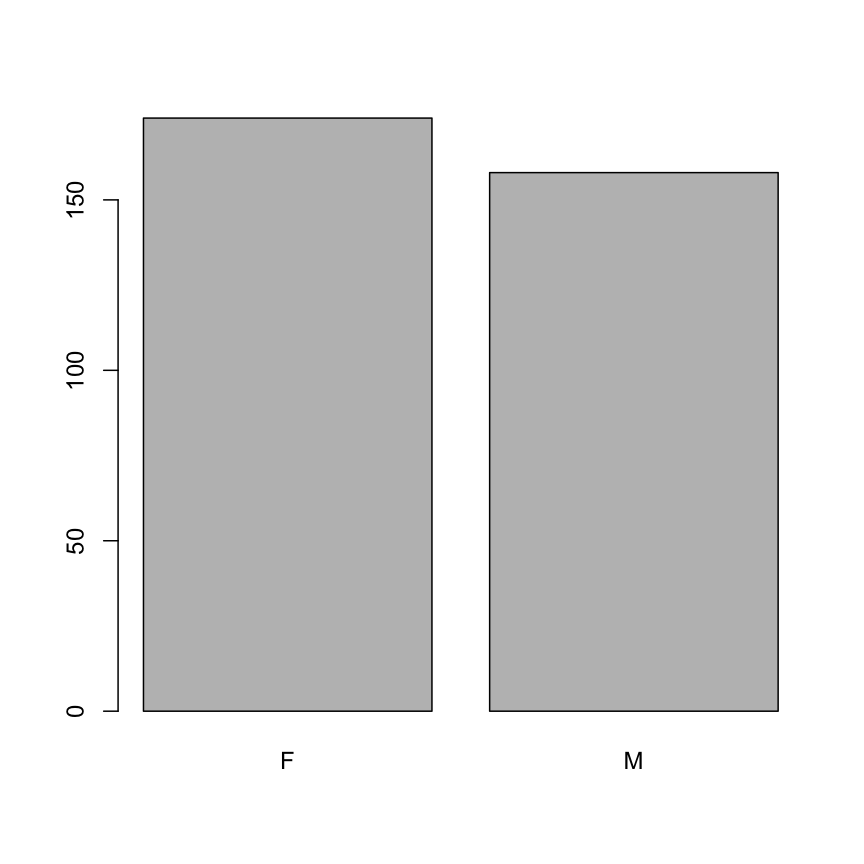
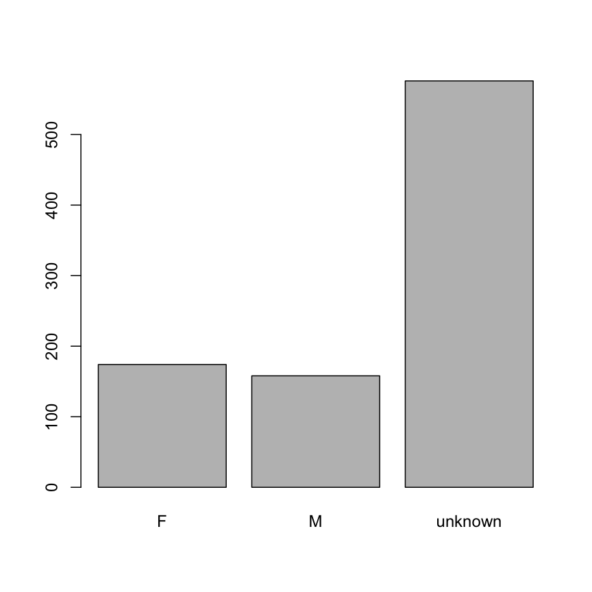
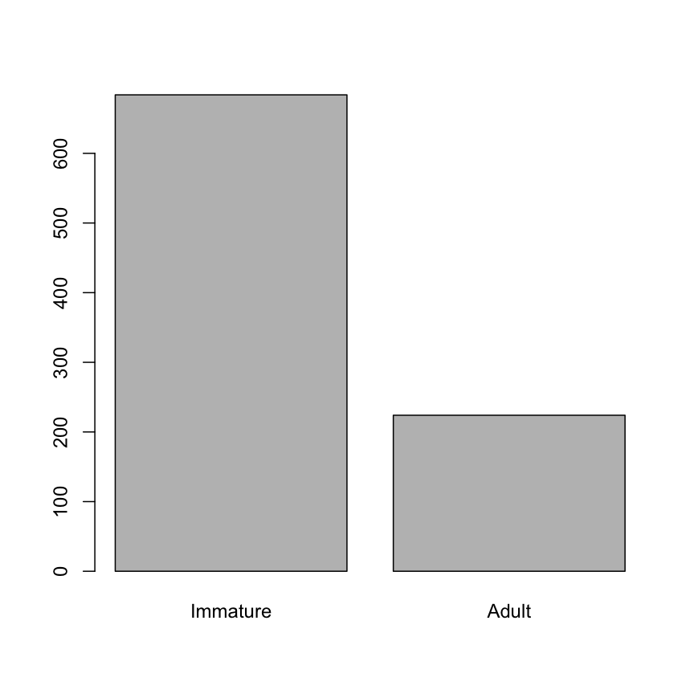

---
# Please do not edit this file directly; it is auto generated.
# Instead, please edit 02-starting-with-data.md in _episodes_rmd/
title: "Starting with data"
teaching: 30
exercises: 10
questions:
- "How do I get started with tabular data (e.g. spreadsheets) in R?"
- "What are some good practices for reading data into R?"
- "How do I save tabular data generated in R?"
objectives:
- "Load external data from a .csv file into a data frame."
- "Describe what a data frame is."
- "Summarize the contents of a data frame."
- "Use indexing to subset specific portions of data frames."
- "Describe what a factor is."
- "Convert between strings and factors."
- "Reorder and rename factors."
- "Change how character strings are handled in a data frame."
keypoints:
- "It is easy to import data into R from tabular formats including Excel.
  However, you still need to check that R has imported and interpreted your
  data correctly."
- "There are best practices for organizing your data (keeping it tidy) and R
  is great for this."
- "Base R has many useful functions for manipulating data, but all of R's
  capabilities are greatly enhanced by software packages developed by the
  community."
source: Rmd
---

# Loading the hawks data

We we will use here a dataset with measurements on three hawk species. The data
was collected during bird capture sessions by students and faculty at Cornell
College in Mount Vernon, Iowa, USA. The dataset include birds of the following
species: Red-tailed, Sharp-shinned, and Cooper's hawks.

| Column       | Description                                                                                      |
|--------------|--------------------------------------------------------------------------------------------------|
| Month        | 8=September to 12=December                                                                       |
| Day          | Date in the month                                                                                |
| Year         | Year: 1992-2003                                                                                  |
| CaptureTime  | Time of capture (HH:MM)                                                                          |
| ReleaseTime  | Time of release (HH:MM)                                                                          |
| BandNumber   | ID band code                                                                                     |
| Species      | `CH`=Cooper's, `RT`=Red-tailed, `SS`=Sharp-shinned                                               |
| Age          | `A`=Adult or `I`=Immature                                                                         |
| Sex          | `F`=Female or `M`=Male                                                                           |
| Wing         | Length (in mm) of primary wing feather from tip to wrist it attaches to                          |
| Weight       | Body weight (in gram)                                                                              |
| Culmen       | Length (in mm) of the upper bill from the tip to where it bumps into the fleshy part of the bird |
| Hallux       | Length (in mm) of the killing talon                                                              |
| Tail         | Measurement (in mm) related to the length of the tail (invented at the MacBride Raptor Center)   |
| StandardTail | Standard measurement of tail length (in mm)                                                      |
| Tarsus       | Length of the basic foot bone (in mm)                                                            |
| WingPitFat   | Amount of fat in the wing pit                                                                    |
| KeelFat      | Amount of fat on the breastbone (measured by feel)                                               |
| Crop         | Amount of material in the crop, coded from 1=full to 0=empty                                     |

The "Hawks" dataset is available from the [RDatasets website](https://vincentarelbundock.github.io/Rdatasets/).

### Downloading the data

We will store the data inside the project folder that we created during the
introduction to RStudio. If you have set up the folder structure properly, you
should have a folder `data_raw` inside your project folder.

We are going to use the R function `download.file()` to download the CSV file
that contains the Hawks dataset, and we will use `read_csv()` to load the
content of the CSV file into R.

Inside the `download.file` command, the first entry is a character string with the
source URL ("https://nbisweden.github.io/module-r-intro-dm-practices/data/Hawks.csv"). 
This source URL downloads a CSV file from GitHub. The text after the comma
("data_raw/Hawks.csv") is the destination of the file on your local
machine. You'll need the folder "raw" inside a folder named "data" in your
project folder (which should be your working directory). So this command
downloads the file from GitHub, names it "hawks.csv" and adds it to a preexisting
folder named "data_raw".

~~~
download.file(
  url = "https://nbisweden.github.io/module-r-intro-dm-practices/data/Hawks.csv",
  destfile = "data_raw/Hawks.csv"
)
~~~
{: .language-r}

### Reading the data into R

The file has now been downloaded to the destination you specified, but R has not 
yet loaded the data from the file into memory. To do this, we can use the 
`read_csv()` function from the **`tidyverse`** package. 

Packages in R are basically sets of additional functions that let you do more
stuff. The functions we've been using so far, like `round()`, `sqrt()`, or `c()`
come built into R. Packages give you access to additional functions beyond base R. 
A similar function to `read_csv()` from the tidyverse package is `read.csv()` from 
base R. We don't have time to cover their differences but notice that the exact 
spelling determines which function is used. Before you use a package for the
first time you need to install it on your machine, and then you should import it
in every subsequent R session when you need it. 

To install the **`tidyverse`** package, we can type 
`install.packages("tidyverse")` straight into the console. In fact, it's better 
to write this in the console than in our script for any package, as there's no 
need to re-install packages every time we run the script. 
Then, to load the package type:

~~~
## load the tidyverse packages, incl. dplyr
library(tidyverse)
~~~
{: .language-r}

Now we can use the functions from the **`tidyverse`** package. 
Let's use `read_csv()` to read the data into a data frame 
(we will learn more about data frames later):

~~~
Rows: 908 Columns: 19
~~~
{: .output}

~~~
── Column specification ────────────────────────────────────────────────────────────────────────────────────────────────────────────────────
Delimiter: ","
chr   (5): CaptureTime, BandNumber, Species, Age, Sex
dbl  (13): Month, Day, Year, Wing, Weight, Culmen, Hallux, Tail, StandardTai...
time  (1): ReleaseTime
~~~
{: .output}

~~~

ℹ Use `spec()` to retrieve the full column specification for this data.
ℹ Specify the column types or set `show_col_types = FALSE` to quiet this message.
~~~
{: .output}

~~~
hawks <- read_csv("data_raw/Hawks.csv")
~~~
{: .language-r}

When you execute `read_csv` on a data file, it looks through the first 1000 rows 
of each column and guesses its data type. Use the function `spec()` to view the
full column specification:

~~~
spec(hawks)
~~~
{: .language-r}

~~~
cols(
  Month = col_double(),
  Day = col_double(),
  Year = col_double(),
  CaptureTime = col_character(),
  ReleaseTime = col_time(format = ""),
  BandNumber = col_character(),
  Species = col_character(),
  Age = col_character(),
  Sex = col_character(),
  Wing = col_double(),
  Weight = col_double(),
  Culmen = col_double(),
  Hallux = col_double(),
  Tail = col_double(),
  StandardTail = col_double(),
  Tarsus = col_double(),
  WingPitFat = col_double(),
  KeelFat = col_double(),
  Crop = col_double()
)
~~~
{: .output}

For example, in this dataset, `read_csv()` reads `CaptureTime` and `BandNumber` 
as `col_character`, `Month` and `Weight` as `col_double` (a numeric data type),
and `ReleaseTime` as `col_time`. You can use the `col_types` argument in
`read_csv()` to manually specify the data type when reading the data.

You might have noticed that `read_csv()` interpreted `CaptureTime` as
`col_character` and not as `col_time` (like was done for `RealeaseTime`). The
reason for this is one malformed value  ("9.12" instead of "9:12") in the column.
A common way of dealing with such situations is to read the column as 
`col_character`, modify any erroneous character strings, and then convert the 
column to the appropriate data type. In the next episode, we will learn how to
use some **`tidyverse`** functions to modify data.

> ### Note
>
> `read_csv()` assumes that fields are delineated by commas. However, in several
> countries, the comma is used as a decimal separator and the semicolon (;) is
> used as a field delineator. If you want to read in this type of files in R,
> you can use the `read_csv2()` function. It behaves like `read_csv()` but
> uses different parameters for the decimal and the field separators. 
There is also the `read_tsv()` for tab separated data files and `read_delim()` 
> for less common formats.
> Check out the help for `read_csv()` by typing `?read_csv` to learn more. 
>
> In addition to the above versions of the csv format, you should develop the habits
> of looking at and recording some parameters of your csv files. For instance, 
> the character encoding, control characters used for line ending, date format
> (if the date is not split into three variables), and the presence of unexpected
> [newlines](https://en.wikipedia.org/wiki/Newline) are important characteristics of your data files.
> Those parameters will ease up the import step of your data in R.
{: .callout}

We can see the contents of the first few lines of the data by typing its 
name: `hawks`. By default, this will show you as many rows and columns of
the data as fit on your screen. 
If you wanted the first 50 rows, you could type `print(hawks, n = 50)`

We can also extract the first few lines of this dataset using the function 
`head()`:

~~~
head(hawks)
~~~
{: .language-r}

~~~
# A tibble: 6 × 19
  Month   Day  Year CaptureTime ReleaseTime BandNumber Species Age   Sex    Wing
  <dbl> <dbl> <dbl> <chr>       <time>      <chr>      <chr>   <chr> <chr> <dbl>
1     9    19  1992 13:30          NA       877-76317  RT      I     <NA>    385
2     9    22  1992 10:30          NA       877-76318  RT      I     <NA>    376
3     9    23  1992 12:45          NA       877-76319  RT      I     <NA>    381
4     9    23  1992 10:50          NA       745-49508  CH      I     F       265
5     9    27  1992 11:15          NA       1253-98801 SS      I     F       205
6     9    28  1992 11:25          NA       1207-55910 RT      I     <NA>    412
# … with 9 more variables: Weight <dbl>, Culmen <dbl>, Hallux <dbl>,
#   Tail <dbl>, StandardTail <dbl>, Tarsus <dbl>, WingPitFat <dbl>,
#   KeelFat <dbl>, Crop <dbl>
~~~
{: .output}

Unlike the `print()` function, `head()` returns the extracted data. You could 
use it to assign the first 100 rows of `hawks` to an object using 
`hawks_sample <- head(hawks, 100)`. This can be useful if you want to try 
out complex computations on a subset of your data before you apply them to the
whole dataset. 
There is a similar function that lets you extract the last few lines of the data 
set. It is called (you might have guessed it) `tail()`.

To open the dataset in RStudio's Data Viewer, use the `view()` function:

~~~
view(hawks)
~~~
{: .language-r}

> ### Note
> 
>  There are two functions for viewing which are case-sensitive. Using `view()` with a 
>  lowercase 'v' is part of tidyverse, whereas using `View()` with an uppercase 'V' is 
>  loaded through base R in the `utils` package.
{: .callout}

## What are data frames?

When we loaded the data into R, it got stored as an object of class `tibble`, 
which is a special kind of data frame (the difference is not important for our 
purposes, but you can learn more about tibbles 
[here](https://tibble.tidyverse.org/)). 
Data frames are the _de facto_ data structure for most tabular data, and what we
use for statistics and plotting.
Data frames can be created by hand, but most commonly they are generated by
functions like `read_csv()`; in other words, when importing
spreadsheets from your hard drive or the web.

A data frame is the representation of data in the format of a table where the
columns are vectors that all have the same length. Because columns are
vectors, each column must contain a single type of data (e.g., characters, integers,
factors). For example, here is a figure depicting a data frame comprising a
numeric, a character, and a logical vector.

We can see this also when inspecting the <b>str</b>ucture of a data frame
with the function `str()`:

~~~
str(hawks)
~~~
{: .language-r}

~~~
spec_tbl_df [908 × 19] (S3: spec_tbl_df/tbl_df/tbl/data.frame)
 $ Month       : num [1:908] 9 9 9 9 9 9 9 9 9 9 ...
 $ Day         : num [1:908] 19 22 23 23 27 28 28 29 29 30 ...
 $ Year        : num [1:908] 1992 1992 1992 1992 1992 ...
 $ CaptureTime : chr [1:908] "13:30" "10:30" "12:45" "10:50" ...
 $ ReleaseTime : 'hms' num [1:908] NA NA NA NA ...
  ..- attr(*, "units")= chr "secs"
 $ BandNumber  : chr [1:908] "877-76317" "877-76318" "877-76319" "745-49508" ...
 $ Species     : chr [1:908] "RT" "RT" "RT" "CH" ...
 $ Age         : chr [1:908] "I" "I" "I" "I" ...
 $ Sex         : chr [1:908] NA NA NA "F" ...
 $ Wing        : num [1:908] 385 376 381 265 205 412 370 375 412 405 ...
 $ Weight      : num [1:908] 920 930 990 470 170 1090 960 855 1210 1120 ...
 $ Culmen      : num [1:908] 25.7 NA 26.7 18.7 12.5 28.5 25.3 27.2 29.3 26 ...
 $ Hallux      : num [1:908] 30.1 NA 31.3 23.5 14.3 32.2 30.1 30 31.3 30.2 ...
 $ Tail        : num [1:908] 219 221 235 220 157 230 212 243 210 238 ...
 $ StandardTail: num [1:908] NA NA NA NA NA NA NA NA NA NA ...
 $ Tarsus      : num [1:908] NA NA NA NA NA NA NA NA NA NA ...
 $ WingPitFat  : num [1:908] NA NA NA NA NA NA NA NA NA NA ...
 $ KeelFat     : num [1:908] NA NA NA NA NA NA NA NA NA NA ...
 $ Crop        : num [1:908] NA NA NA NA NA NA NA NA NA NA ...
 - attr(*, "spec")=
  .. cols(
  ..   Month = col_double(),
  ..   Day = col_double(),
  ..   Year = col_double(),
  ..   CaptureTime = col_character(),
  ..   ReleaseTime = col_time(format = ""),
  ..   BandNumber = col_character(),
  ..   Species = col_character(),
  ..   Age = col_character(),
  ..   Sex = col_character(),
  ..   Wing = col_double(),
  ..   Weight = col_double(),
  ..   Culmen = col_double(),
  ..   Hallux = col_double(),
  ..   Tail = col_double(),
  ..   StandardTail = col_double(),
  ..   Tarsus = col_double(),
  ..   WingPitFat = col_double(),
  ..   KeelFat = col_double(),
  ..   Crop = col_double()
  .. )
 - attr(*, "problems")=<externalptr> 
~~~
{: .output}
 
## Inspecting data frames

We already saw how the functions `head()` and `str()` can be useful to check the
content and the structure of a data frame. Here is a non-exhaustive list of
functions to get a sense of the content/structure of the data. Let's try them out!

* Size:
    * `dim(hawks)` - returns a vector with the number of rows in the first element,
          and the number of columns as the second element (the **dim**ensions of
          the object)
    * `nrow(hawks)` - returns the number of rows
    * `ncol(hawks)` - returns the number of columns

* Content:
    * `head(hawks)` - shows the first 6 rows
    * `tail(hawks)` - shows the last 6 rows

* Names:
    * `names(hawks)` - returns the column names (synonym of `colnames()` for `data.frame`
	   objects)
    * `rownames(hawks)` - returns the row names

* Summary:
    * `str(hawks)` - structure of the object and information about the class, length and
	   content of  each column
    * `summary(hawks)` - summary statistics for each column

Note: most of these functions are "generic", they can be used on other types of
objects besides `data.frame`.

> ## Challenge 2.1
>
> Based on the output of `str(hawks)`, can you answer the following questions?
>
> * What is the class of the object `hawks`?
> * How many rows and how many columns are in this object?
>
>> ## Solution
>>
>> 
>> ~~~
>> str(hawks)
>> ~~~
>> {: .language-r}
>> 
>> 
>> 
>> ~~~
>> spec_tbl_df [908 × 19] (S3: spec_tbl_df/tbl_df/tbl/data.frame)
>>  $ Month       : num [1:908] 9 9 9 9 9 9 9 9 9 9 ...
>>  $ Day         : num [1:908] 19 22 23 23 27 28 28 29 29 30 ...
>>  $ Year        : num [1:908] 1992 1992 1992 1992 1992 ...
>>  $ CaptureTime : chr [1:908] "13:30" "10:30" "12:45" "10:50" ...
>>  $ ReleaseTime : 'hms' num [1:908] NA NA NA NA ...
>>   ..- attr(*, "units")= chr "secs"
>>  $ BandNumber  : chr [1:908] "877-76317" "877-76318" "877-76319" "745-49508" ...
>>  $ Species     : chr [1:908] "RT" "RT" "RT" "CH" ...
>>  $ Age         : chr [1:908] "I" "I" "I" "I" ...
>>  $ Sex         : chr [1:908] NA NA NA "F" ...
>>  $ Wing        : num [1:908] 385 376 381 265 205 412 370 375 412 405 ...
>>  $ Weight      : num [1:908] 920 930 990 470 170 1090 960 855 1210 1120 ...
>>  $ Culmen      : num [1:908] 25.7 NA 26.7 18.7 12.5 28.5 25.3 27.2 29.3 26 ...
>>  $ Hallux      : num [1:908] 30.1 NA 31.3 23.5 14.3 32.2 30.1 30 31.3 30.2 ...
>>  $ Tail        : num [1:908] 219 221 235 220 157 230 212 243 210 238 ...
>>  $ StandardTail: num [1:908] NA NA NA NA NA NA NA NA NA NA ...
>>  $ Tarsus      : num [1:908] NA NA NA NA NA NA NA NA NA NA ...
>>  $ WingPitFat  : num [1:908] NA NA NA NA NA NA NA NA NA NA ...
>>  $ KeelFat     : num [1:908] NA NA NA NA NA NA NA NA NA NA ...
>>  $ Crop        : num [1:908] NA NA NA NA NA NA NA NA NA NA ...
>>  - attr(*, "spec")=
>>   .. cols(
>>   ..   Month = col_double(),
>>   ..   Day = col_double(),
>>   ..   Year = col_double(),
>>   ..   CaptureTime = col_character(),
>>   ..   ReleaseTime = col_time(format = ""),
>>   ..   BandNumber = col_character(),
>>   ..   Species = col_character(),
>>   ..   Age = col_character(),
>>   ..   Sex = col_character(),
>>   ..   Wing = col_double(),
>>   ..   Weight = col_double(),
>>   ..   Culmen = col_double(),
>>   ..   Hallux = col_double(),
>>   ..   Tail = col_double(),
>>   ..   StandardTail = col_double(),
>>   ..   Tarsus = col_double(),
>>   ..   WingPitFat = col_double(),
>>   ..   KeelFat = col_double(),
>>   ..   Crop = col_double()
>>   .. )
>>  - attr(*, "problems")=<externalptr> 
>> ~~~
>> {: .output}
>> * The object `hawks` is of class `data.frame`, or more specifically a
>>   `tibble` (`spec_tbl_df/tbl_df/tbl/data.frame`)
>> * Rows and columns: 908 rows and 19 columns
> {: .solution}
{: .challenge}

## Indexing and subsetting data frames

Our hawks data frame has rows and columns (it has 2 dimensions), if we want to
extract some specific data from it, we need to specify the "coordinates" we
want from it. Row numbers come first, followed by column numbers.

~~~
# first element in the first column of the data frame
hawks[1, 1]   
~~~
{: .language-r}

~~~
# A tibble: 1 × 1
  Month
  <dbl>
1     9
~~~
{: .output}

~~~
# first element in the 6th column
hawks[1, 6]   
~~~
{: .language-r}

~~~
# A tibble: 1 × 1
  BandNumber
  <chr>     
1 877-76317 
~~~
{: .output}

~~~
# first column of the data frame
hawks[, 1]    
~~~
{: .language-r}

~~~
# A tibble: 908 × 1
   Month
   <dbl>
 1     9
 2     9
 3     9
 4     9
 5     9
 6     9
 7     9
 8     9
 9     9
10     9
# … with 898 more rows
~~~
{: .output}

~~~
# first column of the data frame
hawks[1]      
~~~
{: .language-r}

~~~
# A tibble: 908 × 1
   Month
   <dbl>
 1     9
 2     9
 3     9
 4     9
 5     9
 6     9
 7     9
 8     9
 9     9
10     9
# … with 898 more rows
~~~
{: .output}

~~~
# first three rows of the 6th column
hawks[1:3, 6] 
~~~
{: .language-r}

~~~
# A tibble: 3 × 1
  BandNumber
  <chr>     
1 877-76317 
2 877-76318 
3 877-76319 
~~~
{: .output}

~~~
# the 3rd row of the data frame
hawks[3, ]    
~~~
{: .language-r}

~~~
# A tibble: 1 × 19
  Month   Day  Year CaptureTime ReleaseTime BandNumber Species Age   Sex    Wing
  <dbl> <dbl> <dbl> <chr>       <time>      <chr>      <chr>   <chr> <chr> <dbl>
1     9    23  1992 12:45          NA       877-76319  RT      I     <NA>    381
# … with 9 more variables: Weight <dbl>, Culmen <dbl>, Hallux <dbl>,
#   Tail <dbl>, StandardTail <dbl>, Tarsus <dbl>, WingPitFat <dbl>,
#   KeelFat <dbl>, Crop <dbl>
~~~
{: .output}

~~~
# equivalent to head_hawks <- head(hawks)
head_hawks <- hawks[1:6, ] 
~~~
{: .language-r}

`:` is a special function that creates numeric vectors of integers in increasing
or decreasing order, test `1:10` and `10:1` for instance.

You can also exclude certain indices of a data frame using the "`-`" sign:

~~~
hawks[, -1]  # the whole data frame, except the first column
~~~
{: .language-r}

~~~
# A tibble: 908 × 18
     Day  Year CaptureTime ReleaseTime BandNumber Species Age   Sex    Wing
   <dbl> <dbl> <chr>       <time>      <chr>      <chr>   <chr> <chr> <dbl>
 1    19  1992 13:30          NA       877-76317  RT      I     <NA>    385
 2    22  1992 10:30          NA       877-76318  RT      I     <NA>    376
 3    23  1992 12:45          NA       877-76319  RT      I     <NA>    381
 4    23  1992 10:50          NA       745-49508  CH      I     F       265
 5    27  1992 11:15          NA       1253-98801 SS      I     F       205
 6    28  1992 11:25          NA       1207-55910 RT      I     <NA>    412
 7    28  1992 13:30          NA       877-76320  RT      I     <NA>    370
 8    29  1992 11:45          NA       877-76321  RT      A     <NA>    375
 9    29  1992 15:35          NA       877-76322  RT      A     <NA>    412
10    30  1992 13:45          NA       1207-55911 RT      I     <NA>    405
# … with 898 more rows, and 9 more variables: Weight <dbl>, Culmen <dbl>,
#   Hallux <dbl>, Tail <dbl>, StandardTail <dbl>, Tarsus <dbl>,
#   WingPitFat <dbl>, KeelFat <dbl>, Crop <dbl>
~~~
{: .output}

~~~
hawks[-(7:908), ]  # equivalent to head(hawks)
~~~
{: .language-r}

~~~
# A tibble: 6 × 19
  Month   Day  Year CaptureTime ReleaseTime BandNumber Species Age   Sex    Wing
  <dbl> <dbl> <dbl> <chr>       <time>      <chr>      <chr>   <chr> <chr> <dbl>
1     9    19  1992 13:30          NA       877-76317  RT      I     <NA>    385
2     9    22  1992 10:30          NA       877-76318  RT      I     <NA>    376
3     9    23  1992 12:45          NA       877-76319  RT      I     <NA>    381
4     9    23  1992 10:50          NA       745-49508  CH      I     F       265
5     9    27  1992 11:15          NA       1253-98801 SS      I     F       205
6     9    28  1992 11:25          NA       1207-55910 RT      I     <NA>    412
# … with 9 more variables: Weight <dbl>, Culmen <dbl>, Hallux <dbl>,
#   Tail <dbl>, StandardTail <dbl>, Tarsus <dbl>, WingPitFat <dbl>,
#   KeelFat <dbl>, Crop <dbl>
~~~
{: .output}

Data frames can be subset by calling indices (as shown previously), but also by
calling their column names directly:

~~~
hawks["Year"]
~~~
{: .language-r}

~~~
# A tibble: 908 × 1
    Year
   <dbl>
 1  1992
 2  1992
 3  1992
 4  1992
 5  1992
 6  1992
 7  1992
 8  1992
 9  1992
10  1992
# … with 898 more rows
~~~
{: .output}

~~~
hawks[, "Year"]
~~~
{: .language-r}

~~~
# A tibble: 908 × 1
    Year
   <dbl>
 1  1992
 2  1992
 3  1992
 4  1992
 5  1992
 6  1992
 7  1992
 8  1992
 9  1992
10  1992
# … with 898 more rows
~~~
{: .output}

When we extract a subset from a data frame of class `tibble`, we normally
get back an object of the same class. To get one-column subsets returned as
vectors, we can use double square brackets:

~~~
hawks[[1]]  # first column as vector
~~~
{: .language-r}

~~~
  [1]  9  9  9  9  9  9  9  9  9  9 10 10 10 10 10 10 10 10 10 10 10 10 10 10 10
 [26] 10 10 10 10 10 10 10 11 11 11 11 11 11 11  9  9  9  9  9  9  9  9  9  9  9
 [51]  9  9  9  9  9 10 10 10 10 10 10 10 10 10 10 10 10 10 10 10 10 10 10 10 10
 [76] 10 11 11  9  9  9  9  9  9  9  9  9  9  9  9  9  9  9  8  9  9  9  9  9  9
[101]  9  9  9  9  9  9  9  9  9  9  9  9  9  9  9  9  9  9  9  9 10 10 10 10 10
[126] 10 10 10 10 10 10 10 10 10 10 10 10 10 10 10 10 10 10 10 10 10 10 10 10 10
[151] 10 10 10 10 10 10 10 10 10 10 10 10 10 10 10 10 10 10 10 10 10 10 10 10 10
[176] 10 10 10 10 10 10 10 10 10 11 11 11 11 11 11 11 11 11 11 11 11 11 11 11 11
[201] 11 11 11 11 11 11 11  9  9  9  9  9  9  9  9  9  9  9  9  9  9  9  9  9  9
[226]  9  9  9  9  9 10 10 10 10 10 10 10 10 10 10 10 10 10 10 10 10 10 10 10 10
[251] 10 10 10 10 10 10 10 10 10 10 10 10 10 10 10 10 10 10 10 10 10 10 10 10 10
[276] 10 10 11 11 11 11 10 10 10 10 10 10 10 10 10 10 10 10 10 10 10 10 11 11  9
[301]  9  9  9  9  9  9  9  9  9  9  9  9  9  9  9  9  9  9  9  9  9  9  9  9  9
[326]  9  9  9  9  9  9  9  9 10 10 10 10 10 10 10 10 10 10 10 10 10 10 10 10 10
[351] 10 10 10 10 10 10 10 10 10 10 10 10 10 10 10 10 10 10 11 11 11 11 11 11 11
[376] 11 11 11 11  9  9 10 10 10 10 10 10 10 10 10 10 10 10 10 10 10 10 10 10 10
[401] 11 11 11 11 11 11 11 11 11 11 11 11 11  9  9  9  9  9  9  9  9  9  9  9  9
[426]  9  9  9  9  9  9  9  9  9  9  9  9  9  9 10 10 10 10 10 10 10 10 10 10 10
[451] 10 10 10 10 10 10 10 10 10 10 10 10 10 10 10 10 10 10 10 10 10 10 10 10 10
[476] 10 10 10 11 11 11 11 11 11 11 11 11 11 11 11 11 11 11 11 11 11 11 11 11  9
[501]  9  9  9  9  9  9  9  9  9  9  9  9  9  9  9  9  9  9  9  9  9  9  9  9  9
[526]  9  9  9  9  9  9  9  9  9  9  9  9  9  9  9  9 10 10 10 10 10 10 10 10 10
[551] 10 10 10 10 10 10 10 10 10 10 10 10 10 10 10 10 10 10 10 10 10 10 10 10 10
[576] 10 10 10 10 10 10 10 10 10 10 10 10 10 10 10 10 10 10 10 10 10 10 10 10 10
[601] 11 11 11 11 11 11 11 11 11 11 11 11 11 11 11 11  9  9  9  9  9  9  9  9  9
[626]  9  9  9  9  9  9  9  9  9  9  9  9  9  9  9  9 10 10 10 10 10 10 10 10 10
[651] 10 10 10 10 10 10 10 10 10 10 10 10 10 10 10 10 10 10 10 10 10 10 10 10 10
[676] 10 10 10 10 10 10 10 10 10 11 11 11 11 11 11 11 11 11 11 11 11 11 11 11 11
[701]  9  9  9  9  9  9  9  9  9  9  9  9  9  9  9  9  9  9  9  9  9  9  9  9  9
[726]  9  9  9  9  9  9  9 10 10 10 10 10 10 10 10 10 10 10 10 10 10 10 10 10 10
[751] 10 10 10 10 10 10 10 10 10 10 10 10 10 10 10 10 10 10 10 10 10 10 10 10 10
[776] 10 10 10 10 10 10 11 11 11 11 11 11 11 11 11 11 11 11 11 11 11 11 11 11  9
[801]  9  9  9  9  9  9  9  9  9  9  9  9  9  9  9  9  9  9  9  9  9  9  9  9  9
[826]  9  9  9  9  9  9  9  9  9  9  9  9  9  9  9  9 10 10 10 10 10 10 10 10 10
[851] 10 10 10 10 10 10 10 10 10 10 10 10 10 10 10 10 10 10 10 10 10 10 10 10 10
[876] 10 10 10 10 10 10 10 10 10 10 10 10 10 10 11 11 11 11 11 11 11 11 11 11 11
[901] 11 11 11 11 11 11 11 11
~~~
{: .output}

~~~
hawks[["Year"]]  # named column as vector
~~~
{: .language-r}

~~~
  [1] 1992 1992 1992 1992 1992 1992 1992 1992 1992 1992 1992 1992 1992 1992 1992
 [16] 1992 1992 1992 1992 1992 1992 1992 1992 1992 1992 1992 1992 1992 1992 1992
 [31] 1992 1992 1992 1992 1992 1992 1992 1992 1992 1993 1993 1993 1993 1993 1993
 [46] 1993 1993 1993 1993 1993 1993 1993 1993 1993 1993 1993 1993 1993 1993 1993
 [61] 1993 1993 1993 1993 1993 1993 1993 1993 1993 1993 1993 1993 1993 1993 1993
 [76] 1993 1993 1993 1994 1994 1994 1994 1994 1994 1994 1994 1994 1994 1994 1994
 [91] 1994 1994 1994 1994 1994 1994 1994 1994 1994 1994 1994 1994 1994 1994 1994
[106] 1994 1994 1994 1994 1994 1994 1994 1994 1994 1994 1994 1994 1994 1994 1994
[121] 1994 1994 1994 1994 1994 1994 1994 1994 1994 1994 1994 1994 1994 1994 1994
[136] 1994 1994 1994 1994 1994 1994 1994 1994 1994 1994 1994 1994 1994 1994 1994
[151] 1994 1994 1994 1994 1994 1994 1994 1994 1994 1994 1994 1994 1994 1994 1994
[166] 1994 1994 1994 1994 1994 1994 1994 1994 1994 1994 1994 1994 1994 1994 1994
[181] 1994 1994 1994 1994 1994 1994 1994 1994 1994 1994 1994 1994 1994 1994 1994
[196] 1994 1994 1994 1994 1994 1994 1994 1994 1994 1994 1994 1994 1995 1995 1995
[211] 1995 1995 1995 1995 1995 1995 1995 1995 1995 1995 1995 1995 1995 1995 1995
[226] 1995 1995 1995 1995 1995 1995 1995 1995 1995 1995 1995 1995 1995 1995 1995
[241] 1995 1995 1995 1995 1995 1995 1995 1995 1995 1995 1995 1995 1995 1995 1995
[256] 1995 1995 1995 1995 1995 1995 1995 1995 1995 1995 1995 1995 1995 1995 1995
[271] 1995 1995 1995 1995 1995 1995 1995 1995 1995 1995 1995 1996 1996 1996 1996
[286] 1996 1996 1996 1996 1996 1996 1996 1996 1996 1996 1996 1996 1996 1996 1997
[301] 1997 1997 1997 1997 1997 1997 1997 1997 1997 1997 1997 1997 1997 1997 1997
[316] 1997 1997 1997 1997 1997 1997 1997 1997 1997 1997 1997 1997 1997 1997 1997
[331] 1997 1997 1997 1997 1997 1997 1997 1997 1997 1997 1997 1997 1997 1997 1997
[346] 1997 1997 1997 1997 1997 1997 1997 1997 1997 1997 1997 1997 1997 1997 1997
[361] 1997 1997 1997 1997 1997 1997 1997 1997 1997 1997 1997 1997 1997 1997 1997
[376] 1997 1997 1997 1997 1998 1998 1998 1998 1998 1998 1998 1998 1998 1998 1998
[391] 1998 1998 1998 1998 1998 1998 1998 1998 1998 1998 1998 1998 1998 1998 1998
[406] 1998 1998 1998 1998 1998 1998 1998 1998 1999 1999 1999 1999 1999 1999 1999
[421] 1999 1999 1999 1999 1999 1999 1999 1999 1999 1999 1999 1999 1999 1999 1999
[436] 1999 1999 1999 1999 1999 1999 1999 1999 1999 1999 1999 1999 1999 1999 1999
[451] 1999 1999 1999 1999 1999 1999 1999 1999 1999 1999 1999 1999 1999 1999 1999
[466] 1999 1999 1999 1999 1999 1999 1999 1999 1999 1999 1999 1999 1999 1999 1999
[481] 1999 1999 1999 1999 1999 1999 1999 1999 1999 1999 1999 1999 1999 1999 1999
[496] 1999 1999 1999 1999 2000 2000 2000 2000 2000 2000 2000 2000 2000 2000 2000
[511] 2000 2000 2000 2000 2000 2000 2000 2000 2000 2000 2000 2000 2000 2000 2000
[526] 2000 2000 2000 2000 2000 2000 2000 2000 2000 2000 2000 2000 2000 2000 2000
[541] 2000 2000 2000 2000 2000 2000 2000 2000 2000 2000 2000 2000 2000 2000 2000
[556] 2000 2000 2000 2000 2000 2000 2000 2000 2000 2000 2000 2000 2000 2000 2000
[571] 2000 2000 2000 2000 2000 2000 2000 2000 2000 2000 2000 2000 2000 2000 2000
[586] 2000 2000 2000 2000 2000 2000 2000 2000 2000 2000 2000 2000 2000 2000 2000
[601] 2000 2000 2000 2000 2000 2000 2000 2000 2000 2000 2000 2000 2000 2000 2000
[616] 2000 2001 2001 2001 2001 2001 2001 2001 2001 2001 2001 2001 2001 2001 2001
[631] 2001 2001 2001 2001 2001 2001 2001 2001 2001 2001 2001 2001 2001 2001 2001
[646] 2001 2001 2001 2001 2001 2001 2001 2001 2001 2001 2001 2001 2001 2001 2001
[661] 2001 2001 2001 2001 2001 2001 2001 2001 2001 2001 2001 2001 2001 2001 2001
[676] 2001 2001 2001 2001 2001 2001 2001 2001 2001 2001 2001 2001 2001 2001 2001
[691] 2001 2001 2001 2001 2001 2001 2001 2001 2001 2001 2002 2002 2002 2002 2002
[706] 2002 2002 2002 2002 2002 2002 2002 2002 2002 2002 2002 2002 2002 2002 2002
[721] 2002 2002 2002 2002 2002 2002 2002 2002 2002 2002 2002 2002 2002 2002 2002
[736] 2002 2002 2002 2002 2002 2002 2002 2002 2002 2002 2002 2002 2002 2002 2002
[751] 2002 2002 2002 2002 2002 2002 2002 2002 2002 2002 2002 2002 2002 2002 2002
[766] 2002 2002 2002 2002 2002 2002 2002 2002 2002 2002 2002 2002 2002 2002 2002
[781] 2002 2002 2002 2002 2002 2002 2002 2002 2002 2002 2002 2002 2002 2002 2002
[796] 2002 2002 2002 2002 2003 2003 2003 2003 2003 2003 2003 2003 2003 2003 2003
[811] 2003 2003 2003 2003 2003 2003 2003 2003 2003 2003 2003 2003 2003 2003 2003
[826] 2003 2003 2003 2003 2003 2003 2003 2003 2003 2003 2003 2003 2003 2003 2003
[841] 2003 2003 2003 2003 2003 2003 2003 2003 2003 2003 2003 2003 2003 2003 2003
[856] 2003 2003 2003 2003 2003 2003 2003 2003 2003 2003 2003 2003 2003 2003 2003
[871] 2003 2003 2003 2003 2003 2003 2003 2003 2003 2003 2003 2003 2003 2003 2003
[886] 2003 2003 2003 2003 2003 2003 2003 2003 2003 2003 2003 2003 2003 2003 2003
[901] 2003 2003 2003 2003 2003 2003 2003 2003
~~~
{: .output}

~~~
hawks[[1, 1]]  # first element in the first column as vector        
~~~
{: .language-r}

~~~
[1] 9
~~~
{: .output}

~~~
hawks[[1, "Year"]]  # first element in the named column as vector
~~~
{: .language-r}

~~~
[1] 1992
~~~
{: .output}

We can also access an individual column as a vector by using a dollar sign, `$`:

~~~
hawks$Year  # named column as vector
~~~
{: .language-r}

~~~
  [1] 1992 1992 1992 1992 1992 1992 1992 1992 1992 1992 1992 1992 1992 1992 1992
 [16] 1992 1992 1992 1992 1992 1992 1992 1992 1992 1992 1992 1992 1992 1992 1992
 [31] 1992 1992 1992 1992 1992 1992 1992 1992 1992 1993 1993 1993 1993 1993 1993
 [46] 1993 1993 1993 1993 1993 1993 1993 1993 1993 1993 1993 1993 1993 1993 1993
 [61] 1993 1993 1993 1993 1993 1993 1993 1993 1993 1993 1993 1993 1993 1993 1993
 [76] 1993 1993 1993 1994 1994 1994 1994 1994 1994 1994 1994 1994 1994 1994 1994
 [91] 1994 1994 1994 1994 1994 1994 1994 1994 1994 1994 1994 1994 1994 1994 1994
[106] 1994 1994 1994 1994 1994 1994 1994 1994 1994 1994 1994 1994 1994 1994 1994
[121] 1994 1994 1994 1994 1994 1994 1994 1994 1994 1994 1994 1994 1994 1994 1994
[136] 1994 1994 1994 1994 1994 1994 1994 1994 1994 1994 1994 1994 1994 1994 1994
[151] 1994 1994 1994 1994 1994 1994 1994 1994 1994 1994 1994 1994 1994 1994 1994
[166] 1994 1994 1994 1994 1994 1994 1994 1994 1994 1994 1994 1994 1994 1994 1994
[181] 1994 1994 1994 1994 1994 1994 1994 1994 1994 1994 1994 1994 1994 1994 1994
[196] 1994 1994 1994 1994 1994 1994 1994 1994 1994 1994 1994 1994 1995 1995 1995
[211] 1995 1995 1995 1995 1995 1995 1995 1995 1995 1995 1995 1995 1995 1995 1995
[226] 1995 1995 1995 1995 1995 1995 1995 1995 1995 1995 1995 1995 1995 1995 1995
[241] 1995 1995 1995 1995 1995 1995 1995 1995 1995 1995 1995 1995 1995 1995 1995
[256] 1995 1995 1995 1995 1995 1995 1995 1995 1995 1995 1995 1995 1995 1995 1995
[271] 1995 1995 1995 1995 1995 1995 1995 1995 1995 1995 1995 1996 1996 1996 1996
[286] 1996 1996 1996 1996 1996 1996 1996 1996 1996 1996 1996 1996 1996 1996 1997
[301] 1997 1997 1997 1997 1997 1997 1997 1997 1997 1997 1997 1997 1997 1997 1997
[316] 1997 1997 1997 1997 1997 1997 1997 1997 1997 1997 1997 1997 1997 1997 1997
[331] 1997 1997 1997 1997 1997 1997 1997 1997 1997 1997 1997 1997 1997 1997 1997
[346] 1997 1997 1997 1997 1997 1997 1997 1997 1997 1997 1997 1997 1997 1997 1997
[361] 1997 1997 1997 1997 1997 1997 1997 1997 1997 1997 1997 1997 1997 1997 1997
[376] 1997 1997 1997 1997 1998 1998 1998 1998 1998 1998 1998 1998 1998 1998 1998
[391] 1998 1998 1998 1998 1998 1998 1998 1998 1998 1998 1998 1998 1998 1998 1998
[406] 1998 1998 1998 1998 1998 1998 1998 1998 1999 1999 1999 1999 1999 1999 1999
[421] 1999 1999 1999 1999 1999 1999 1999 1999 1999 1999 1999 1999 1999 1999 1999
[436] 1999 1999 1999 1999 1999 1999 1999 1999 1999 1999 1999 1999 1999 1999 1999
[451] 1999 1999 1999 1999 1999 1999 1999 1999 1999 1999 1999 1999 1999 1999 1999
[466] 1999 1999 1999 1999 1999 1999 1999 1999 1999 1999 1999 1999 1999 1999 1999
[481] 1999 1999 1999 1999 1999 1999 1999 1999 1999 1999 1999 1999 1999 1999 1999
[496] 1999 1999 1999 1999 2000 2000 2000 2000 2000 2000 2000 2000 2000 2000 2000
[511] 2000 2000 2000 2000 2000 2000 2000 2000 2000 2000 2000 2000 2000 2000 2000
[526] 2000 2000 2000 2000 2000 2000 2000 2000 2000 2000 2000 2000 2000 2000 2000
[541] 2000 2000 2000 2000 2000 2000 2000 2000 2000 2000 2000 2000 2000 2000 2000
[556] 2000 2000 2000 2000 2000 2000 2000 2000 2000 2000 2000 2000 2000 2000 2000
[571] 2000 2000 2000 2000 2000 2000 2000 2000 2000 2000 2000 2000 2000 2000 2000
[586] 2000 2000 2000 2000 2000 2000 2000 2000 2000 2000 2000 2000 2000 2000 2000
[601] 2000 2000 2000 2000 2000 2000 2000 2000 2000 2000 2000 2000 2000 2000 2000
[616] 2000 2001 2001 2001 2001 2001 2001 2001 2001 2001 2001 2001 2001 2001 2001
[631] 2001 2001 2001 2001 2001 2001 2001 2001 2001 2001 2001 2001 2001 2001 2001
[646] 2001 2001 2001 2001 2001 2001 2001 2001 2001 2001 2001 2001 2001 2001 2001
[661] 2001 2001 2001 2001 2001 2001 2001 2001 2001 2001 2001 2001 2001 2001 2001
[676] 2001 2001 2001 2001 2001 2001 2001 2001 2001 2001 2001 2001 2001 2001 2001
[691] 2001 2001 2001 2001 2001 2001 2001 2001 2001 2001 2002 2002 2002 2002 2002
[706] 2002 2002 2002 2002 2002 2002 2002 2002 2002 2002 2002 2002 2002 2002 2002
[721] 2002 2002 2002 2002 2002 2002 2002 2002 2002 2002 2002 2002 2002 2002 2002
[736] 2002 2002 2002 2002 2002 2002 2002 2002 2002 2002 2002 2002 2002 2002 2002
[751] 2002 2002 2002 2002 2002 2002 2002 2002 2002 2002 2002 2002 2002 2002 2002
[766] 2002 2002 2002 2002 2002 2002 2002 2002 2002 2002 2002 2002 2002 2002 2002
[781] 2002 2002 2002 2002 2002 2002 2002 2002 2002 2002 2002 2002 2002 2002 2002
[796] 2002 2002 2002 2002 2003 2003 2003 2003 2003 2003 2003 2003 2003 2003 2003
[811] 2003 2003 2003 2003 2003 2003 2003 2003 2003 2003 2003 2003 2003 2003 2003
[826] 2003 2003 2003 2003 2003 2003 2003 2003 2003 2003 2003 2003 2003 2003 2003
[841] 2003 2003 2003 2003 2003 2003 2003 2003 2003 2003 2003 2003 2003 2003 2003
[856] 2003 2003 2003 2003 2003 2003 2003 2003 2003 2003 2003 2003 2003 2003 2003
[871] 2003 2003 2003 2003 2003 2003 2003 2003 2003 2003 2003 2003 2003 2003 2003
[886] 2003 2003 2003 2003 2003 2003 2003 2003 2003 2003 2003 2003 2003 2003 2003
[901] 2003 2003 2003 2003 2003 2003 2003 2003
~~~
{: .output}

In RStudio, you can use the autocompletion feature to get the full and correct
names of the columns.

> ## Challenge 2.2
>
> 1. Create a `data.frame` (`hawks_20`) containing only the data in
>    row 20 of the `hawks` dataset.
>
> 2. Notice how `nrow()` gave you the number of rows in a `data.frame`?
>
>      * Use that number to pull out just that last row in the data frame.
>      * Compare that with what you see as the last row using `tail()` to make
>        sure it's meeting expectations.
>      * Pull out that last row using `nrow()` instead of the row number.
>      * Create a new data frame (`hawks_last`) from that last row.
>
> 3. Combine `nrow()` with the `-` notation above to reproduce the behavior of
>    `head(hawks)`, keeping just the first 6 rows of the hawks
>    dataset.
>
>> ## Solution
>>
>> 
>> ~~~
>> ## 1.
>> hawks_20 <- hawks[20, ]
>> ## 2.
>> # Saving `n_rows` to improve readability and reduce duplication
>> n_rows <- nrow(hawks)
>> hawks_last <- hawks[n_rows, ]
>> ## 3.
>> hawks_head<- hawks[-(7:n_rows), ]
>> ~~~
>> {: .language-r}
> {: .solution}
{: .challenge}

## Factors

When we did `str(hawks)` we saw that the e.g. the columns `Month`, `Wing` and
`Tail` consist of numeric values while other columns (e.g. `CaptureTime`, 
`Species` and `Sex`), were of class `character`. Arguably, some of these columns 
(like `Species` and `Sex`) contain categorical data, which means that they can
only take on a limited number of values. 

R has a special class for working with categorical data, called `factor`. 
Factors are very useful and actually contribute to making R particularly well 
suited to working with data. So we are going to spend a little time introducing 
them.

Once created, factors can only contain a pre-defined set of values, known as
_levels_. Factors are stored as integers associated with labels and they can be
ordered or unordered. While factors look (and often behave) like character
vectors, they are actually treated as integer vectors by R. So you need to be
very careful when treating them as strings.

When importing a data frame with `read_csv()`, the columns that contain text are
not automatically coerced (=converted) into the `factor` data type, but once we
have loaded the data we can do the conversion using the `factor()` function: 

~~~
hawks$Sex <- factor(hawks$Sex)
~~~
{: .language-r}

We can see that the conversion has worked by using the `summary()` 
function again. This produces a table with the counts for each factor level:

~~~
summary(hawks$Sex)
~~~
{: .language-r}

~~~
   F    M NA's 
 174  158  576 
~~~
{: .output}

By default, R always sorts levels in alphabetical order. For
instance, if you have a factor with 2 levels:

~~~
sex <- factor(c("M", "F", "F", "M"))
~~~
{: .language-r}

R will assign `1` to the level `"F"` and `2` to the level `"M"`
(because `F` comes before `M`, even though the first element in this vector is
`"M"`). You can see this by using the function `levels()` and you can
find the number of levels using `nlevels()`:

~~~
levels(sex)
~~~
{: .language-r}

~~~
[1] "F" "M"
~~~
{: .output}

~~~
nlevels(sex)
~~~
{: .language-r}

~~~
[1] 2
~~~
{: .output}

Sometimes, the order of the factors does not matter, other times you might want
to specify the order because it is meaningful (e.g., "low", "medium", "high"),
it improves your visualization, or it is required by a particular type of
analysis. Here, one way to reorder our levels in the `sex` vector
would be:

~~~
sex # current order
~~~
{: .language-r}

~~~
[1] M F F M
Levels: F M
~~~
{: .output}

~~~
sex <- factor(sex, levels = c("M", "F"))
sex # after re-ordering
~~~
{: .language-r}

~~~
[1] M F F M
Levels: M F
~~~
{: .output}

In R's memory, these factors are represented by integers (1, 2), but are more
informative than integers because factors are self describing: `"M"`,
`"F"` is more descriptive than `1`, `2`. Which one is "M"? You 
wouldn't be able to tell just from the integer data. Factors, on the other hand,
have this information built in. It is particularly helpful when there are many
levels.

> ## Challenge 2.3
>
> 1. Change the columns `Species` and `Age` in the `hawks` data frame
>    into factors.
>
> 2. Using the functions you have learnt so far, can you find out...
>
>      * How many levels are there in the `Age` column?
>      * How many observed birds are listed as females?
>
>> ## Solution
>>
>> 
>> ~~~
>> hawks$Species <- factor(hawks$Species)
>> hawks$Age <- factor(hawks$Age)
>> nlevels(hawks$Age)
>> ~~~
>> {: .language-r}
>> 
>> 
>> 
>> ~~~
>> [1] 2
>> ~~~
>> {: .output}
>> 
>> 
>> 
>> ~~~
>> summary(hawks$Sex)
>> ~~~
>> {: .language-r}
>> 
>> 
>> 
>> ~~~
>>    F    M NA's 
>>  174  158  576 
>> ~~~
>> {: .output}
>>
>> * How many levels in the `Age` column? There are 2 levels.
>> * How many are listed as females? There are 174 listed as females.
> {: .solution}
{: .challenge}

### Converting factors

If you need to convert a factor to a character vector, you use
`as.character(x)`.

~~~
as.character(sex)
~~~
{: .language-r}

~~~
[1] "M" "F" "F" "M"
~~~
{: .output}

In some cases, you may have to convert factors where the levels appear as
numbers (such as concentration levels or years) to a numeric vector. For
instance, in one part of your analysis the years might need to be encoded as
factors (e.g., comparing average weights across years) but in another part of
your analysis they may need to be stored as numeric values (e.g., doing math
operations on the years). This conversion from factor to numeric is a little
trickier. The `as.numeric()` function returns the index values of the factor,
not its levels, so it will result in an entirely new (and unwanted in this case)
set of numbers. One method to avoid this is to convert factors to characters,
and then to numbers.

Another method is to use the `levels()` function. Compare:

~~~
year_fct <- factor(c(1990, 1983, 1977, 1998, 1990))
as.numeric(year_fct)  # Wrong! And there is no warning...
~~~
{: .language-r}

~~~
[1] 3 2 1 4 3
~~~
{: .output}

~~~
as.numeric(as.character(year_fct))  # Works...
~~~
{: .language-r}

~~~
[1] 1990 1983 1977 1998 1990
~~~
{: .output}

~~~
as.numeric(levels(year_fct))[year_fct]  # The recommended way.
~~~
{: .language-r}

~~~
[1] 1990 1983 1977 1998 1990
~~~
{: .output}

Notice that in the `levels()` approach, three important steps occur:

* We obtain all the factor levels using `levels(year_fct)`
* We convert these levels to numeric values using `as.numeric(levels(year_fct))`
* We then access these numeric values using the underlying integers of the
  vector `year_fct` inside the square brackets

### Renaming factors

When your data is stored as a factor, you can use the `plot()` function to get a
quick glance at the number of observations represented by each factor
level. Let's look at the number of captured males and females:

~~~
plot(hawks$Sex)
~~~
{: .language-r}

However, as we saw when we used `summary(hawks$Sex)`, there are
576 individuals for which the information hasn't been recorded. To show them in
the plot, we can turn the missing values into a factor level with the `addNA()`
function. We will also have to give the new factor level a label. We are going
to work with a copy of the `Sex` column, so we're not modifying the
working copy of the data frame:

~~~
sex <- hawks$Sex
levels(sex)
~~~
{: .language-r}

~~~
[1] "F" "M"
~~~
{: .output}

We see that the missing values are not among the levels, so let's add them into
a new level:

~~~
sex <- addNA(sex)
levels(sex)
~~~
{: .language-r}

~~~
[1] "F" "M" NA 
~~~
{: .output}

Let us then label the new level with something more sensible:

~~~
levels(sex)[3] <- "unknown"
levels(sex)
~~~
{: .language-r}

~~~
[1] "F"       "M"       "unknown"
~~~
{: .output}

Now we can plot the data again, using `plot(sex)`.

> ## Challenge 2.4
>
> * Store a copy of the factor column `Age` to a new object named `age`.
> * In the new object, rename "A" and "I" to "Adult" and "Immature", respectively.
> * Reorder the factor levels so that "Immature" comes before "Adult".
> * Create a bar plot of the factor.
>
>> ## Solution
>>
>> 
>> ~~~
>> age <- factor(hawks$Age)
>> levels(age)[1:2] <- c("Adult", "Immature")
>> age <- factor(age, levels = c("Immature", "Adult"))
>> plot(age)
>> ~~~
>> {: .language-r}
>> 
>> 
> {: .solution}
{: .challenge}

> ## Challenge 2.5 (optional)
>
> 1. We have seen how data frames are created when using `read_csv()`, but they
>    can also be created by hand with the `data.frame()` function. There are a
>    few mistakes in this hand-crafted `data.frame`. Can you spot and fix them?
>    Don't hesitate to experiment!
>
>    
>    ~~~
>    animal_data <- data.frame(
>              animal = c(dog, cat, sea cucumber, sea urchin),
>              feel = c("furry", "squishy", "spiny"),
>              weight = c(45, 8 1.1, 0.8)
>              )
>    ~~~
>    {: .language-r}
>
> 2. Can you predict the class for each of the columns in the following example?
>    Check your guesses using `str(country_climate)`:
>      * Are they what you expected? Why? Why not?
>      * What would you need to change to ensure that each column had the
>        accurate data type?
>
>     
>     ~~~
>     country_climate <- data.frame(
>            country = c("Canada", "Panama", "South Africa", "Australia"),
>            climate = c("cold", "hot", "temperate", "hot/temperate"),
>            temperature = c(10, 30, 18, "15"),
>            northern_hemisphere = c(TRUE, TRUE, FALSE, "FALSE"),
>            has_kangaroo = c(FALSE, FALSE, FALSE, 1)
>            )
>     ~~~
>     {: .language-r}
>
>> ## Solution
>>
>> * missing quotations around the names of the animals
>> * missing one entry in the `feel` column (probably for one of the furry
>>   animals)
>> * missing one comma in the `weight` column
>> * `country`, `climate`, `temperature`, and `northern_hemisphere` are
>>    characters; `has_kangaroo` is numeric
>> * using `factor()` one could replace character columns with factors columns
>> * removing the quotes in `temperature` and `northern_hemisphere` and
>>   replacing 1 by TRUE in the `has_kangaroo` column would give what was
>>   probably intended
> {: .solution}
{: .challenge}

The automatic conversion of data type is sometimes a blessing, sometimes an
annoyance. Be aware that it exists, learn the rules, and double check that data
you import in R are of the correct type within your data frame. If not, use it
to your advantage to detect mistakes that might have been introduced during data
entry (for instance, a letter in a column that should only contain numbers).

Learn more in this [RStudio tutorial](https://support.rstudio.com/hc/en-us/articles/218611977-Importing-Data-with-RStudio)
