---
# Please do not edit this file directly; it is auto generated.
# Instead, please edit 04-data-visualization.md in _episodes_rmd/
title: "Data Visualization with ggplot2"
teaching: 45
exercises: 30
questions:
- "How can I create simple plots with ggplot?"
- "What is faceting in ggplot?"
- "How can I change the aestetics (e.g. axis labels and color) of a plot?"
objectives:
- "Produce scatter plots, boxplots, and barplots using ggplot."
- "Set universal plot settings."
- "Describe what faceting is and apply faceting in ggplot."
- "Modify the aesthetics of an existing ggplot plot (including axis labels and color)."
- "Build complex and customized plots from data in a data frame."
keypoints:
- "ggplot2 is powerful data visualization package in R."
- "ggplot2 lets the user add, remove or change components of a plot."
- "Plots created with ggplot2 can be customized in many ways, which make the package very useful."
source: Rmd
---

## Getting ready for plotting


We start by loading the required packages. **`ggplot2`** is included in
the **`tidyverse`** package.


~~~
library(tidyverse)
~~~
{: .language-r}

If not still in the workspace, load the Hawks dataset used in the previous
episode.


~~~
hawks <- read_csv("data_raw/Hawks.csv")
~~~
{: .language-r}


## Plotting with **`ggplot2`**

**`ggplot2`** is a plotting package that makes it simple to create complex plots
from data in a data frame. It provides a more programmatic interface for
specifying what variables to plot, how they are displayed, and general visual
properties. Therefore, we only need minimal changes if the underlying data 
change or if we decide to change from a bar plot to a scatterplot. This helps in 
creating publication quality plots with minimal amounts of adjustments and 
tweaking.

**`ggplot2`** plots work best with data in the 'long' format, i.e. a column for
every dimension, and a row for every observation. Well-structured data will save
you lots of time when making figures with **`ggplot2`**.

ggplot graphics are built layer by layer by adding new elements. Adding layers
in this fashion allows for extensive flexibility and customization of plots.

To build a ggplot, we will use the following basic template that can be used for
different types of plots:

```
ggplot(data = <DATA>, mapping = aes(<MAPPINGS>)) +  <GEOM_FUNCTION>()
```

- use the `ggplot()` function and bind the plot to a specific data frame using 
  the `data` argument:


~~~
ggplot(data = Hawks)
~~~
{: .language-r}

- define an aesthetic mapping (using the aesthetic (`aes`) function), by 
  selecting the variables to be plotted and specifying how to present them in
  the graph, e.g. as x/y positions, or characteristics such as size, shape,
  color, etc:      


~~~
ggplot(data = hawks, mapping = aes(x = Weight, y = Weight))
~~~
{: .language-r}

- add 'geoms' (geometric objects) – graphical representations of the data in the
  plot (points, lines, bars). **`ggplot2`** offers many different geoms; we will
  use some common ones today, including:
  
  * `geom_point()` for scatter plots, dot plots, etc.
  * `geom_boxplot()` for, well, boxplots!
  * `geom_bar()` for displaying relations between numeric and categorical variables. 

To add a geom to the plot use `+` operator. Let's first try `geom_point()`:


~~~
ggplot(data = hawks, mapping = aes(x = Weight, y = Wing)) +
  geom_point()
~~~
{: .language-r}


~~~
Warning: Removed 11 rows containing missing values (`geom_point()`).
~~~
{: .warning}

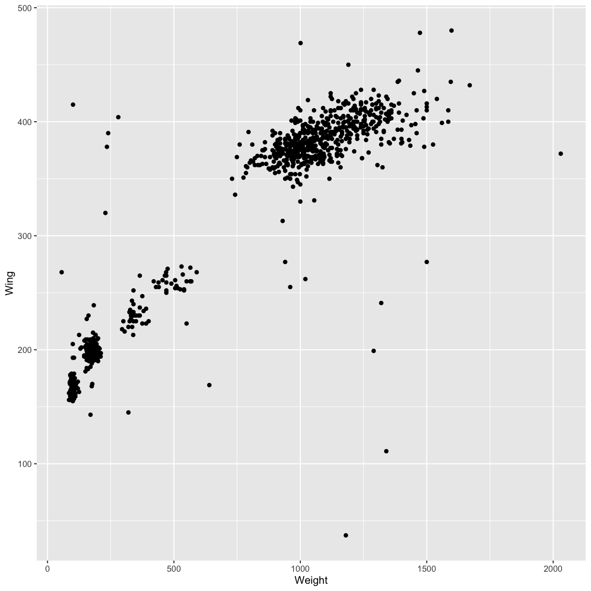

The `+` in the **`ggplot2`** package is particularly useful because it allows 
you to modify existing `ggplot` objects. This means you can easily set up plot
"templates" and conveniently explore different types of plots, so the above
plot can also be generated with code like this:


~~~
# Assign plot to a variable
weight_vs_wing_plot <- ggplot(data = hawks, mapping = aes(x = Weight, y = Wing))

# Draw the plot
weight_vs_wing_plot + 
  geom_point()
~~~
{: .language-r}


**Notes**

- Anything you put in the `ggplot()` function can be seen by any geom layers
  that you add (i.e. these are universal plot settings). This includes the x- 
  and y-axis you set up in `aes()`.
- You can also specify aesthetics for a given geom independently of the
  aesthetics defined globally in the `ggplot()` function.
- The `+` sign used to add layers must be placed at the end of each line 
  containing a layer. If, instead, the `+` sign is added in the line before the 
  other layer, **`ggplot2`** will not add the new layer and will return an error 
  message.


~~~
# This is the correct syntax for adding layers
weight_vs_wing_plot + 
  geom_point()

# This will not add the new layer and will return an error message
weight_vs_wing_plot
  + geom_point()
~~~
{: .language-r}

> ## Challenge 4.1
>
> Create a scatter plot with the culmen length (column `Culmen`) plotted against
> the tail length (column `Tail`).
>
>> ## Solution
>>
>> 
>> ~~~
>> ggplot(data = hawks, 
>>        mapping = aes(x = Culmen, y = Tail)) +
>>   geom_point()
>> ~~~
>> {: .language-r}
>> 
>> 
>> 
>> ~~~
>> Warning: Removed 7 rows containing missing values (`geom_point()`).
>> ~~~
>> {: .warning}
>> 
>> 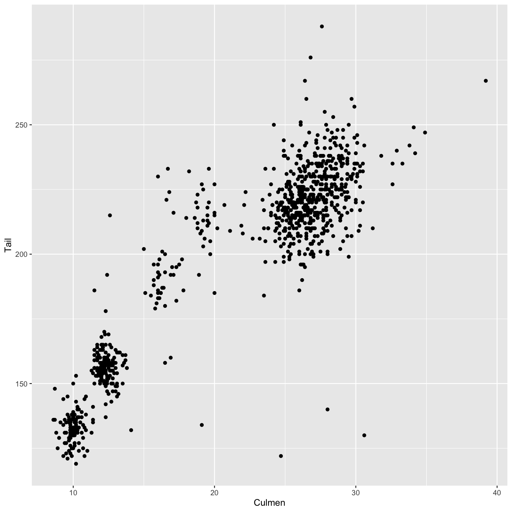
> {: .solution}
{: .challenge}

## Building your plots iteratively

Building plots with **`ggplot2`** is typically an iterative process. We start by
defining the dataset we'll use, lay out the axes, and choose a geom:


~~~
ggplot(data = hawks, mapping = aes(x = Weight, y = Wing)) +
  geom_point()
~~~
{: .language-r}


~~~
Warning: Removed 11 rows containing missing values (`geom_point()`).
~~~
{: .warning}


Then, we start modifying this plot to extract more information from it. For
instance, we can add transparency (`alpha`) to avoid overplotting:


~~~
ggplot(data = hawks, mapping = aes(x = Weight, y = Wing)) +
  geom_point(alpha = 0.5)
~~~
{: .language-r}


~~~
Warning: Removed 11 rows containing missing values (`geom_point()`).
~~~
{: .warning}

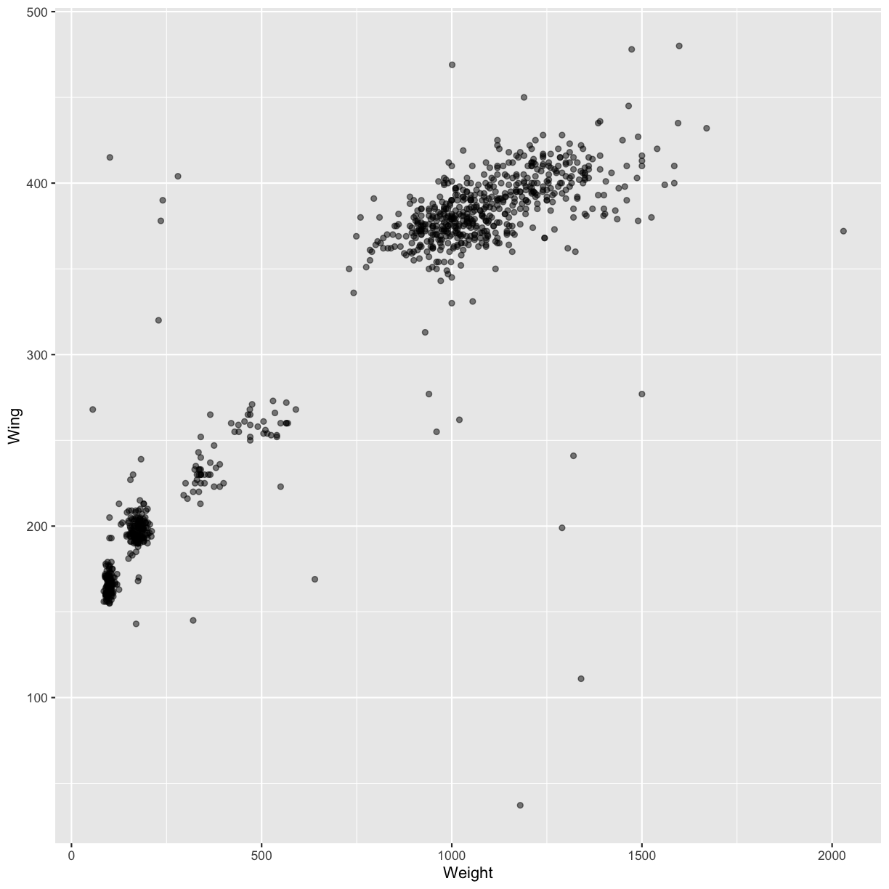

We can also add colors for all the points:


~~~
ggplot(data = hawks, mapping = aes(x = Weight, y = Wing)) +
    geom_point(alpha = 0.5, color = "blue")
~~~
{: .language-r}


~~~
Warning: Removed 11 rows containing missing values (`geom_point()`).
~~~
{: .warning}

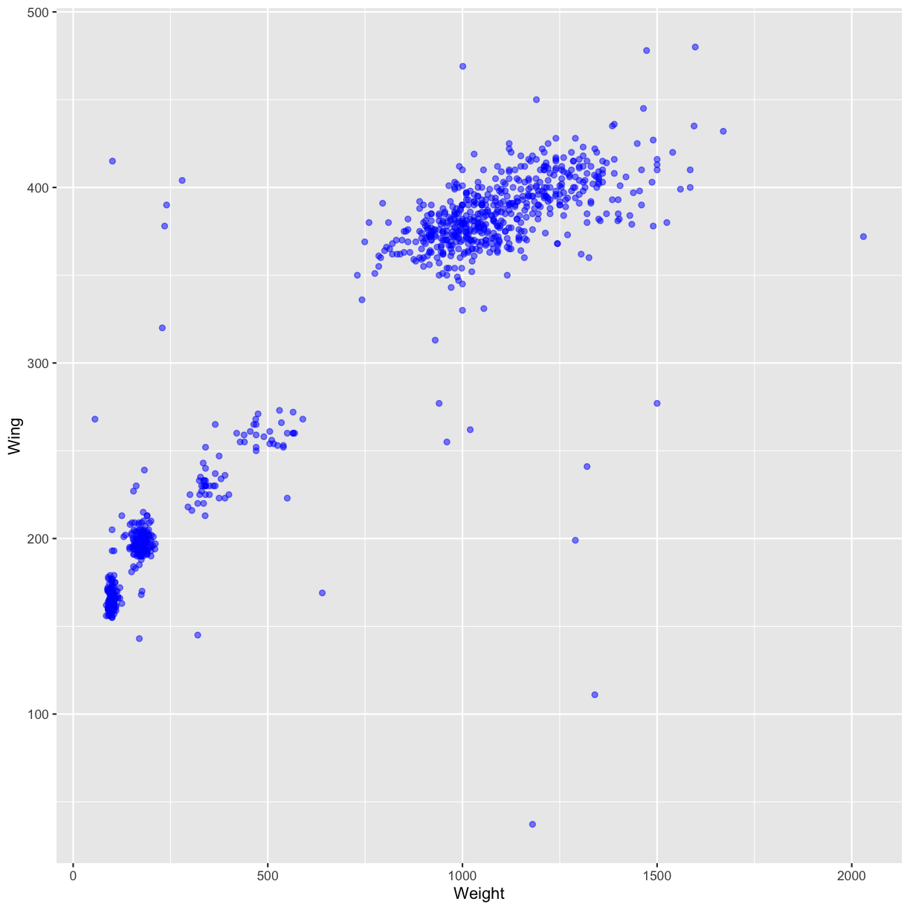

Or to color each point in the plot differently, you could use a vector as an
input to the argument **color**. **`ggplot2`** will provide a different color
corresponding to different values in the vector. Here is an example where we
color with `Species`:


~~~
ggplot(data = hawks, mapping = aes(x = Weight, y = Wing)) +
    geom_point(alpha = 0.5, aes(color = Species))
~~~
{: .language-r}


~~~
Warning: Removed 11 rows containing missing values (`geom_point()`).
~~~
{: .warning}

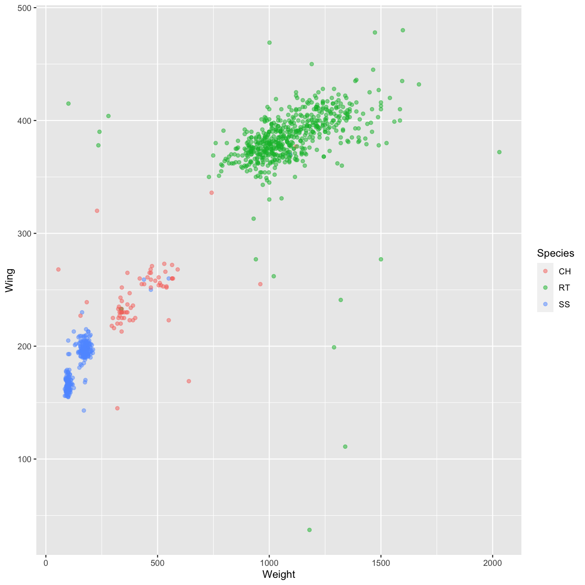

> ## Challenge 4.2
>
> Use what you just learned to create a scatter plot of the species
> (column `Species`) against the wing length (column `Wing`). Is this a good 
> way to show this type of data?
>
>> ## Solution
>>
>> 
>> ~~~
>> ggplot(data = hawks, 
>>        mapping = aes(x = Species, y = Wing)) +
>>   geom_point(aes(color = Species))
>> ~~~
>> {: .language-r}
>> 
>> 
>> 
>> ~~~
>> Warning: Removed 1 rows containing missing values (`geom_point()`).
>> ~~~
>> {: .warning}
>> 
>> 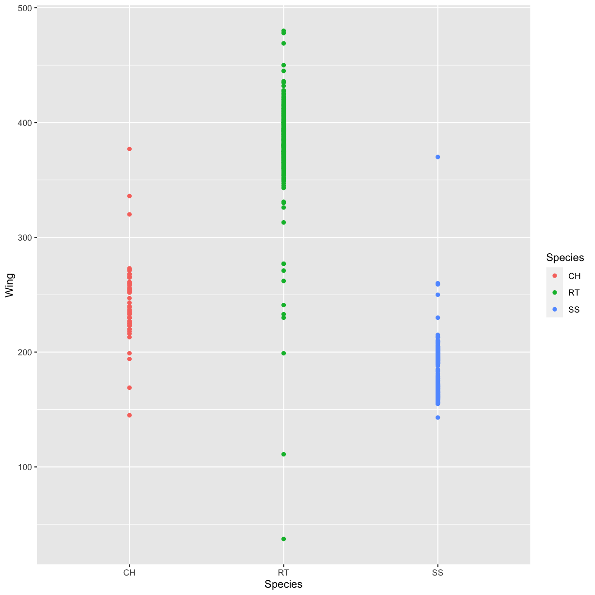
> {: .solution}
{: .challenge}

## Boxplot

Another useful way to visualize and compare distributions across groups is the
boxplot. Here we will first create a boxplot that visualizes the distribution of
wing lengths within each Species:


~~~
ggplot(data = hawks, mapping = aes(x = Species, y = Wing)) +
    geom_boxplot()
~~~
{: .language-r}


~~~
Warning: Removed 1 rows containing non-finite values (`stat_boxplot()`).
~~~
{: .warning}

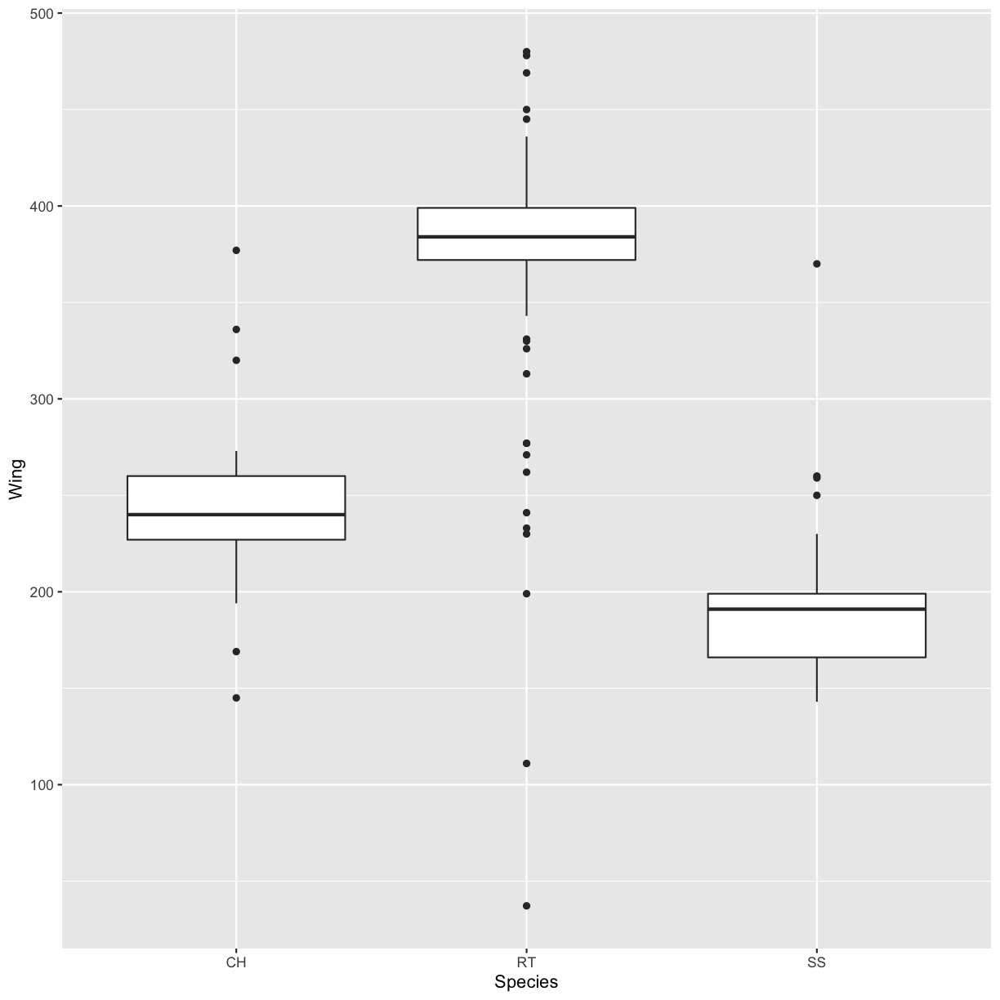

By adding points to the boxplot, we can have a better idea of the number of
counts and of their distribution:


~~~
ggplot(data = hawks, mapping = aes(x = Species, y = Wing)) +
    geom_boxplot(alpha = 0) +
    geom_jitter(alpha = 0.5, color = "tomato")
~~~
{: .language-r}


~~~
Warning: Removed 1 rows containing non-finite values (`stat_boxplot()`).
~~~
{: .warning}


~~~
Warning: Removed 1 rows containing missing values (`geom_point()`).
~~~
{: .warning}

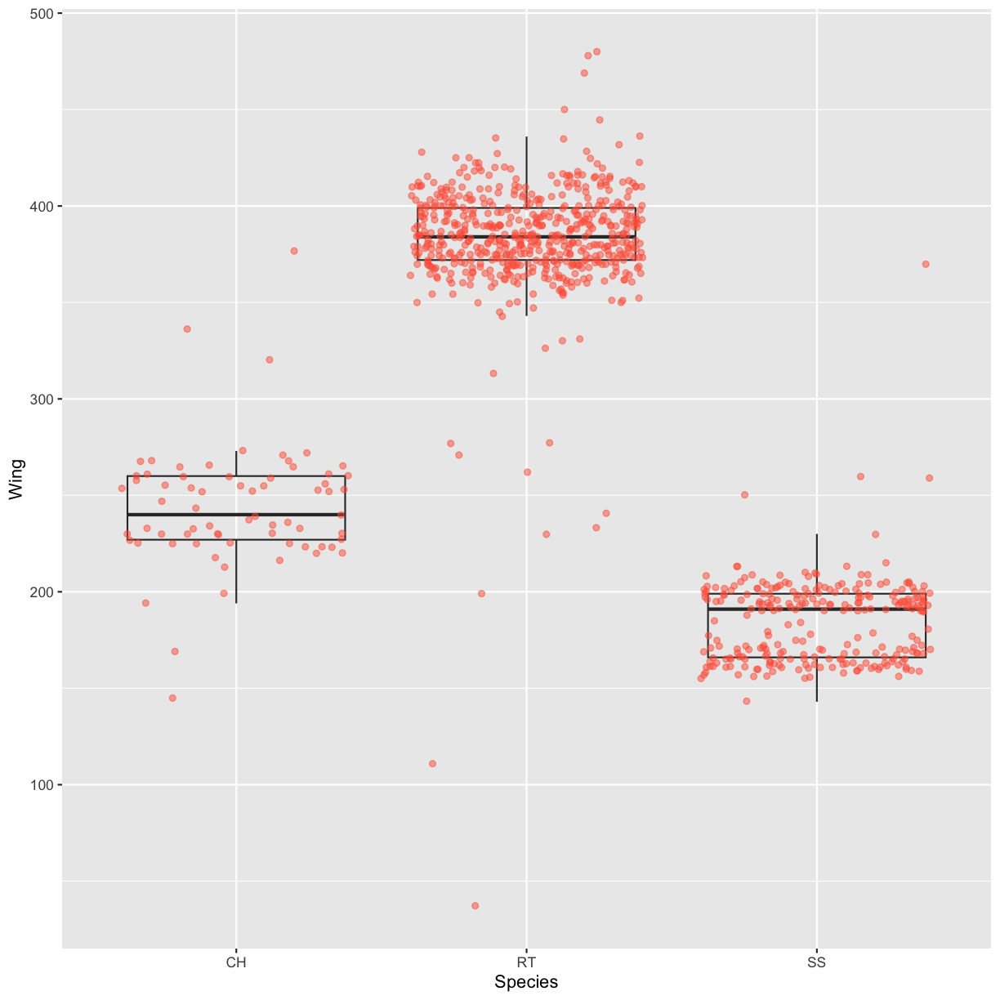

Notice how the boxplot layer is behind the jitter layer? What do you need to
change in the code to put the boxplot in front of the points such that it's not
hidden?

> ## Challenges 4.3
>
> Boxplots are useful summaries, but hide the *shape* of the distribution. For
> example, if there is a bimodal distribution, it would not be observed with a
> boxplot. An alternative to the boxplot is the violin plot (sometimes known as 
> a beanplot), where the shape (of the density of points) is drawn. Replace the
> box plot with a violin plot; see `geom_violin()`. Modify the code below to
> show a violin plot instead.
>
> 
> ~~~
> ggplot(data = hawks, mapping = aes(x = Species, y = Wing)) +
>     geom_boxplot(alpha = 0) +
>     geom_jitter(alpha = 0.5, color = "tomato")
> ~~~
> {: .language-r}
>
>> ## Solution
>>
>> 
>> ~~~
>> ggplot(data = hawks, mapping = aes(x = Species, y = Wing)) +
>>     geom_violin(alpha = 0) +
>>     geom_jitter(alpha = 0.5, color = "tomato")
>> ~~~
>> {: .language-r}
>> 
>> 
>> 
>> ~~~
>> Warning: Removed 1 rows containing non-finite values (`stat_ydensity()`).
>> ~~~
>> {: .warning}
>> 
>> 
>> 
>> ~~~
>> Warning: Removed 1 rows containing missing values (`geom_point()`).
>> ~~~
>> {: .warning}
>> 
>> 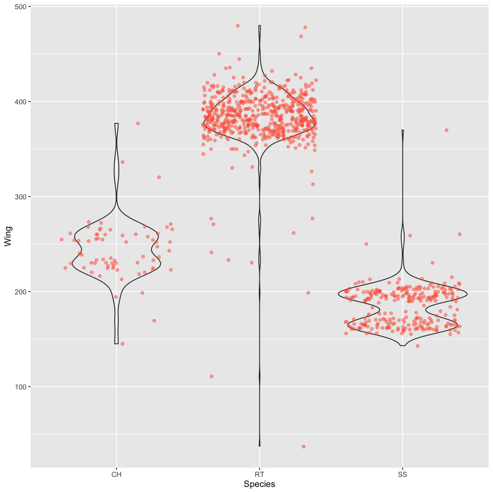
> {: .solution}
>
> In many types of data, it is important to consider the *scale* of the
> observations. For example, it may be worth changing the scale of the axis to
> better distribute the observations in the space of the plot. Changing the
> scale of the axes is done similarly to adding/modifying other components.
> 
> * Modify the code below so that weight is shown on a
>   log 10 scale; see `scale_x_log10()`.
>
> 
> ~~~
> ggplot(data = hawks, mapping = aes(x = Weight, y = Wing)) +
>     geom_point(alpha = 0)
> ~~~
> {: .language-r}
>
>> ## Solution
>>
>> 
>> ~~~
>> ggplot(data = hawks, mapping = aes(x = Weight, y = Wing)) +
>>   geom_point() +
>>   scale_x_log10()
>> ~~~
>> {: .language-r}
>> 
>> 
>> 
>> ~~~
>> Warning: Removed 11 rows containing missing values (`geom_point()`).
>> ~~~
>> {: .warning}
>> 
>> 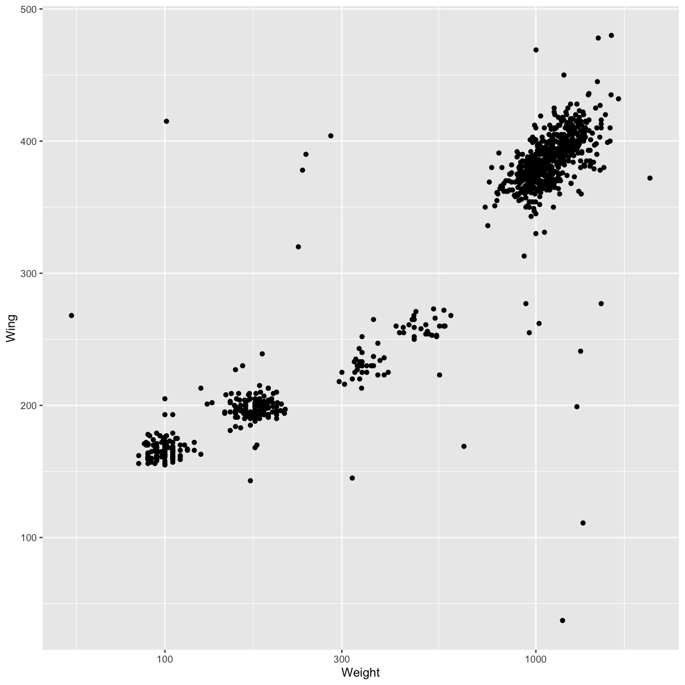
> {: .solution}
>
> * Add color to the data points on your plot according to the Species.
>
>> ## Solution
>>
>> 
>> ~~~
>> ggplot(data = hawks, mapping = aes(x = Weight, y = Wing)) +
>>   geom_point(aes(color = Species)) +
>>   scale_x_log10()
>> ~~~
>> {: .language-r}
>> 
>> 
>> 
>> ~~~
>> Warning: Removed 11 rows containing missing values (`geom_point()`).
>> ~~~
>> {: .warning}
>> 
>> 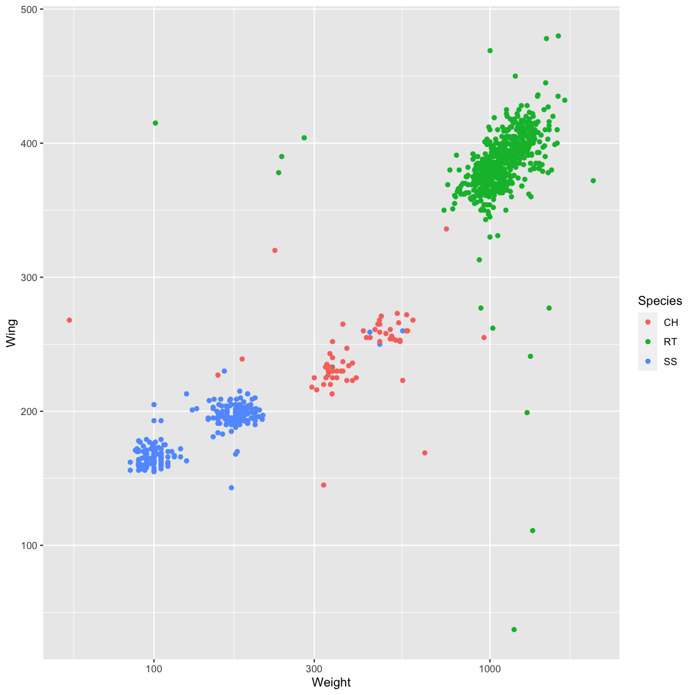
> {: .solution}
{: .challenge}

## Barplot

Another common type of plot is the barplot. This kind of plot can be created 
with `geom_bar()`. In order to create a barplot, we will first prepare a
suitable dataset:


~~~
sex_counts <- hawks %>% count(Sex)
sex_counts
~~~
{: .language-r}


~~~
# A tibble: 3 × 2
  Sex       n
  <chr> <int>
1 F       174
2 M       158
3 <NA>    576
~~~
{: .output}

Let's then create a barplot from the tiny dataset that we just created:


~~~
ggplot(sex_counts, aes(x = Sex, y = n)) +
  geom_bar(stat = "identity")
~~~
{: .language-r}

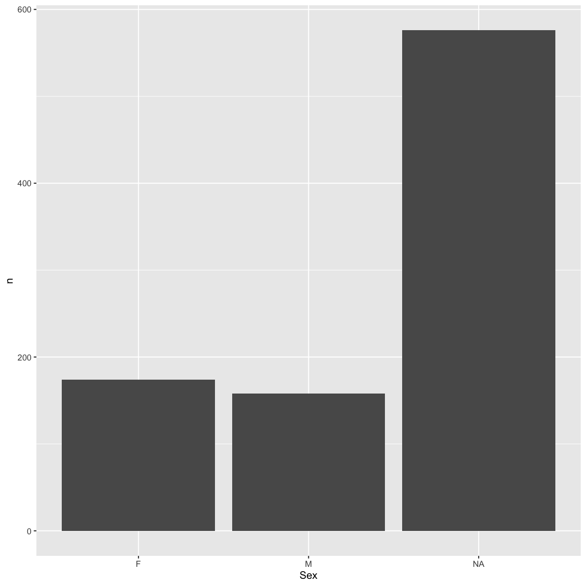

In the code above, we used the argument `stat = "identity"` instead of the
default value `bin`. This means that the height of the bar will be represented
by the count in each category.

We can improve the plot by using different fill colors for the sexes:


~~~
ggplot(sex_counts, aes(x = Sex, y = n, fill = Sex)) +
  geom_bar(stat = "identity")
~~~
{: .language-r}

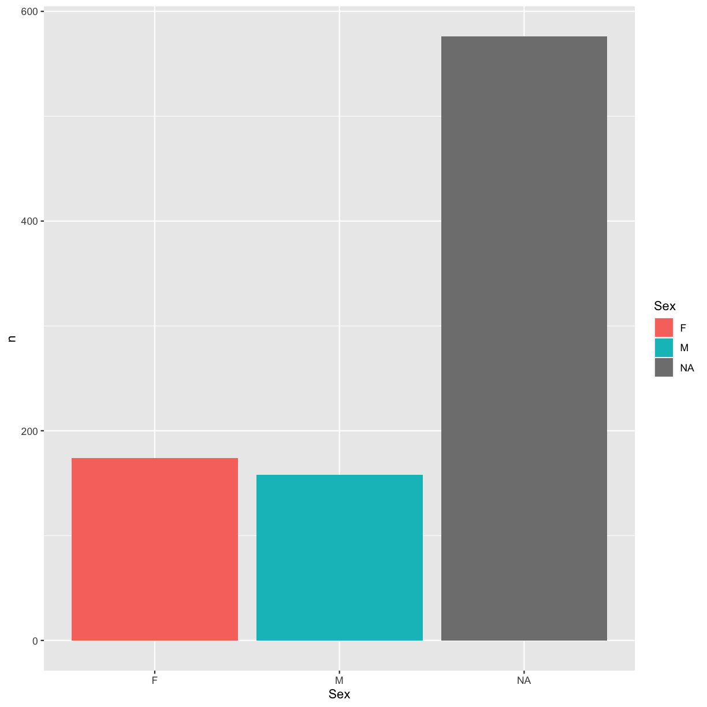

We could also have added this configuration to the `geom_bar()` layer instead:


~~~
ggplot(sex_counts, aes(x = Sex, y = n)) +
  geom_bar(stat = "identity", aes(fill = Sex))
~~~
{: .language-r}


## Plotting time series data

Let’s calculate number of counts per year for the Cooper's and Sharp-shinned hawks.
First we need to group the data and count records within each group.


~~~
yearly_sp_counts <- hawks %>%
  filter(Species  == "CH" | Species == "SS") %>% 
  count(Year, Species)
~~~
{: .language-r}

Timelapse data can be visualized as a line plot with years on the x-axis and 
counts on the y-axis:


~~~
ggplot(data = yearly_sp_counts, aes(x = Year, y = n)) +
  geom_line()
~~~
{: .language-r}


Unfortunately, this does not work because we plotted data for both the species 
together. We need to tell ggplot to draw a line for each species by modifying the 
aesthetic function to include group = Species:


~~~
ggplot(data = yearly_sp_counts, aes(x = Year, y = n, group = Species)) +
  geom_line()
~~~
{: .language-r}

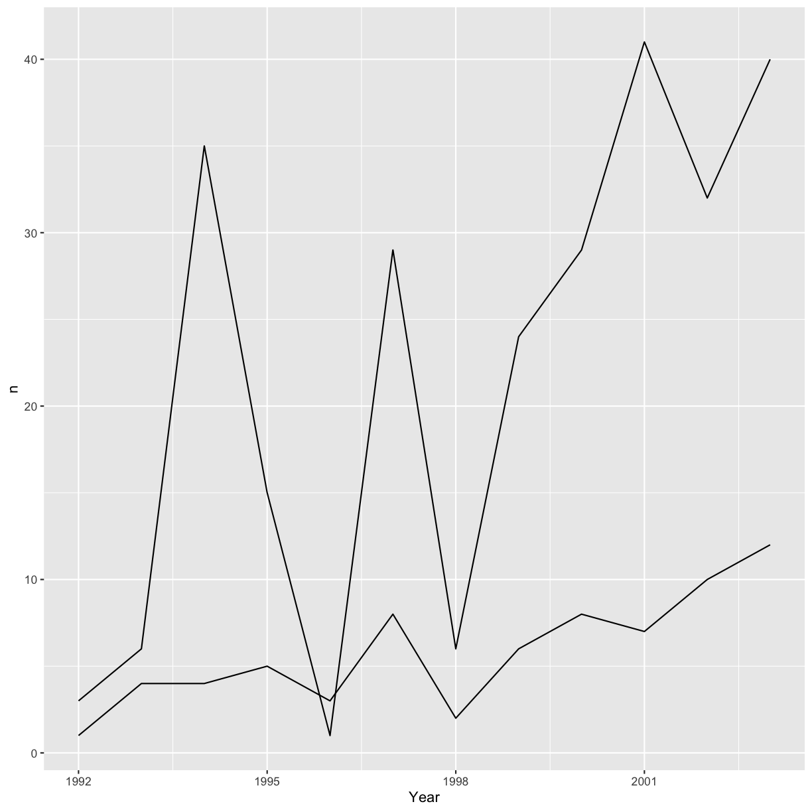

We will be able to distinguish the species in the plot if we add colors (using 
`color` also automatically groups the data):


~~~
ggplot(data = yearly_sp_counts, aes(x = Year, y = n, color = Species)) +
  geom_line()
~~~
{: .language-r}


## Integrating the pipe operator with ggplot2

In the previous lesson, we saw how to use the pipe operator `%>%` to use
different functions in a sequence and create a coherent workflow.
We can also use the pipe operator to pass the `data` argument to the
`ggplot()` function. The hard part is to remember that to build your ggplot,
you need to use `+` and not `%>%`.


~~~
yearly_sp_counts %>% ggplot(aes(x = Year, y = n, color = Species)) +
  geom_line()
~~~
{: .language-r}

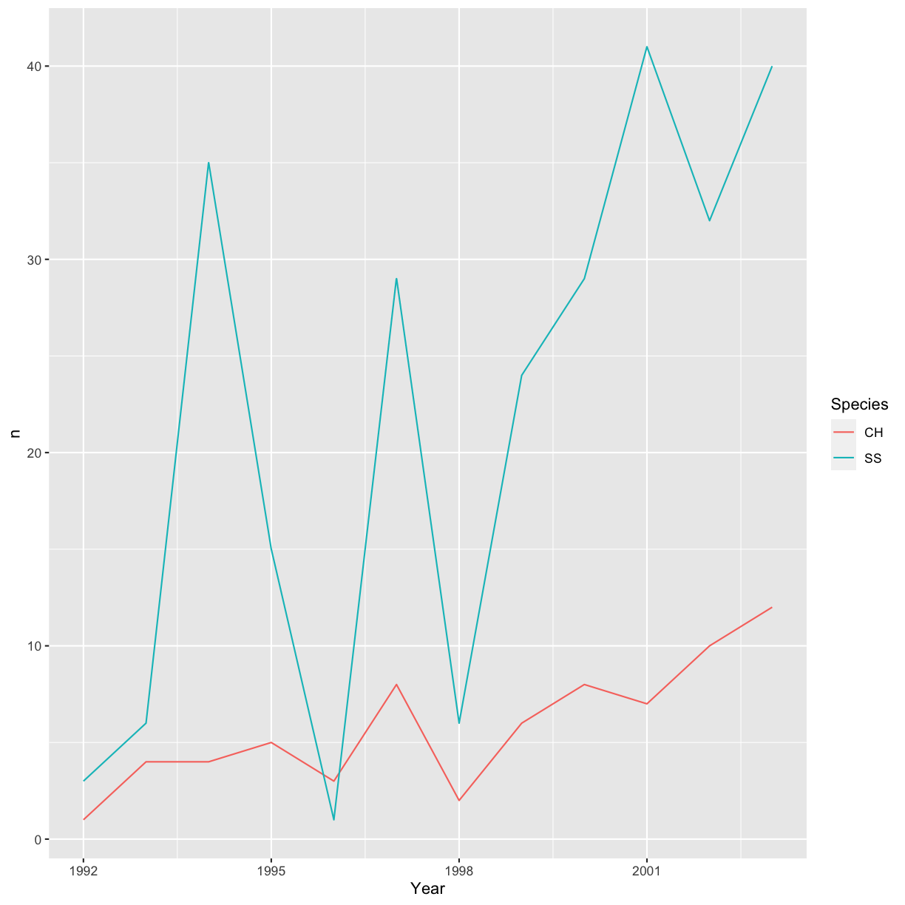

The pipe operator can also be used to link data manipulation with consequent
data visualization.


~~~
yearly_sp_plot <- hawks %>%
  filter(Species  == "CH" | Species == "SS") %>% 
  count(Year, Species) %>%
  ggplot(aes(x = Year, y = n, color = Species)) +
  geom_line()

yearly_sp_plot
~~~
{: .language-r}


## Faceting

`ggplot` has a special technique called *faceting* that allows the user to split 
one plot into multiple plots based on a factor included in the dataset. We will 
use it to make one lineplot for each of the species:


~~~
ggplot(data = yearly_sp_counts, aes(x = Year, y = n)) +
    geom_line() +
  facet_wrap(facets = vars(Species))
~~~
{: .language-r}

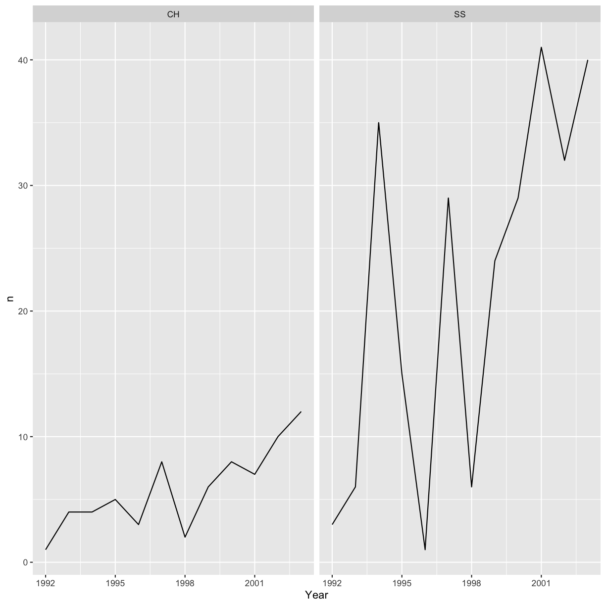
Now we would like to split the line in each plot by the sex of each individual 
measured. To do that we need to make counts in the data frame grouped by `Year`, 
`Species`, and `Sex`. We will also drop rows with `NA` in any of these three columns.


~~~
yearly_sp_sex_counts <- hawks %>%
  filter(Species  == "CH" | Species == "SS") %>% 
  drop_na(Year, Species, Sex) %>% 
  count(Year, Species, Sex)
~~~
{: .language-r}

We can now make the faceted plot by splitting further by sex using `color` 
(within a single plot):


~~~
ggplot(data = yearly_sp_sex_counts, aes(x = Year, y = n, color = Sex)) +
    geom_line() +
  facet_wrap(facets = vars(Species))
~~~
{: .language-r}

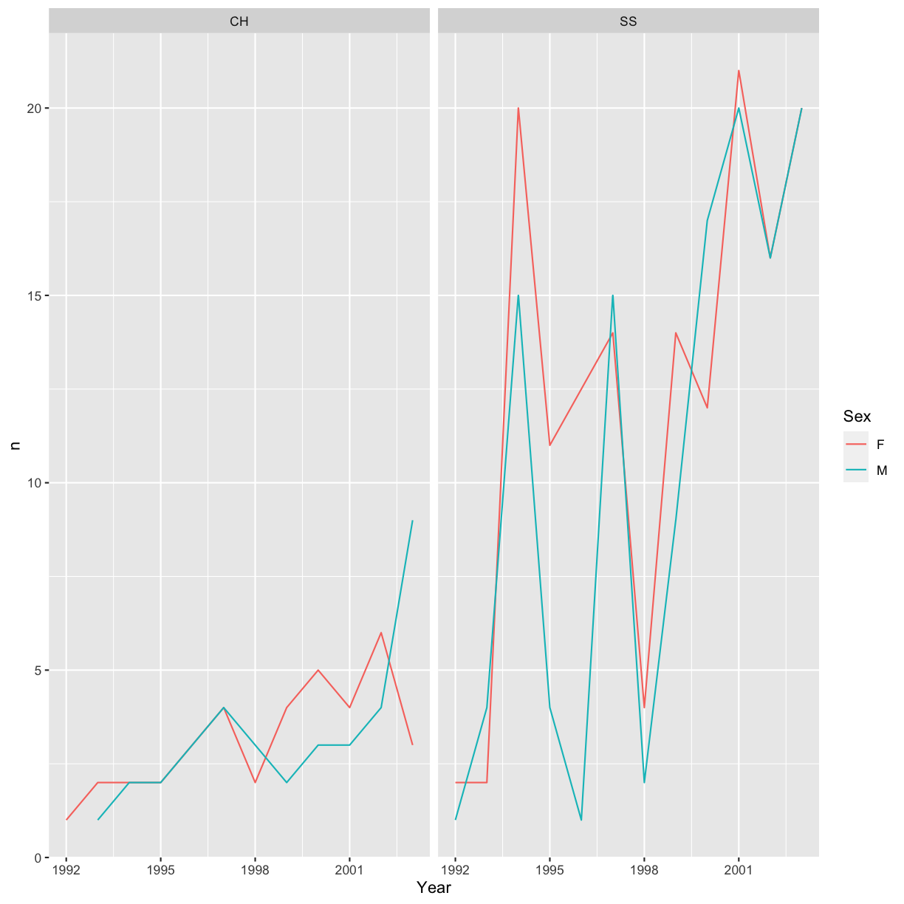


It is also possible to create more advanced layouts using the `facet_grid()`
function. We can for example facet both by species and sex:


~~~
ggplot(data = yearly_sp_sex_counts, aes(x = Year, y = n, color = Sex, group = Sex)) +
    geom_line() +
  facet_grid(rows = vars(Sex), cols = vars(Species))
~~~
{: .language-r}

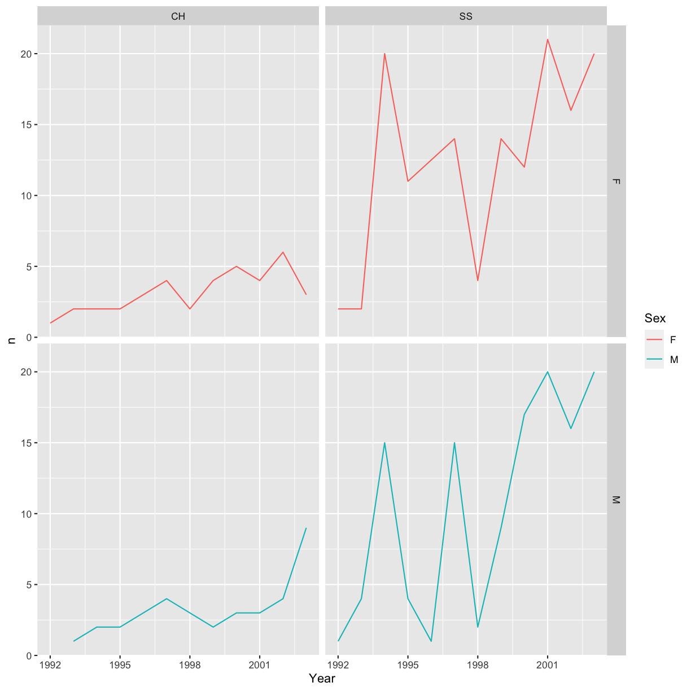

You can also organise the panels only by rows (or only by columns):


~~~
# One row, facet by column
ggplot(data = yearly_sp_sex_counts, aes(x = Year, y = n, color = Sex)) +
    geom_line() +
    facet_grid(rows = vars(Species))
~~~
{: .language-r}

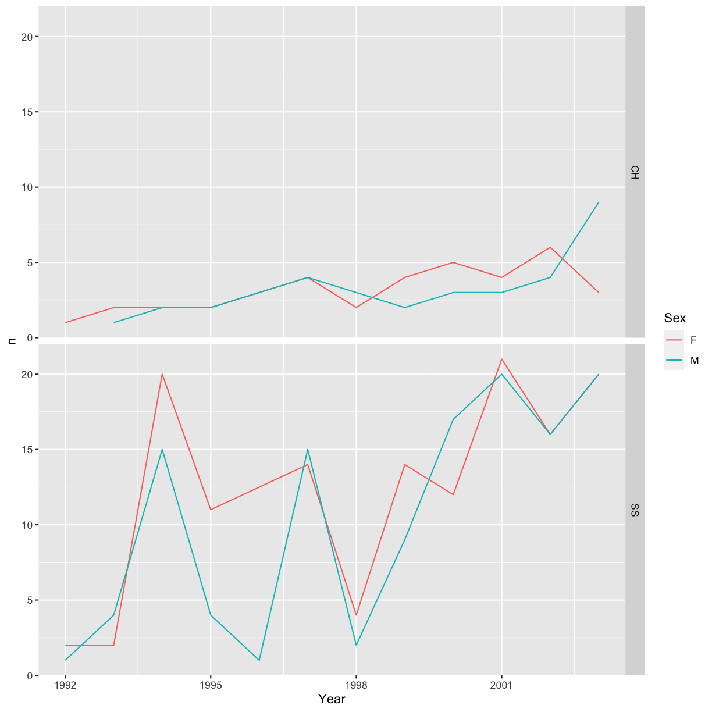

>> ## Note 
>> `ggplot2` before version 3.0.0 used formulas to specify how plots are faceted.
>> If you encounter `facet_grid`/`wrap(...)` code containing `~`, please read
>> <https://ggplot2.tidyverse.org/news/#ggplot2-300>.
{: .callout}

## **`ggplot2`** themes

Usually plots with white background look more readable when printed. Every
single component of a `ggplot` graph can be customized using the generic
`theme()` function, as we will see below. However, there are pre-loaded themes 
available that change the overall appearance of the graph without much effort. 

For example, we can change our previous graph to have a simpler white background 
using the `theme_bw()` function:


~~~
ggplot(data = yearly_sp_sex_counts, aes(x = Year, y = n, color = Sex)) +
    geom_line() +
    facet_wrap(facets = vars(Species)) +
    theme_bw()
~~~
{: .language-r}

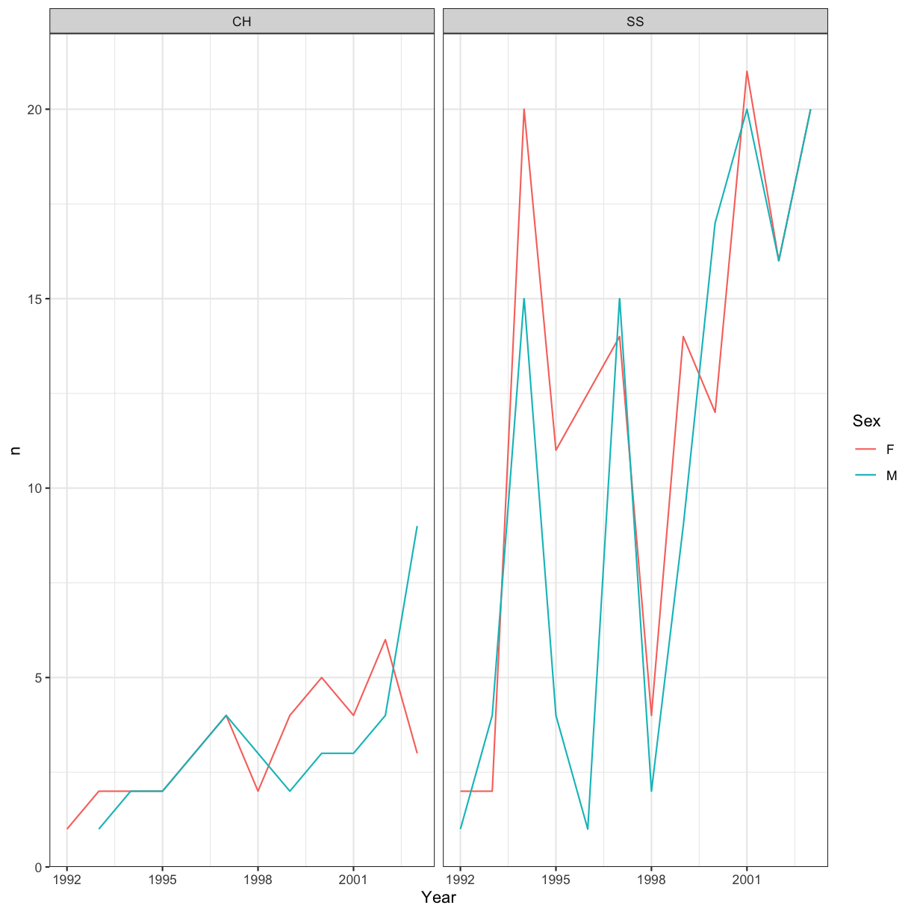

In addition to `theme_bw()`, which changes the plot background to white,
**`ggplot2`** comes with several other themes which can be useful to quickly
change the look of your visualization. The complete list of themes is available
at <https://ggplot2.tidyverse.org/reference/ggtheme.html>. `theme_minimal()` and
`theme_light()` are popular, and `theme_void()` can be useful as a starting
point to create a new hand-crafted theme.

The [ggthemes](https://jrnold.github.io/ggthemes/reference/index.html) package
provides a wide variety of options.

> ## Challenge 4.4
>
> Use what you just learned to create a plot that depicts how the average weight
> of each species changes through the years.
>
>> ## Solution
>> 
>> 
>> ~~~
>> yearly_weight <- hawks %>% 
>>   group_by(Species, Year) %>%
>>   summarize(average_weight = mean(Weight, na.rm = TRUE))
>> 
>> ggplot(data = yearly_weight, aes(x=Year, y = average_weight)) + 
>>   geom_line() + facet_wrap(vars(Species))
>> ~~~
>> {: .language-r}
>> 
>> 
> {: .solution}
{: .challenge}


## Customization

Take a look at the [**`ggplot2`** cheat sheet](https://github.com/rstudio/cheatsheets/blob/master/data-visualization-2.1.pdf), and
think of ways you could improve the plot.

Now, let's start with changing the names of axes and add a title to the figure:


~~~
ggplot(data = yearly_sp_sex_counts, aes(x = Year, y = n, color = Sex)) +
  geom_line() +
  facet_wrap(vars(Species)) +
  labs(title = "Captured individuals through time",
     x = "Year of capture",
     y = "Number of individuals") +
  theme_bw()
~~~
{: .language-r}

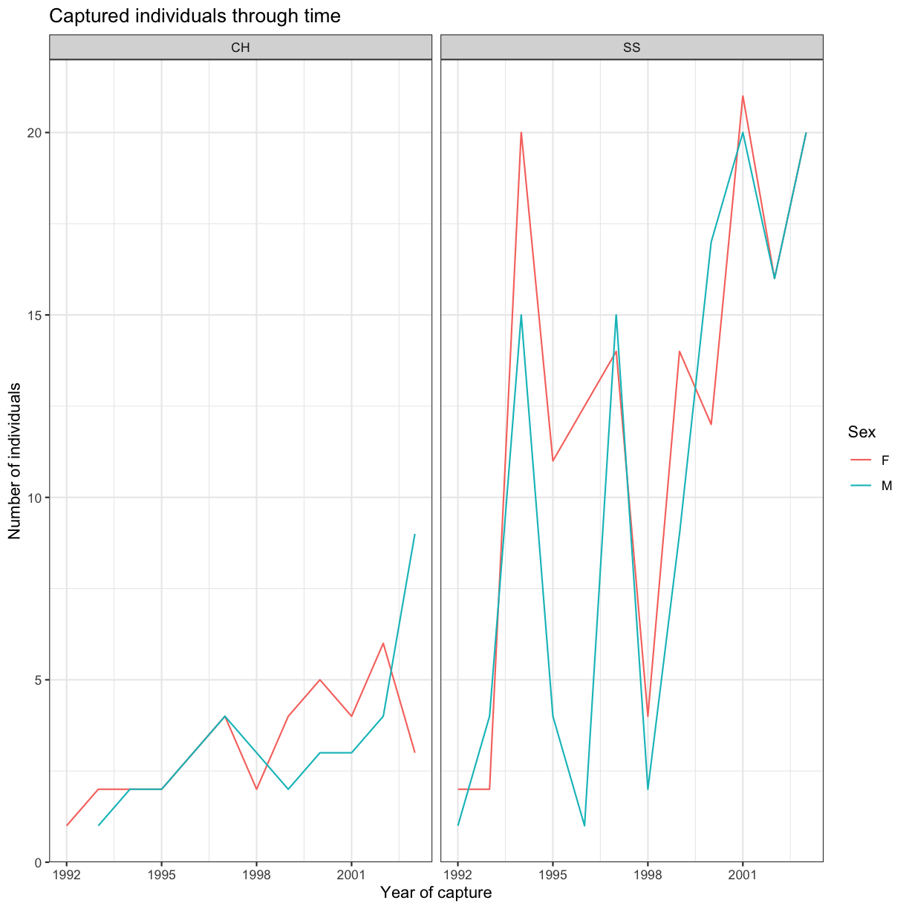

The axes have more informative names, but their readability can be improved by
increasing the font size. This can be done with the generic `theme()` function:


~~~
ggplot(data = yearly_sp_sex_counts, aes(x = Year, y = n, color = Sex)) +
  geom_line() +
  facet_wrap(vars(Species)) +
  labs(title = "Captured individuals through time",
     x = "Year of capture",
     y = "Number of individuals") +
  theme_bw() +
  theme(text = element_text(size = 16))  # set the font size of text elements
~~~
{: .language-r}

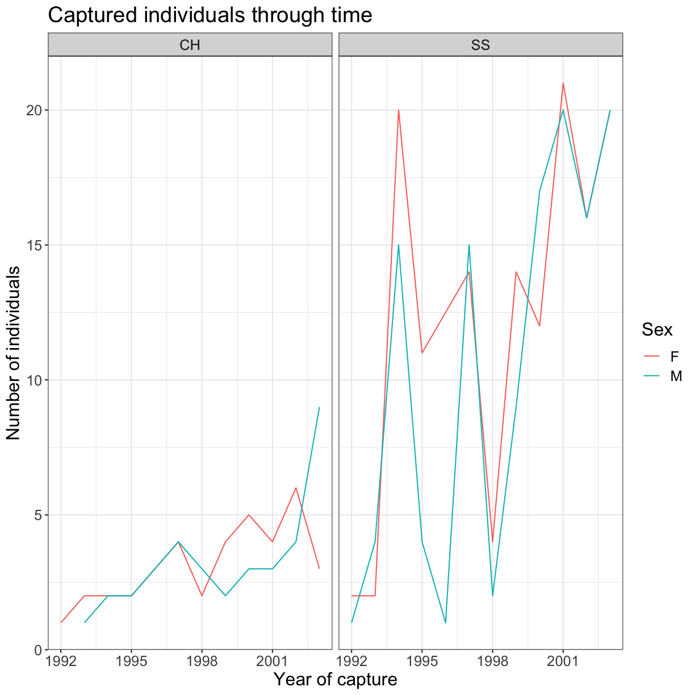

To alter the species and sex labels, we create factors and modify the levels:


~~~
yearly_sp_sex_counts <- yearly_sp_sex_counts %>% mutate(
  Species = factor(Species),
  Sex = factor(Sex)
)

levels(yearly_sp_sex_counts$Species)[1:2] = c("Cooper's hawk", "Sharp-shinned hawk")
levels(yearly_sp_sex_counts$Sex)[1:2] = c("Female", "Male")
~~~
{: .language-r}

Now, run the code to generate the plots once again:


~~~
ggplot(data = yearly_sp_sex_counts, aes(x = Year, y = n, color = Sex)) +
  geom_line() +
  facet_wrap(vars(Species)) +
  labs(
    title = "Captured individuals through time",
     x = "Year of capture",
     y = "Number of individuals") +
  theme_bw() +
  theme(text = element_text(size = 16))
~~~
{: .language-r}

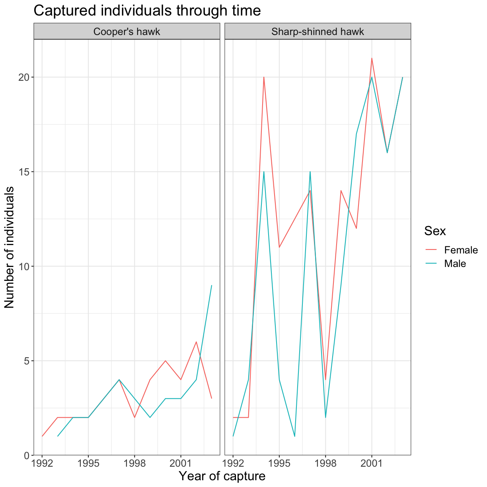

Note that it is also possible to change the fonts of your plots. If you are on
Windows, you may have to install the [**`extrafont`** package](https://github.com/wch/extrafont),
and follow the instructions included in the README for this package.

> ## Challenge 4.5
>
> With all of this information in hand, please take another five minutes to either
> improve one of the plots generated in this exercise or create a beautiful graph
> of your own. Use the RStudio [**`ggplot2`** cheat sheet](https://github.com/rstudio/cheatsheets/blob/master/data-visualization-2.1.pdf) 
> for inspiration.
>
> Here are some ideas:
>
> * See if you can change the thickness of the lines.
> * Can you find a way to change the name of the legend?
> * Try using a different color palette (see
>   [http://www.cookbook-r.com/Graphs/Colors_(ggplot2)/](http://www.cookbook-r.com/Graphs/Colors_(ggplot2)/)).
{: .challenge}

## Arranging plots

Faceting is a great tool for splitting one plot into multiple plots, but 
sometimes you may want to produce a single figure that contains multiple plots
using different variables or even different data frames. We won't go into 
it here, but the * **`patchwork`** package can be used to combine separate 
gplots into a single figure while keeping everything aligned properly. Like most
R packages, `patchwork` can be installed from CRAN, the R package repository.

## Exporting plots

After creating your plot, you can save it to a file in your favorite format. The
Export tab in the **Plot** pane in RStudio will save your plots at low 
resolution, which will not be accepted by many journals and will not scale well 
for posters. The [**`ggplot2`** extensions website](https://exts.ggplot2.tidyverse.org/)
provides a list of packages that extend the capabilities of **`ggplot2`**,
including additional themes.

Instead, use the `ggsave()` function, which allows you easily change the 
dimension and resolution of your plot by adjusting the appropriate arguments 
(`width`, `height` and `dpi`):


~~~
year_plot <- ggplot(data = yearly_sp_sex_counts, aes(x = Year, y = n, color = Sex)) +
  geom_line() +
  facet_wrap(vars(Species)) +
  labs(
    title = "Captured individuals through time",
     x = "Year of capture",
     y = "Number of individuals") +
  theme_bw() +
  theme(text = element_text(size = 16))
  
# Save the file to a subfolder named "figs"
ggsave("figs/year_plot.png", year_plot, width = 15, height = 10)
~~~
{: .language-r}
