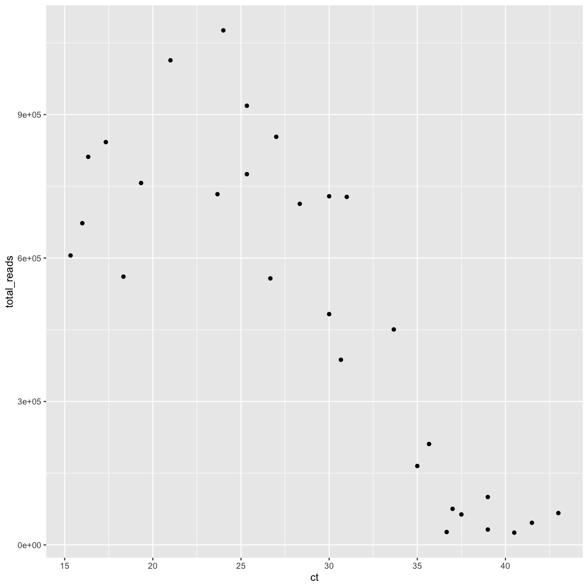
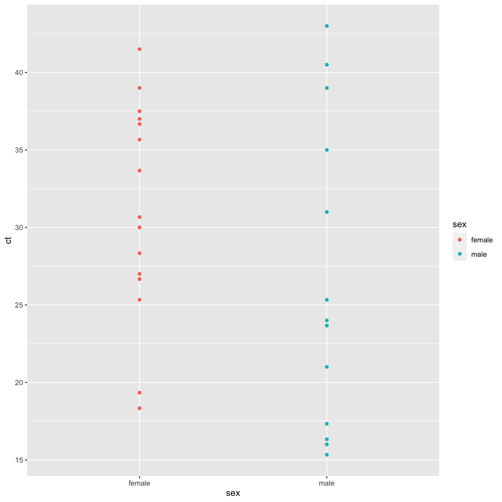
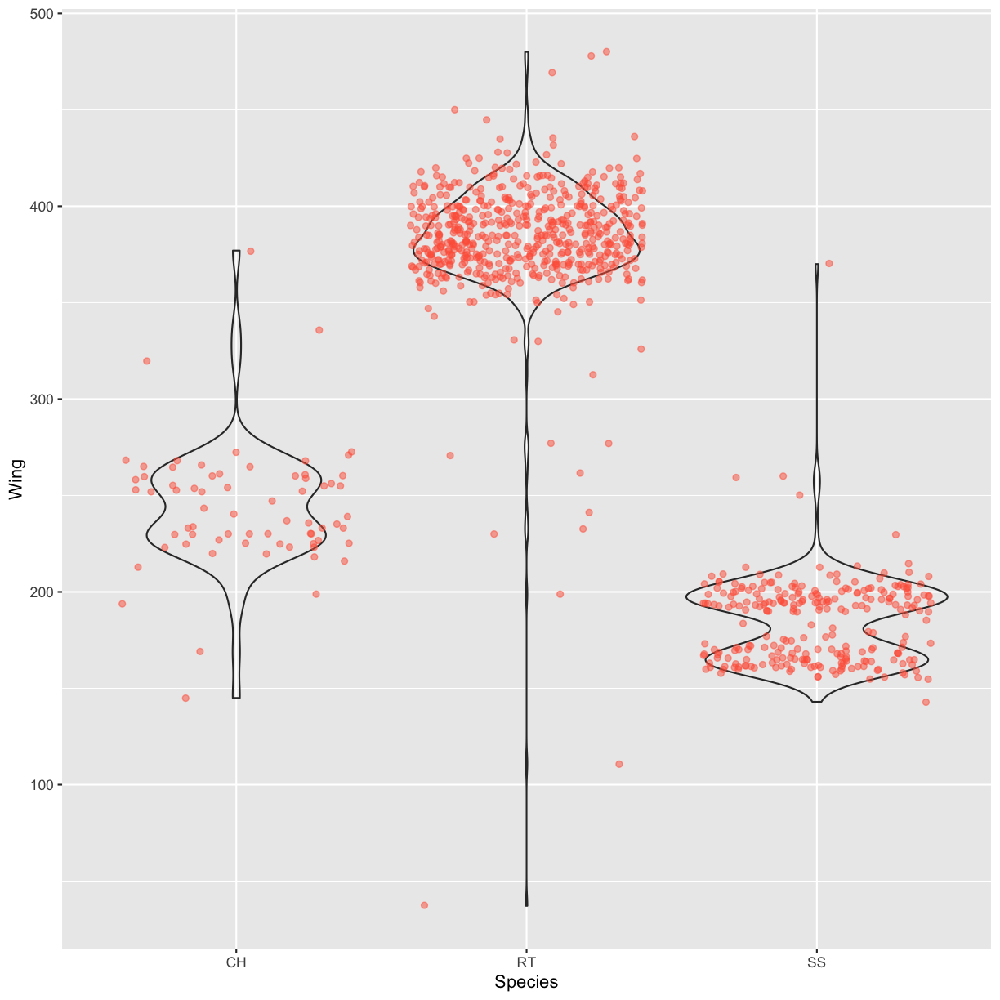
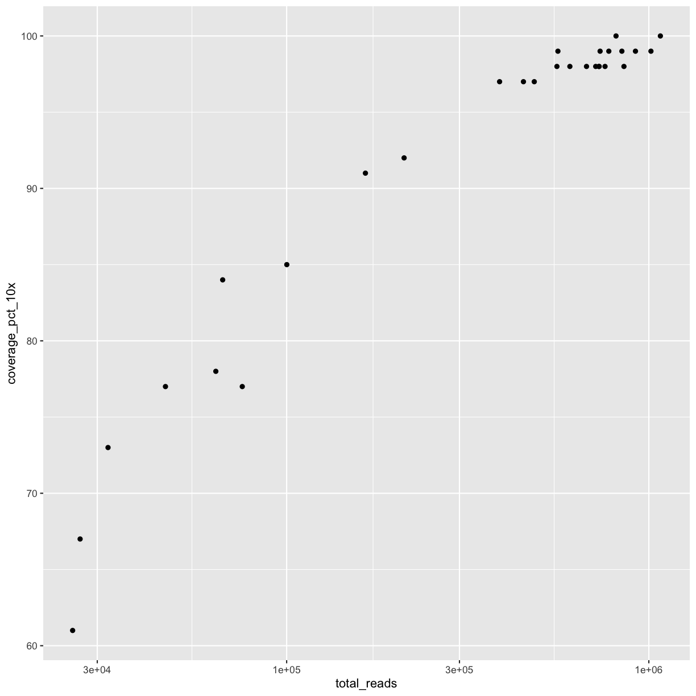

---
# Please do not edit this file directly; it is auto generated.
# Instead, please edit 05-data-visualization.md in _episodes_rmd/
title: "Data Visualization with ggplot2"
teaching: 45
exercises: 30
questions:
- "How can I create simple plots with ggplot?"
- "What is faceting in ggplot?"
- "How can I change the aestetics (e.g. axis labels and color) of a plot?"
objectives:
- "Produce scatter plots, boxplots, and barplots using ggplot."
- "Set universal plot settings."
- "Describe what faceting is and apply faceting in ggplot."
- "Modify the aesthetics of an existing ggplot plot (including axis labels and color)."
- "Build complex and customized plots from data in a data frame."
keypoints:
- "ggplot2 is powerful data visualization package in R."
- "ggplot2 lets the user add, remove or change components of a plot."
- "Plots created with ggplot2 can be customized in many ways, which make the package very useful."
source: Rmd
---

## Getting ready for plotting


We start by loading the required packages. **`ggplot2`** is included in
the **`tidyverse`** package.


~~~
library(tidyverse)
~~~
{: .language-r}

If not still in the workspace, load the samples dataset used in the previous
episode.


~~~
samples <- read_csv("data_raw/covid_samples.csv")
~~~
{: .language-r}


Like previously, we turn the `disease_outcome` and `sex` columns into factors:


~~~
samples$disease_outcome <- factor(samples$disease_outcome)
samples$sex <- factor(samples$sex)
~~~
{: .language-r}

## Loading the sequencing data

To make plotting a bit more interesting, we will in this episode also make use
of the COVseq-MiSeq dataset mentioned in episode 3. This dataset contains
results from the sequencing of the SARS-CoV-2 samples using the COVseq method on
a MiSeq instrument from Illumina. We will first load the sequencing data into a
dataframe, and then combine that data frame with the `samples` data frame.

<a title="Konrad Förstner, CC0, via Wikimedia Commons" href="https://commons.wikimedia.org/wiki/File:Illumina_MiSeq_sequencer.jpg"></a>

A MiSeq instrument from Illumina.

The sequencing dataset has the following columns:

| Column              | Description
|---------------------|-------------------------------------------------------------|
| alias               | code for the sequencing run                                 | 
| patient_id          | code for the sampled individual                             |
| instrument_model    | instrument model                                            |
| library_name        | library preparation method                                  |
| total_reads         | total number of sequence reads                              |
| mapped_reads        | number of reads mapped against the SARS-CoV-2 virus         |
| mapped_reads_pct    | per cent reads mapped against the SARS-CoV-2 virus          |
| coverage_median     | median sequencing coverage (depth) of the mapped reads      |
| coverage_pct_1x     | per cent with 1x or more sequencing coverage                |
| coverage_pct_10x    | per cent with 10x or more sequencing coverage               |
| snps                | number of identified SNPs (single-nucleotide polymorphisms) |
| pangolin_lineage    | PANGO lineage, epidemiological lineage of SARS-CoV-2        |
| nextclade_clade     | Phylogenetic placement according to Nextclade               |


Let's read the data into a new data frame named `sequencing`:


~~~
sequencing <- read_csv("data_raw/covseq_miseq.csv")
~~~
{: .language-r}


Now that we have created the data frame, we are going to transform two of the
columns into factors:


~~~
sequencing$pangolin_lineage <- factor(sequencing$pangolin_lineage)
sequencing$nextclade_clade <- factor(sequencing$nextclade_clade)
~~~
{: .language-r}

## Joining the sequencing and samples data

We now have two separate, but obviously related data frames. Both the `samples`
and `sequencing` data frames have rows that correspond to the 29 SARS-CoV-2
samples. They both also have and a column named `patient_id` that uniquely
identifies each sample. By joining the two data frames based on the patient ID,
we can ensure that each row in the `sequencing` data frame is paired with the
correct row in the `samples` data frame. 

Joining two related datasets based on shared variables is fairly common in data
analysis workflows. We will use the `dplyr` function `inner_join()` to
accommodate this in R:


~~~
covseq <- sequencing %>%
  inner_join(samples, by = "patient_id")
~~~
{: .language-r}

> ### Note
> `dplyr` offers 4 "mutating joins" functions for different situations:
> `inner_join()`, `left_join()`, `right_join()` and `full_join`. You can read
> more about the functions in R:s built-in help and [here](https://rpubs.com/williamsurles/293454).
{: .callout}

We should now have a data frame named `covseq` with 29 rows and all the columns
from the `sequencing` and `samples` data frames. We can check this with the
`str()` function:


~~~
str(covseq)
~~~
{: .language-r}


~~~
spec_tbl_df [29 × 20] (S3: spec_tbl_df/tbl_df/tbl/data.frame)
 $ alias           : chr [1:29] "PE300_COVseq_OAS-1" "PE300_COVseq_OAS-10" "PE300_COVseq_OAS-11" "PE300_COVseq_OAS-12" ...
 $ patient_id      : chr [1:29] "OAS-29_1" "OAS-29_10" "OAS-29_11" "OAS-29_12" ...
 $ instrument_model: chr [1:29] "Illumina MiSeq" "Illumina MiSeq" "Illumina MiSeq" "Illumina MiSeq" ...
 $ library_name    : chr [1:29] "COVseq" "COVseq" "COVseq" "COVseq" ...
 $ total_reads     : num [1:29] 46280 605294 918492 853598 775350 ...
 $ mapped_reads    : num [1:29] 46260 605266 918430 853536 775298 ...
 $ mapped_reads_pct: num [1:29] 100 100 100 100 100 ...
 $ coverage_median : num [1:29] 22 1211 1530 1514 1567 ...
 $ coverage_pct_1x : num [1:29] 96 100 100 100 100 100 99 95 98 100 ...
 $ coverage_pct_10x: num [1:29] 77 98 99 98 99 98 97 73 92 98 ...
 $ snps            : num [1:29] 14 15 6 17 16 14 18 16 15 15 ...
 $ pangolin_lineage: Factor w/ 3 levels "B.1","B.1.1.1",..: 2 2 3 2 2 2 2 1 3 2 ...
 $ nextclade_clade : Factor w/ 2 levels "20A","20D": 2 2 1 2 2 2 2 1 1 2 ...
 $ collection_date : Date[1:29], format: "2020-03-31" "2020-03-31" ...
 $ country         : chr [1:29] "Italy" "Italy" "Italy" "Italy" ...
 $ region          : chr [1:29] "Turin" "Turin" "Turin" "Turin" ...
 $ age             : num [1:29] 48 35 59 60 83 21 44 55 81 63 ...
 $ disease_outcome : Factor w/ 2 levels "dead","recovered": 1 NA 2 2 1 1 2 2 1 2 ...
 $ sex             : Factor w/ 2 levels "female","male": 1 2 2 1 1 2 1 2 1 1 ...
 $ ct              : num [1:29] 41.5 15.3 25.3 27 25.3 ...
 - attr(*, "spec")=
  .. cols(
  ..   alias = col_character(),
  ..   patient_id = col_character(),
  ..   instrument_model = col_character(),
  ..   library_name = col_character(),
  ..   total_reads = col_double(),
  ..   mapped_reads = col_double(),
  ..   mapped_reads_pct = col_double(),
  ..   coverage_median = col_double(),
  ..   coverage_pct_1x = col_double(),
  ..   coverage_pct_10x = col_double(),
  ..   snps = col_double(),
  ..   pangolin_lineage = col_character(),
  ..   nextclade_clade = col_character()
  .. )
 - attr(*, "problems")=<externalptr> 
~~~
{: .output}


## Plotting with **`ggplot2`**

**`ggplot2`** is a plotting package that makes it simple to create complex plots
from data in a data frame. It provides a more programmatic interface for
specifying what variables to plot, how they are displayed, and general visual
properties. Therefore, we only need minimal changes if the underlying data 
change or if we decide to change from a bar plot to a scatterplot. This helps in 
creating publication quality plots with minimal amounts of adjustments and 
tweaking.

**`ggplot2`** plots work best with data in the 'long' format, i.e. a column for
every dimension, and a row for every observation. Well-structured data will save
you lots of time when making figures with **`ggplot2`**.

ggplot graphics are built layer by layer by adding new elements. Adding layers
in this fashion allows for extensive flexibility and customization of plots.

To build a ggplot, we will use the following basic template that can be used for
different types of plots:

```
ggplot(data = <DATA>, mapping = aes(<MAPPINGS>)) +  <GEOM_FUNCTION>()
```

- use the `ggplot()` function and bind the plot to a specific data frame using 
  the `data` argument:


~~~
ggplot(data = covseq)
~~~
{: .language-r}

- define an aesthetic mapping (using the aesthetic (`aes`) function), by 
  selecting the variables to be plotted and specifying how to present them in
  the graph, e.g. as x/y positions, or characteristics such as size, shape,
  color, etc:      


~~~
ggplot(data = covseq, mapping = aes(x = ct, y = total_reads))
~~~
{: .language-r}

- add 'geoms' (geometric objects) – graphical representations of the data in the
  plot (points, lines, bars). **`ggplot2`** offers many different geoms; we will
  use some common ones today, including:
  
  * `geom_point()` for scatter plots, dot plots, etc.
  * `geom_boxplot()` for, well, boxplots!
  * `geom_bar()` for displaying relations between numeric and categorical variables. 

To add a geom to the plot use `+` operator. Let's first try `geom_point()`:


~~~
ggplot(data = covseq, mapping = aes(x = total_reads, y = coverage_pct_10x)) +
  geom_point()
~~~
{: .language-r}


The `+` in the **`ggplot2`** package is particularly useful because it allows 
you to modify existing `ggplot` objects. This means you can easily set up plot
"templates" and conveniently explore different types of plots, so the above
plot can also be generated with code like this:


~~~
# Assign plot to a variable
reads_10x_plot <- ggplot(data = covseq,
                         mapping = aes(x = total_reads, y = coverage_pct_10x))

# Draw the plot
reads_10x_plot + 
  geom_point()
~~~
{: .language-r}


**Notes**

- Anything you put in the `ggplot()` function can be seen by any geom layers
  that you add (i.e. these are universal plot settings). This includes the x- 
  and y-axis you set up in `aes()`.
- You can also specify aesthetics for a given geom independently of the
  aesthetics defined globally in the `ggplot()` function.
- The `+` sign used to add layers must be placed at the end of each line 
  containing a layer. If, instead, the `+` sign is added in the line before the 
  other layer, **`ggplot2`** will not add the new layer and will return an error 
  message.


~~~
# This is the correct syntax for adding layers
reads_10x_plot + 
  geom_point()

# This will not add the new layer and will return an error message
reads_10x_plot
  + geom_point()
~~~
{: .language-r}

> ## Challenge 5.1
>
> Create a scatter plot with the Ct value plotted against the total number of
> sequence reads.
>
>> ## Solution
>>
>> 
>> ~~~
>> ggplot(data = covseq, 
>>        mapping = aes(x = ct, y = total_reads)) +
>>   geom_point()
>> ~~~
>> {: .language-r}
>> 
>> 
> {: .solution}
{: .challenge}

## Building your plots iteratively

Building plots with **`ggplot2`** is typically an iterative process. We start by
defining the dataset we'll use, lay out the axes, and choose a geom:


~~~
ggplot(data = covseq, mapping = aes(x = total_reads, y = coverage_pct_10x)) +
  geom_point()
~~~
{: .language-r}


Then, we start modifying this plot to extract more information from it. For
instance, we can add transparency (`alpha`) to avoid overplotting:


~~~
ggplot(data = covseq, mapping = aes(x = total_reads, y = coverage_pct_10x)) +
  geom_point(alpha = 0.5)
~~~
{: .language-r}


We can also add colors for all the points:


~~~
ggplot(data = covseq, mapping = aes(x = total_reads, y = coverage_pct_10x)) +
    geom_point(alpha = 0.5, color = "blue")
~~~
{: .language-r}


Or to color each point in the plot differently, you could use a vector as an
input to the argument **color**. **`ggplot2`** will provide a different color
corresponding to different values in the vector. Here is an example where we
color with **`disease_outcome`**:


~~~
ggplot(data = covseq, mapping = aes(x = total_reads, y =coverage_pct_10x)) +
    geom_point(alpha = 0.5, aes(color = disease_outcome))
~~~
{: .language-r}


> ## Challenge 5.2
>
> Use what you just learned to create a scatter plot of the sex against the
> cycle threshold (Ct). Is this a good way to show this type of data?
>
>> ## Solution
>>
>> 
>> ~~~
>> ggplot(data = covseq, 
>>        mapping = aes(x = sex, y = ct)) +
>>   geom_point(aes(color = sex))
>> ~~~
>> {: .language-r}
>> 
>> 
> {: .solution}
{: .challenge}

## Boxplot

Another useful way to visualize and compare distributions across groups is the
boxplot. Here we will first create a boxplot that visualizes the distribution of
Ct values within each sex:


~~~
ggplot(data = covseq, mapping = aes(x = sex, y = ct)) +
    geom_boxplot()
~~~
{: .language-r}


By adding points to the boxplot, we can have a better idea of the number of
counts and of their distribution:


~~~
ggplot(data = covseq, mapping = aes(x = sex, y = ct)) +
    geom_boxplot(alpha = 0) +
    geom_jitter(alpha = 0.5, color = "tomato")
~~~
{: .language-r}


Notice how the boxplot layer is behind the jitter layer? What do you need to
change in the code to put the boxplot in front of the points such that it's not
hidden?

> ## Challenges 5.3
>
> Boxplots are useful summaries, but hide the *shape* of the distribution. For
> example, if there is a bimodal distribution, it would not be observed with a
> boxplot. An alternative to the boxplot is the violin plot (sometimes known as 
> a beanplot), where the shape (of the density of points) is drawn. Replace the
> box plot with a violin plot; see `geom_violin()`. Modify the code below to
> show a violin plot instead.
>
> 
> ~~~
> ggplot(data = covseq, mapping = aes(x = sex, y = ct)) +
>     geom_boxplot(alpha = 0) +
>     geom_jitter(alpha = 0.5, color = "tomato")
> ~~~
> {: .language-r}
>
>> ## Solution
>>
>> 
>> ~~~
>> ggplot(data = covseq, mapping = aes(x = sex, y = ct)) +
>>     geom_violin(alpha = 0) +
>>     geom_jitter(alpha = 0.5, color = "tomato")
>> ~~~
>> {: .language-r}
>> 
>> 
> {: .solution}
>
> In many types of data, it is important to consider the *scale* of the
> observations. For example, it may be worth changing the scale of the axis to
> better distribute the observations in the space of the plot. Changing the
> scale of the axes is done similarly to adding/modifying other components.
> 
> * Modify the code below so that the number of reads are shown on a
>   log 10 scale; see `scale_x_log10()`.
>
> 
> ~~~
> ggplot(data = covseq, mapping = aes(x = total_reads, y = coverage_pct_10x)) +
>     geom_point(alpha = 0)
> ~~~
> {: .language-r}
>
>> ## Solution
>>
>> 
>> ~~~
>> ggplot(data = covseq, mapping = aes(x = total_reads, y = coverage_pct_10x)) +
>>   geom_point() +
>>   scale_x_log10()
>> ~~~
>> {: .language-r}
>> 
>> 
> {: .solution}
>
> * Add color to the data points on your plot according to the disease outcome.
>
>> ## Solution
>>
>> 
>> ~~~
>> ggplot(data = covseq, mapping = aes(x = total_reads, y = coverage_pct_10x)) +
>>   geom_point(aes(color = disease_outcome)) +
>>   scale_y_log10()
>> ~~~
>> {: .language-r}
>> 
>> 
> {: .solution}
>
> * Replace "NA" with "unknown" (**hint:** use the `addNA()` and `levels()`
>   functions).
>
>> ## Solution
>>
>> 
>> ~~~
>> # Add NAs to the factor
>> covseq$disease_outcome <- addNA(covseq$disease_outcome)
>> 
>> # Rename the level
>> levels(covseq$disease_outcome)[3] <- "unknown"
>> 
>> # Now create the plot in the same way as before
>> ggplot(data = covseq, mapping = aes(x = total_reads, y = coverage_pct_10x)) +
>>   geom_point(aes(color = disease_outcome)) +
>>   scale_y_log10()
>> ~~~
>> {: .language-r}
>> 
>> 
> {: .solution}
{: .challenge}

## Barplot

Another common type of plot is the barplot. This kind of plot can be created 
with `geom_bar()`. In order to create a barplot, we will first prepare a
suitable dataset:


~~~
# Count the 
sex_cnts <- covseq %>% count(sex)

sex_cnts
~~~
{: .language-r}


~~~
# A tibble: 2 × 2
  sex        n
  <fct>  <int>
1 female    16
2 male      13
~~~
{: .output}

Let's then create a barplot from the tiny dataset that we just created:


~~~
ggplot(sex_cnts, aes(x = sex, y = n)) +
  geom_bar(stat = "identity")
~~~
{: .language-r}


In the code above, we used the argument `stat = "identity"` instead of the
default value `bin`. This means that the height of the bar will be represented
by the count in each category.

We can improve the plot by using different fill colors for the sexes:


~~~
ggplot(sex_cnts, aes(x = sex, y = n, fill = sex)) +
  geom_bar(stat = "identity")
~~~
{: .language-r}


We could also have added this configuration to the `geom_bar()` layer instead:


~~~
ggplot(sex_cnts, aes(x = sex, y = n)) +
  geom_bar(stat = "identity", aes(fill = sex))
~~~
{: .language-r}

## Integrating the pipe operator with ggplot2

In the previous lesson, we saw how to use the pipe operator `%>%` to use
different functions in a sequence and create a coherent workflow.
We can also use the pipe operator to pass the `data` argument to the
`ggplot()` function. The hard part is to remember that to build your ggplot,
you need to use `+` and not `%>%`.


~~~
sex_cnts %>% ggplot(aes(x = sex, y = n, fill = sex)) +
  geom_bar(stat = "identity")
~~~
{: .language-r}


The pipe operator can also be used to link data manipulation with consequent
data visualization.


~~~
sex_cnts_plot <- covseq %>%
  count(sex) %>%
  ggplot(aes(x = sex, y = n, fill = sex)) +
  geom_bar(stat = "identity")

sex_cnts_plot
~~~
{: .language-r}


## Faceting

`ggplot` has a special technique called *faceting* that allows the user to split 
one plot into multiple plots based on a factor included in the dataset. We will 
use it to make one barplot for each of disease outcome:


~~~
covseq %>%
  # Count sex and disease outcome
  count(sex, disease_outcome) %>%
  # Create a separate barplot for each disease outcome
  ggplot(aes(x = sex, y = n, fill = sex)) +
    geom_bar(stat = "identity") +
    facet_wrap(facets = vars(disease_outcome))
~~~
{: .language-r}


You can also create more advanced layouts using the `facet_grid()` function.
We can for example arrange the plots vertically instead of horizontally:


~~~
covseq %>%
  # Count sex and disease outcome
  count(sex, disease_outcome) %>%
  # Create a separate barplot for each disease outcome
    ggplot(aes(x = sex, y = n, fill = sex)) +
    geom_bar(stat = "identity") +
    facet_grid(rows = vars(disease_outcome))
~~~
{: .language-r}


**Note:** 
`ggplot2` before version 3.0.0 used formulas to specify how plots are faceted.
If you encounter `facet_grid`/`wrap(...)` code containing `~`, please read
<https://ggplot2.tidyverse.org/news/#tidy-evaluation>.


## **`ggplot2`** themes

Usually plots with white background look more readable when printed. Every
single component of a `ggplot` graph can be customized using the generic
`theme()` function, as we will see below. However, there are pre-loaded themes 
available that change the overall appearance of the graph without much effort. 

For example, we can change our previous graph to have a simpler white background 
using the `theme_bw()` function:


~~~
covseq %>%
  # Count sex and disease outcome
  count(sex, disease_outcome) %>%
  # Create a separate barplot for each disease outcome
  ggplot(aes(x = sex, y = n, fill = sex)) +
    geom_bar(stat = "identity") +
    facet_wrap(facets = vars(disease_outcome)) +
    theme_bw()
~~~
{: .language-r}


In addition to `theme_bw()`, which changes the plot background to white,
**`ggplot2`** comes with several other themes which can be useful to quickly
change the look of your visualization. The complete list of themes is available
at <https://ggplot2.tidyverse.org/reference/ggtheme.html>. `theme_minimal()` and
`theme_light()` are popular, and `theme_void()` can be useful as a starting
point to create a new hand-crafted theme.

The [ggthemes](https://jrnold.github.io/ggthemes/reference/index.html) package
provides a wide variety of options.

> ## Challenge 5.4
>
> Use what you just learned to create a plot that shows how counts of PANGO
> lineages (`pangolin_lineage`) differ between disease outcomes.
>
>> ## Solution
>> 
>> 
>> ~~~
>> covseq %>%
>>   count(pangolin_lineage, disease_outcome) %>%
>>   ggplot(aes(x = disease_outcome, y = n, fill = disease_outcome)) +
>>     geom_bar(stat = "identity") +
>>     facet_wrap(vars(pangolin_lineage))
>> ~~~
>> {: .language-r}
>> 
>> 
> {: .solution}
{: .challenge}


## Customization

Take a look at the [**`ggplot2`** cheat sheet](https://github.com/rstudio/cheatsheets/blob/master/data-visualization-2.1.pdf), and
think of ways you could improve the plot.

Now, let's start with changing the names of axes and add a title to the figure:


~~~
covseq %>%
  # Count sex and disease outcome
  count(sex, disease_outcome) %>%
  # Create a separate barplot for each disease outcome
  ggplot(aes(x = sex, y = n, fill = sex)) +
    geom_bar(stat = "identity") +
    facet_wrap(facets = vars(disease_outcome)) +
    labs(title = "Females and males per disease outcome",
         x = "Sex",
         y = "Number of patients") +
    theme_bw()
~~~
{: .language-r}


The axes have more informative names, but their readability can be improved by
increasing the font size. This can be done with the generic `theme()` function:


~~~
covseq %>%
  # Count sex and disease outcome
  count(sex, disease_outcome) %>%
  # Create a separate barplot for each disease outcome
  ggplot(aes(x = sex, y = n, fill = sex)) +
    geom_bar(stat = "identity") +
    facet_wrap(facets = vars(disease_outcome)) +
    labs(title = "Females and males per disease outcome",
         x = "Sex",
         y = "Number of patients") +
    theme(text = element_text(size = 16))  # set the font size of text elements
~~~
{: .language-r}


We can also add another layer with the `scale_fill_discrete()` function to
adjust the figure legend:


~~~
covseq %>%
  # Count sex and disease outcome
  count(sex, disease_outcome) %>%
  # Create a separate barplot for each disease outcome
  ggplot(aes(x = sex, y = n, fill = sex)) +
    geom_bar(stat = "identity") +
    facet_wrap(facets = vars(disease_outcome)) +
    labs(title = "Females and males per disease outcome",
         x = "Sex",
         y = "Number of patients") +
    scale_fill_discrete(
      name = "Sex",  # figure legend title
      labels = c("Female", "Male")) +  # new figure legend labels
    theme_bw() +
    theme(text = element_text(size = 16))
~~~
{: .language-r}


Note that it is also possible to change the fonts of your plots. If you are on
Windows, you may have to install the [**`extrafont`** package](https://github.com/wch/extrafont),
and follow the instructions included in the README for this package.

> ## Challenge 5.5
>
> With all of this information in hand, please take another five minutes to either
> improve one of the plots generated in this exercise or create a beautiful graph
> of your own. Use the RStudio [**`ggplot2`** cheat sheet](https://github.com/rstudio/cheatsheets/blob/master/data-visualization-2.1.pdf) 
> for inspiration.
>
> Here are some ideas:
>
> * See if you can change the thickness of the lines.
> * Can you find a way to change the name of the legend? What about its labels?
> * Try using a different color palette (see
>   [http://www.cookbook-r.com/Graphs/Colors_(ggplot2)/](http://www.cookbook-r.com/Graphs/Colors_(ggplot2)/)).
{: .challenge}

## Arranging plots

Faceting is a great tool for splitting one plot into multiple plots, but 
sometimes you may want to produce a single figure that contains multiple plots
using different variables or even different data frames. We won't go into 
it here, but the * **`patchwork`** package can be used to combine separate 
gplots into a single figure while keeping everything aligned properly. Like most
R packages, `patchwork` can be installed from CRAN, the R package repository.

## Exporting plots

After creating your plot, you can save it to a file in your favorite format. The
Export tab in the **Plot** pane in RStudio will save your plots at low 
resolution, which will not be accepted by many journals and will not scale well 
for posters. The [**`ggplot2`** extensions website](https://exts.ggplot2.tidyverse.org/)
provides a list of packages that extend the capabilities of **`ggplot2`**,
including additional themes.

Instead, use the `ggsave()` function, which allows you easily change the 
dimension and resolution of your plot by adjusting the appropriate arguments 
(`width`, `height` and `dpi`):


~~~
sex_outcome_plot <- covseq %>%
  # Count sex and disease outcome
  count(sex, disease_outcome) %>%
  # Create a separate barplot for each disease outcome
  ggplot(aes(x = sex, y = n, fill = sex)) +
    geom_bar(stat = "identity") +
    facet_wrap(facets = vars(disease_outcome)) +
    labs(title = "Females and males per disease outcome",
         x = "Sex",
         y = "Number of patients") +
    scale_fill_discrete(
      name = "Sex",  # figure legend title
      labels = c("Female", "Male")) +  # new figure legend labels
    theme_bw() +
    theme(text = element_text(size = 16))
  
# Save the file in a subdirectory named "fig"
ggsave("fig/sex_disease_outcome.png", sex_outcome_plot, width = 15, height = 10)
~~~
{: .language-r}
