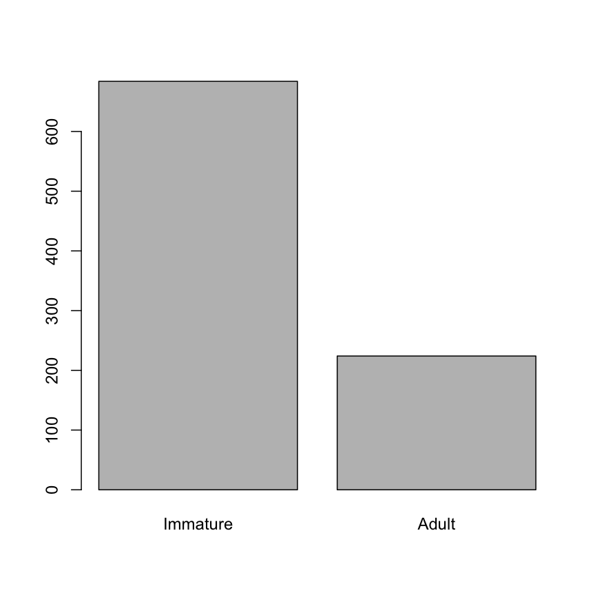
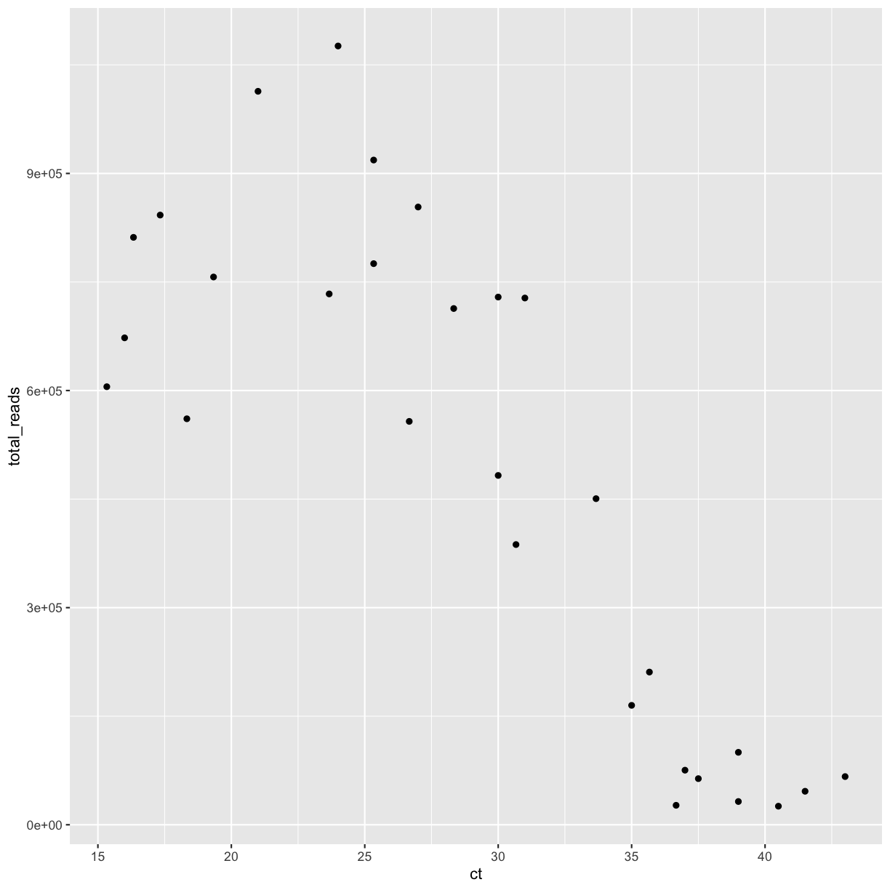
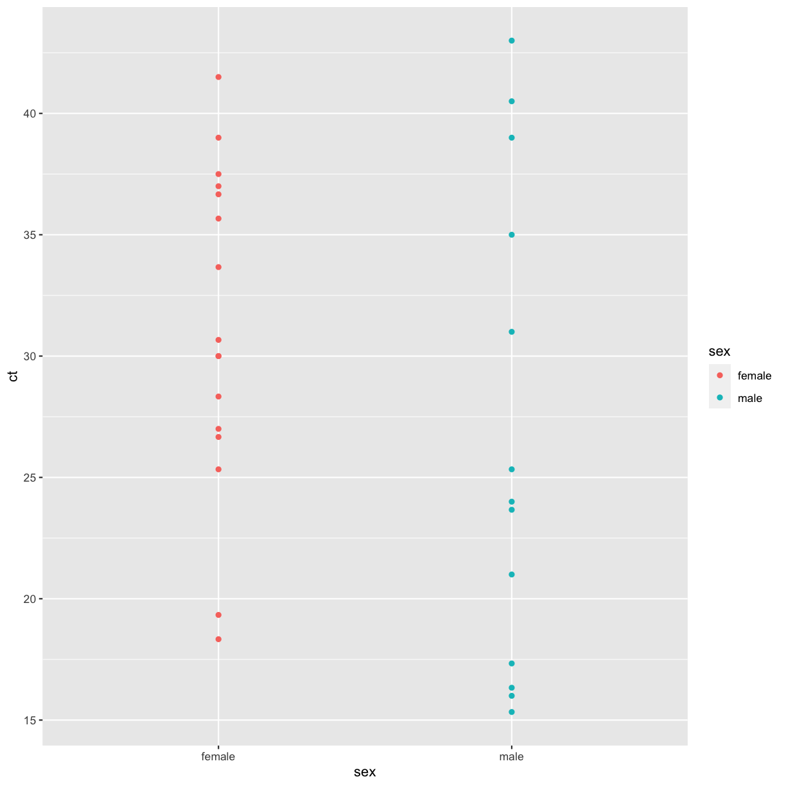
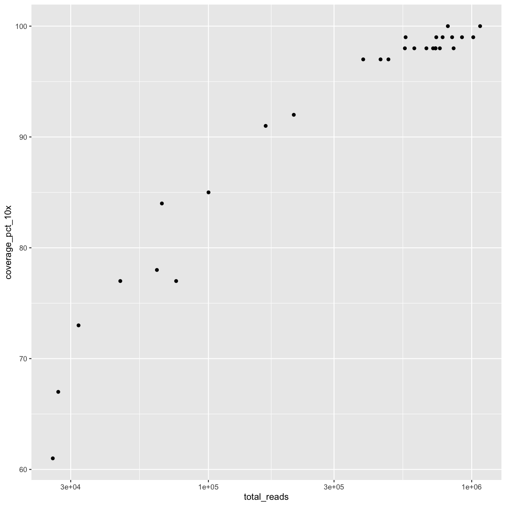
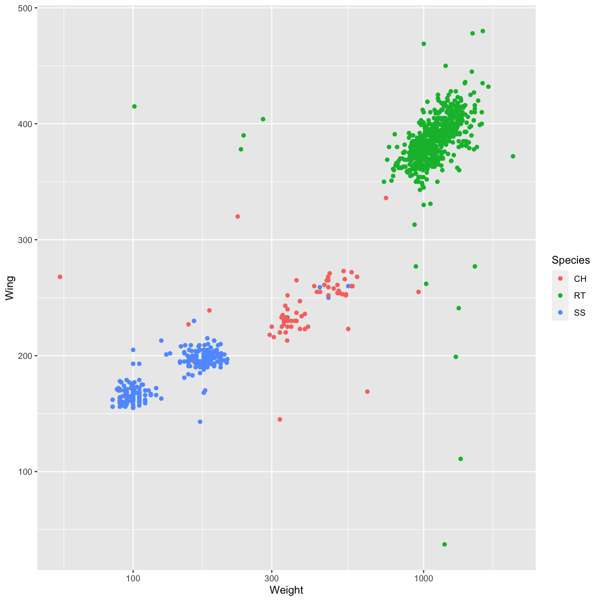
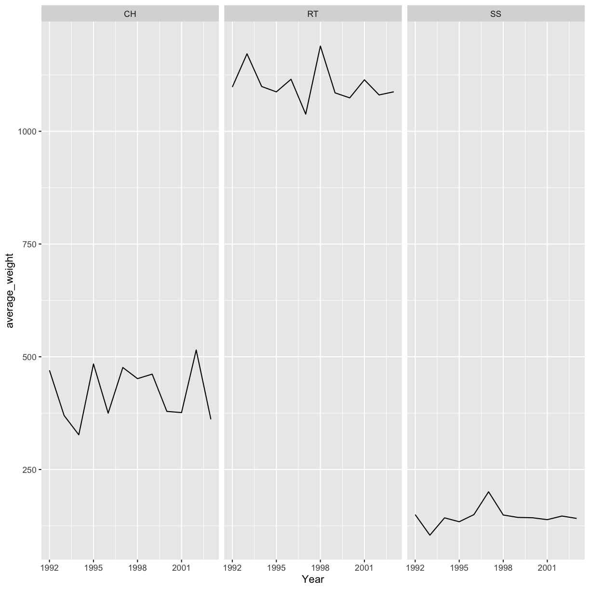

---
# Please do not edit this file directly; it is auto generated.
# Instead, please edit 05-exercises.md in _episodes_rmd/
title: Exercises
teaching: 0
exercises: 0
questions:
- ""
objectives:
- ""
keypoints:
- ""
source: Rmd
---


## 1. First steps in R

> ## Challenge 1.1
>
> What are the values after each statement in the following?
>
> 
> ~~~
> mass <- 47.5            # mass?
> age  <- 122             # age?
> mass <- mass * 2.0      # mass?
> age  <- age - 20        # age?
> mass_index <- mass/age  # mass_index?
> ~~~
> {: .language-r}
{: .challenge}

> ## Challenge 1.2
>
> * We’ve seen that atomic vectors can be of type character, numeric (or
>   double), integer, and logical. But what happens if we try to mix these types
>   in a single vector?
> 
>> ## Answer
>>
>> R implicitly converts them all to be the same type.
> {: .solution}
>
> * What will happen in each of these examples? (hint: use `class()` to check
>   the data type of your objects):
>
>     ```r
>     num_char <- c(1, 2, 3, "a")
>     num_logical <- c(1, 2, 3, TRUE)
>     char_logical <- c("a", "b", "c", TRUE)
>     tricky <- c(1, 2, 3, "4")
>     ```
>
> * Why do you think it happens?
>
>> ## Answer
>>
>> Vectors can be of only one data type. R tries to convert (coerce) the content
>> of this vector to find a "common denominator" that doesn't lose any
>> information.
> {: .solution}
>
> * How many values in `combined_logical` are `"TRUE"` (as a character) in the
>   following example (reusing the 2 `..._logical`s from above):
>
>     ```r
>     combined_logical <- c(num_logical, char_logical)
>     ```
>
>> ## Answer
>>
>> Only one. There is no memory of past data types, and the coercion happens the
>> first time the vector is evaluated. Therefore, the `TRUE` in `num_logical`
>> gets converted into a `1` before it gets converted into `"1"` in
>> `combined_logical`.
> {: .solution}
>
> * You've probably noticed that objects of different types get
>   converted into a single, shared type within a vector. In R, we
>   call converting objects from one class into another class
>   _coercion_. These conversions happen according to a hierarchy,
>   whereby some types get preferentially coerced into other
>   types. Can you draw a diagram that represents the hierarchy of how
>   these data types are coerced?
>
>> ## Answer
>>
>> logical &#8594; numeric &#8594; character &#8592; logical
> {: .solution}
{: .challenge}

> ## Challenge 1.3 (optional)
>
> * Can you figure out why `"four" > "five"` returns `TRUE`?
> 
>> ## Answer
>>
>> When using ">" or "<" on strings, R compares their alphabetical order. 
>> Here "four" comes after "five", and therefore is "greater than" it.
> {: .solution}
{: .challenge}


> ## Challenge 1.4
>
> 1. Using this vector of heights in inches, create a new vector,
>    `heights_no_na`, with the NAs removed.
>
>     ```r
>     heights <- c(63, 69, 60, 65, NA, 68, 61, 70, 61, 59, 64, 69, 63, 63, NA, 72, 65, 64, 70, 63, 65)
>     ```
> 2. Use the function `median()` to calculate the median of the `heights` vector.
>
> 3. Use R to figure out how many people in the set are taller than 67 inches.
>
>> ## Solution
>>
>> 
>> ~~~
>> heights <- c(63, 69, 60, 65, NA, 68, 61, 70, 61, 59, 64, 69, 63, 63, NA, 72, 65, 64, 70, 63, 65)
>> 
>> # 1.
>> heights_no_na <- heights[!is.na(heights)] 
>> # or
>> heights_no_na <- na.omit(heights)
>> # or
>> heights_no_na <- heights[complete.cases(heights)]
>> 
>> # 2.
>> median(heights, na.rm = TRUE)
>> ~~~
>> {: .language-r}
>> 
>> 
>> 
>> ~~~
>> [1] 64
>> ~~~
>> {: .output}
>> 
>> 
>> 
>> ~~~
>> # 3.
>> heights_above_67 <- heights_no_na[heights_no_na > 67]
>> length(heights_above_67)
>> ~~~
>> {: .language-r}
>> 
>> 
>> 
>> ~~~
>> [1] 6
>> ~~~
>> {: .output}
> {: .solution}
{: .challenge}


## 2. Starting with data

### Loading the samples data


~~~
download.file(
  url = "https://nbisweden.github.io/module-r-intro-dm-practices/data/Hawks.csv",
  destfile = "data_raw/Hawks.csv"
)
~~~
{: .language-r}


~~~
## load the tidyverse packages, incl. dplyr
library(tidyverse)
~~~
{: .language-r}


~~~
hawks <- read_csv("data_raw/Hawks.csv")
~~~
{: .language-r}


### Inspecting data frames

* Size:
    * `dim(hawks)` - returns a vector with the number of rows in the first element,
          and the number of columns as the second element (the **dim**ensions of
          the object)
    * `nrow(hawks)` - returns the number of rows
    * `ncol(hawks)` - returns the number of columns

* Content:
    * `head(hawks)` - shows the first 6 rows
    * `tail(hawks)` - shows the last 6 rows

* Names:
    * `names(hawks)` - returns the column names (synonym of `colnames()` for `data.frame`
	   objects)
    * `rownames(hawks)` - returns the row names

* Summary:
    * `str(hawks)` - structure of the object and information about the class, length and
	   content of  each column
    * `summary(hawks)` - summary statistics for each column

Note: most of these functions are "generic", they can be used on other types of
objects besides `data.frame`.


### Challenges

> ## Challenge 2.1
>
> Based on the output of `str(hawks)`, can you answer the following questions?
>
> * What is the class of the object `hawks`?
> * How many rows and how many columns are in this object?
>
>> ## Solution
>>
>> 
>> ~~~
>> str(hawks)
>> ~~~
>> {: .language-r}
>> 
>> 
>> 
>> ~~~
>> spec_tbl_df [908 × 19] (S3: spec_tbl_df/tbl_df/tbl/data.frame)
>>  $ Month       : num [1:908] 9 9 9 9 9 9 9 9 9 9 ...
>>  $ Day         : num [1:908] 19 22 23 23 27 28 28 29 29 30 ...
>>  $ Year        : num [1:908] 1992 1992 1992 1992 1992 ...
>>  $ CaptureTime : chr [1:908] "13:30" "10:30" "12:45" "10:50" ...
>>  $ ReleaseTime : 'hms' num [1:908] NA NA NA NA ...
>>   ..- attr(*, "units")= chr "secs"
>>  $ BandNumber  : chr [1:908] "877-76317" "877-76318" "877-76319" "745-49508" ...
>>  $ Species     : chr [1:908] "RT" "RT" "RT" "CH" ...
>>  $ Age         : chr [1:908] "I" "I" "I" "I" ...
>>  $ Sex         : chr [1:908] NA NA NA "F" ...
>>  $ Wing        : num [1:908] 385 376 381 265 205 412 370 375 412 405 ...
>>  $ Weight      : num [1:908] 920 930 990 470 170 1090 960 855 1210 1120 ...
>>  $ Culmen      : num [1:908] 25.7 NA 26.7 18.7 12.5 28.5 25.3 27.2 29.3 26 ...
>>  $ Hallux      : num [1:908] 30.1 NA 31.3 23.5 14.3 32.2 30.1 30 31.3 30.2 ...
>>  $ Tail        : num [1:908] 219 221 235 220 157 230 212 243 210 238 ...
>>  $ StandardTail: num [1:908] NA NA NA NA NA NA NA NA NA NA ...
>>  $ Tarsus      : num [1:908] NA NA NA NA NA NA NA NA NA NA ...
>>  $ WingPitFat  : num [1:908] NA NA NA NA NA NA NA NA NA NA ...
>>  $ KeelFat     : num [1:908] NA NA NA NA NA NA NA NA NA NA ...
>>  $ Crop        : num [1:908] NA NA NA NA NA NA NA NA NA NA ...
>>  - attr(*, "spec")=
>>   .. cols(
>>   ..   Month = col_double(),
>>   ..   Day = col_double(),
>>   ..   Year = col_double(),
>>   ..   CaptureTime = col_character(),
>>   ..   ReleaseTime = col_time(format = ""),
>>   ..   BandNumber = col_character(),
>>   ..   Species = col_character(),
>>   ..   Age = col_character(),
>>   ..   Sex = col_character(),
>>   ..   Wing = col_double(),
>>   ..   Weight = col_double(),
>>   ..   Culmen = col_double(),
>>   ..   Hallux = col_double(),
>>   ..   Tail = col_double(),
>>   ..   StandardTail = col_double(),
>>   ..   Tarsus = col_double(),
>>   ..   WingPitFat = col_double(),
>>   ..   KeelFat = col_double(),
>>   ..   Crop = col_double()
>>   .. )
>>  - attr(*, "problems")=<externalptr> 
>> ~~~
>> {: .output}
>> * The object `hawks` is of class `data.frame`, or more specifically a
>>   `tibble` (`spec_tbl_df/tbl_df/tbl/data.frame`)
>> * Rows and columns: 908 rows and 19 columns
> {: .solution}
{: .challenge}


> ## Challenge 2.2
>
> 1. Create a `data.frame` (`hawks_20`) containing only the data in
>    row 20 of the `hawks` dataset.
>
> 2. Notice how `nrow()` gave you the number of rows in a `data.frame`?
>
>      * Use that number to pull out just that last row in the data frame.
>      * Compare that with what you see as the last row using `tail()` to make
>        sure it's meeting expectations.
>      * Pull out that last row using `nrow()` instead of the row number.
>      * Create a new data frame (`hawks_last`) from that last row.
>
> 3. Combine `nrow()` with the `-` notation above to reproduce the behavior of
>    `head(hawks)`, keeping just the first 6 rows of the hawks
>    dataset.
>
>> ## Solution
>>
>> 
>> ~~~
>> ## 1.
>> hawks_20 <- hawks[20, ]
>> ## 2.
>> # Saving `n_rows` to improve readability and reduce duplication
>> n_rows <- nrow(hawks)
>> hawks_last <- hawks[n_rows, ]
>> ## 3.
>> hawks_head<- hawks[-(7:n_rows), ]
>> ~~~
>> {: .language-r}
> {: .solution}
{: .challenge}


> ## Challenge 2.3
>
> 1. Change the columns `Species` and `Age` in the `hawks` data frame
>    into factors.
>
> 2. Using the functions you have learnt so far, can you find out...
>
>      * How many levels are there in the `Age` column?
>      * How many observed birds are listed as females?
>
>> ## Solution
>>
>> 
>> ~~~
>> hawks$Species <- factor(hawks$Species)
>> hawks$Age <- factor(hawks$Age)
>> nlevels(hawks$Age)
>> ~~~
>> {: .language-r}
>> 
>> 
>> 
>> ~~~
>> [1] 2
>> ~~~
>> {: .output}
>> 
>> 
>> 
>> ~~~
>> summary(hawks$Sex)
>> ~~~
>> {: .language-r}
>> 
>> 
>> 
>> ~~~
>>    Length     Class      Mode 
>>       908 character character 
>> ~~~
>> {: .output}
>>
>> * How many levels in the `Age` column? There are 2 levels.
>> * How many are listed as females? There are 174 listed as females.
> {: .solution}
{: .challenge}


> ## Challenge 2.4
>
> * Store a copy of the factor column `Age` to a new object named `age`.
> * In the new object, rename "A" and "I" to "Adult" and "Immature", respectively.
> * Reorder the factor levels so that "Immature" comes before "Adult".
> * Create a bar plot of the factor.
>
>> ## Solution
>>
>> 
>> ~~~
>> age <- factor(hawks$Age)
>> levels(age)[1:2] <- c("Adult", "Immature")
>> age <- factor(age, levels = c("Immature", "Adult"))
>> plot(age)
>> ~~~
>> {: .language-r}
>> 
>> 
> {: .solution}
{: .challenge}


> ## Challenge 2.5 (optional)
>
> 1. We have seen how data frames are created when using `read_csv()`, but they
>    can also be created by hand with the `data.frame()` function. There are a
>    few mistakes in this hand-crafted `data.frame`. Can you spot and fix them?
>    Don't hesitate to experiment!
>
>    
>    ~~~
>    animal_data <- data.frame(
>              animal = c(dog, cat, sea cucumber, sea urchin),
>              feel = c("furry", "squishy", "spiny"),
>              weight = c(45, 8 1.1, 0.8)
>              )
>    ~~~
>    {: .language-r}
>
> 2. Can you predict the class for each of the columns in the following example?
>    Check your guesses using `str(country_climate)`:
>      * Are they what you expected? Why? Why not?
>      * What would you need to change to ensure that each column had the
>        accurate data type?
>
>     
>     ~~~
>     country_climate <- data.frame(
>            country = c("Canada", "Panama", "South Africa", "Australia"),
>            climate = c("cold", "hot", "temperate", "hot/temperate"),
>            temperature = c(10, 30, 18, "15"),
>            northern_hemisphere = c(TRUE, TRUE, FALSE, "FALSE"),
>            has_kangaroo = c(FALSE, FALSE, FALSE, 1)
>            )
>     ~~~
>     {: .language-r}
>
>> ## Solution
>>
>> * missing quotations around the names of the animals
>> * missing one entry in the `feel` column (probably for one of the furry
>>   animals)
>> * missing one comma in the `weight` column
>> * `country`, `climate`, `temperature`, and `northern_hemisphere` are
>>    characters; `has_kangaroo` is numeric
>> * using `factor()` one could replace character columns with factors columns
>> * removing the quotes in `temperature` and `northern_hemisphere` and
>>   replacing 1 by TRUE in the `has_kangaroo` column would give what was
>>   probably intended
> {: .solution}
{: .challenge}


## 3. Manipulating, analyzing and exporting data with tidyverse


### Useful `dplyr` functions

- `select()`: subset columns
- `filter()`: subset rows on conditions
- `mutate()`: create new columns by using information from other columns
- `group_by()` and `summarize()`: create summary statistics on grouped data
- `arrange()`: sort results
- `count()`: count discrete values

### Challenges

> ## Challenge 3.1
>
> Using pipes, subset the `hawks` data to include only males with a weight
> (column `Weight`) greater than 500 g, and retain only the columns
> `Species` and `Weight`.
>
>> ## Solution
>>
>> 
>> ~~~
>> hawks %>%
>>  filter(Sex == "M" & Weight > 500) %>%
>>  select(Species, Weight)
>> ~~~
>> {: .language-r}
>> 
>> 
>> 
>> ~~~
>> # A tibble: 5 × 2
>>   Species Weight
>>   <fct>    <dbl>
>> 1 CH         550
>> 2 SS         550
>> 3 CH         742
>> 4 SS        1094
>> 5 RT        1080
>> ~~~
>> {: .output}
> {: .solution}
{: .challenge}

> ## Challenge 3.2
>
>  Create a new data frame from the `hawks` data that meets the following
>  criteria: contains only the `Species` column and a new column called
>  `Tarsus_cm` containing the `Tarsus` values (currently in mm)
>  converted to centimeters. Furthermore, include only values in the `Tarsus_cm`
>  column that are less than 6 cm.
>
>  **Hint**: think about how the commands should be ordered to produce this data
>  frame!
>
>> ## Solution
>>
>> 
>> ~~~
>> hawks_tarsus_cm <- hawks %>%
>>     mutate(Tarsus_cm = Tarsus / 10) %>%
>>     filter(Tarsus_cm < 6) %>%
>>     select(Species, Tarsus_cm)
>> ~~~
>> {: .language-r}
> {: .solution}
{: .challenge}


> ## Challenge 3.3
> 
>  Use the function `kg_to_lb()` above to create a new column in the 
>  `hawks` data frame with the body weight expressed in pounds.
>
>> ## Solution
>>
>> 
>> ~~~
>> hawks %>%
>>     mutate(Weight_lb = kg_to_lb(Weight / 1000))
>> ~~~
>> {: .language-r}
> {: .solution}
{: .challenge}


> ## Challenge 3.4
>
> * For each year in the `hawks` data frame, how many captured birds have 
>   a weigh greater than 500 g?
>
>> ## Solution
>>
>> 
>> ~~~
>> hawks %>%
>>  filter(Weight > 500) %>%
>>  count(Year)
>> ~~~
>> {: .language-r}
>> 
>> 
>> 
>> ~~~
>> # A tibble: 12 × 2
>>     Year     n
>>    <dbl> <int>
>>  1  1992    33
>>  2  1993    28
>>  3  1994    90
>>  4  1995    56
>>  5  1996    14
>>  6  1997    45
>>  7  1998    26
>>  8  1999    57
>>  9  2000    82
>> 10  2001    37
>> 11  2002    61
>> 12  2003    58
>> ~~~
>> {: .output}
> {: .solution}
>
> * Use `group_by()` and `summarize()` to find the mean and standard deviation
>   of the weight for each species and sex.
>
>   **Hint:** calculate the standard deviation with the `sd()` function.
>
>> ## Solution
>>
>> 
>> ~~~
>> hawks %>%
>>     group_by(Species, Sex) %>%
>>     summarize(mean = mean(Weight),
>>               stdev = sd(Weight))
>> ~~~
>> {: .language-r}
>> 
>> 
>> 
>> ~~~
>> # A tibble: 9 × 4
>> # Groups:   Species [3]
>>   Species Sex    mean stdev
>>   <fct>   <chr> <dbl> <dbl>
>> 1 CH      F      490. 183. 
>> 2 CH      M      348.  99.1
>> 3 CH      <NA>   402  110. 
>> 4 RT      F     1147.  46.2
>> 5 RT      M     1080   NA  
>> 6 RT      <NA>    NA   NA  
>> 7 SS      F       NA   NA  
>> 8 SS      M       NA   NA  
>> 9 SS      <NA>    95   NA  
>> ~~~
>> {: .output}
> {: .solution}
{: .challenge}


## 4. Data Visualization with ggplot2

### The grammar

```
ggplot(data = <DATA>, mapping = aes(<MAPPINGS>)) +  <GEOM_FUNCTION>() + ...
```

### Challenges

> ## Challenge 4.1
>
> Create a scatter plot with the culmen length (column `Culmen`) plotted against
> the tail length (column `Tail`).
>
>> ## Solution
>>
>> 
>> ~~~
>> ggplot(data = hawks, 
>>        mapping = aes(x = Culmen, y = Tail)) +
>>   geom_point()
>> ~~~
>> {: .language-r}
>> 
>> 
>> 
>> ~~~
>> Warning: Removed 7 rows containing missing values (geom_point).
>> ~~~
>> {: .warning}
>> 
>> 
> {: .solution}
{: .challenge}


> ## Challenge 4.2
>
> Use what you just learned to create a scatter plot of the species
> (column `Species`) against the wing length (column `Wing`). Is this a good 
> way to show this type of data?
>
>> ## Solution
>>
>> 
>> ~~~
>> ggplot(data = hawks, 
>>        mapping = aes(x = Species, y = Wing)) +
>>   geom_point(aes(color = Species))
>> ~~~
>> {: .language-r}
>> 
>> 
>> 
>> ~~~
>> Warning: Removed 1 rows containing missing values (geom_point).
>> ~~~
>> {: .warning}
>> 
>> 
> {: .solution}
{: .challenge}


> ## Challenges 4.3
>
> Boxplots are useful summaries, but hide the *shape* of the distribution. For
> example, if there is a bimodal distribution, it would not be observed with a
> boxplot. An alternative to the boxplot is the violin plot (sometimes known as 
> a beanplot), where the shape (of the density of points) is drawn. Replace the
> box plot with a violin plot; see `geom_violin()`. Modify the code below to
> show a violin plot instead.
>
> 
> ~~~
> ggplot(data = hawks, mapping = aes(x = Species, y = Wing)) +
>     geom_boxplot(alpha = 0) +
>     geom_jitter(alpha = 0.5, color = "tomato")
> ~~~
> {: .language-r}
>
>> ## Solution
>>
>> 
>> ~~~
>> ggplot(data = hawks, mapping = aes(x = Species, y = Wing)) +
>>     geom_violin(alpha = 0) +
>>     geom_jitter(alpha = 0.5, color = "tomato")
>> ~~~
>> {: .language-r}
>> 
>> 
>> 
>> ~~~
>> Warning: Removed 1 rows containing non-finite values (stat_ydensity).
>> ~~~
>> {: .warning}
>> 
>> 
>> 
>> ~~~
>> Warning: Removed 1 rows containing missing values (geom_point).
>> ~~~
>> {: .warning}
>> 
>> 
> {: .solution}
>
> In many types of data, it is important to consider the *scale* of the
> observations. For example, it may be worth changing the scale of the axis to
> better distribute the observations in the space of the plot. Changing the
> scale of the axes is done similarly to adding/modifying other components.
> 
> * Modify the code below so that weight is shown on a
>   log 10 scale; see `scale_x_log10()`.
>
> 
> ~~~
> ggplot(data = hawks, mapping = aes(x = Weight, y = Wing)) +
>     geom_point(alpha = 0)
> ~~~
> {: .language-r}
>
>> ## Solution
>>
>> 
>> ~~~
>> ggplot(data = hawks, mapping = aes(x = Weight, y = Wing)) +
>>   geom_point() +
>>   scale_x_log10()
>> ~~~
>> {: .language-r}
>> 
>> 
>> 
>> ~~~
>> Warning: Removed 11 rows containing missing values (geom_point).
>> ~~~
>> {: .warning}
>> 
>> 
> {: .solution}
>
> * Add color to the data points on your plot according to the Species.
>
>> ## Solution
>>
>> 
>> ~~~
>> ggplot(data = hawks, mapping = aes(x = Weight, y = Wing)) +
>>   geom_point(aes(color = Species)) +
>>   scale_x_log10()
>> ~~~
>> {: .language-r}
>> 
>> 
>> 
>> ~~~
>> Warning: Removed 11 rows containing missing values (geom_point).
>> ~~~
>> {: .warning}
>> 
>> 
> {: .solution}
{: .challenge}


> ## Challenge 4.4
>
> Use what you just learned to create a plot that depicts how the average weight
> of each species changes through the years.
>
>> ## Solution
>> 
>> 
>> ~~~
>> yearly_weight <- hawks %>% 
>>   group_by(Species, Year) %>%
>>   summarize(average_weight = mean(Weight, na.rm = TRUE))
>> 
>> ggplot(data = yearly_weight, aes(x=Year, y = average_weight)) + 
>>   geom_line() + facet_wrap(vars(Species))
>> ~~~
>> {: .language-r}
>> 
>> 
> {: .solution}
{: .challenge}


> ## Challenge 4.5
>
> With all of this information in hand, please take another five minutes to either
> improve one of the plots generated in this exercise or create a beautiful graph
> of your own. Use the RStudio [**`ggplot2`** cheat sheet](https://github.com/rstudio/cheatsheets/blob/master/data-visualization-2.1.pdf) 
> for inspiration.
>
> Here are some ideas:
>
> * See if you can change the thickness of the lines.
> * Can you find a way to change the name of the legend?
> * Try using a different color palette (see
>   [http://www.cookbook-r.com/Graphs/Colors_(ggplot2)/](http://www.cookbook-r.com/Graphs/Colors_(ggplot2)/)).
{: .challenge}

