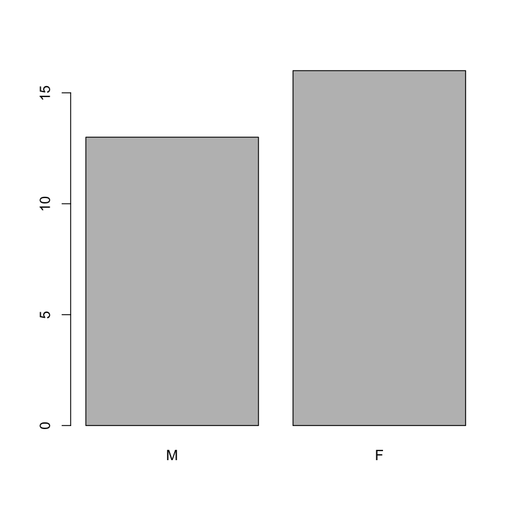
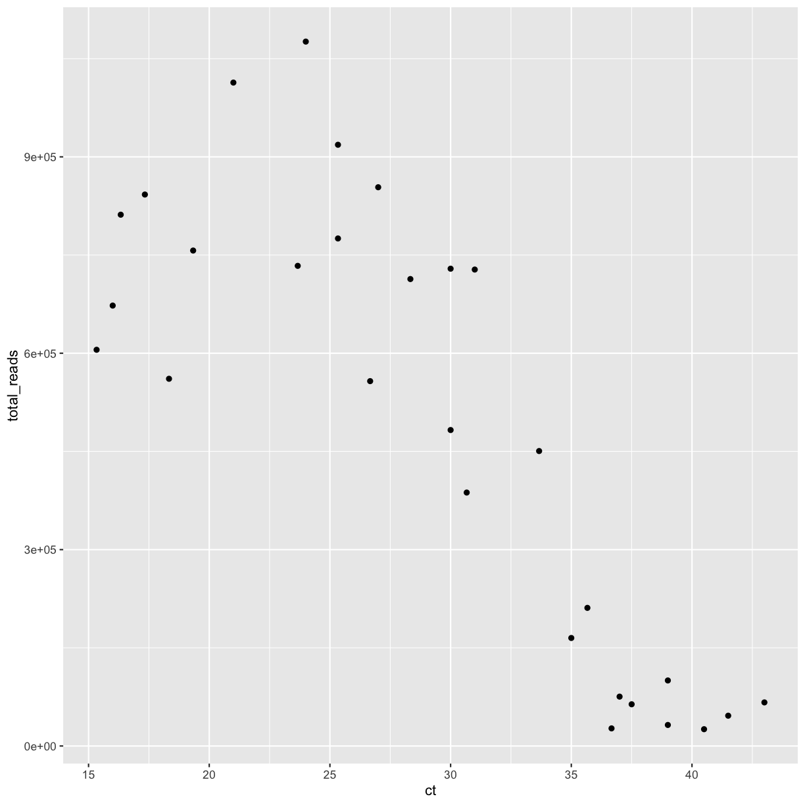
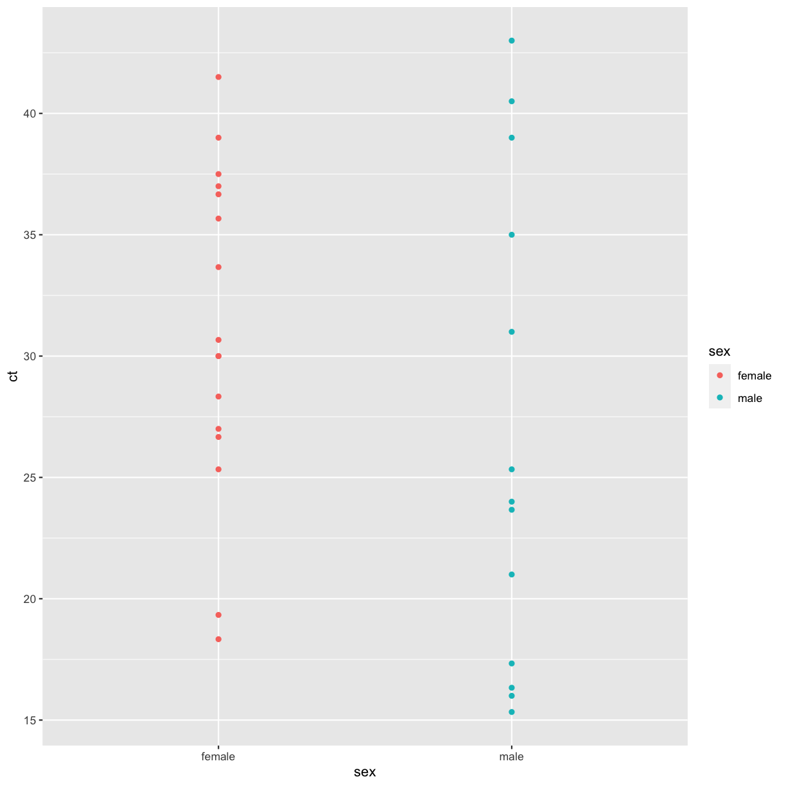
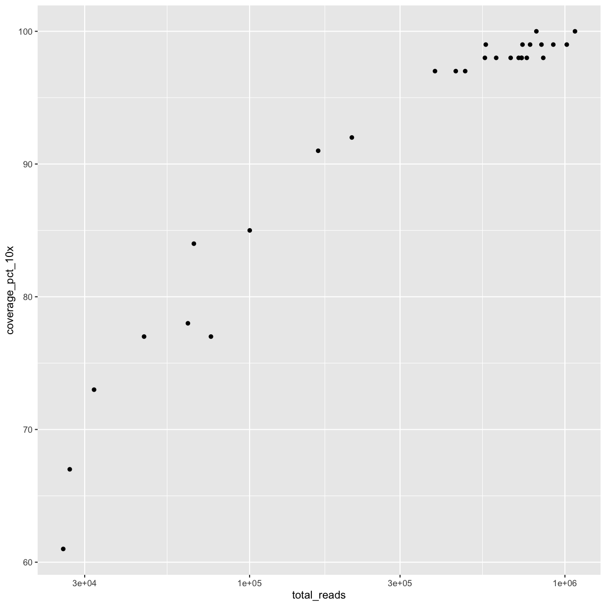
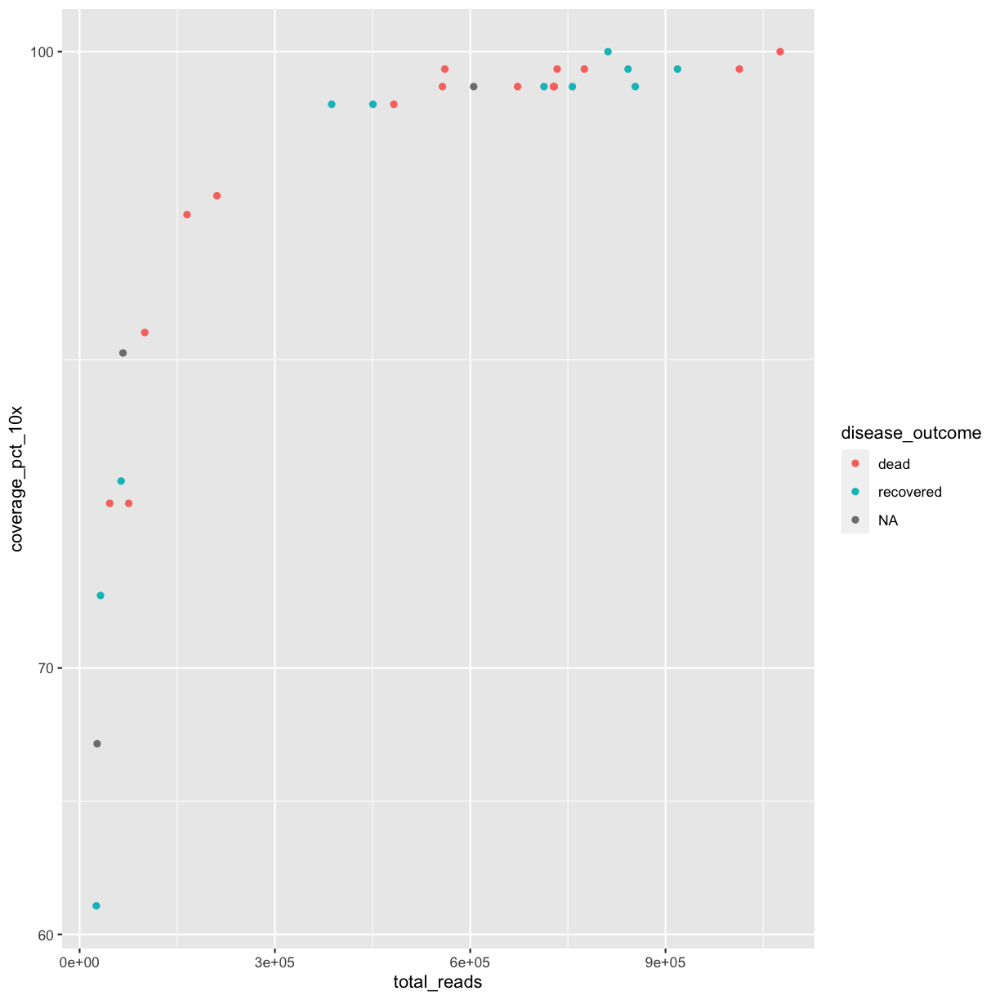
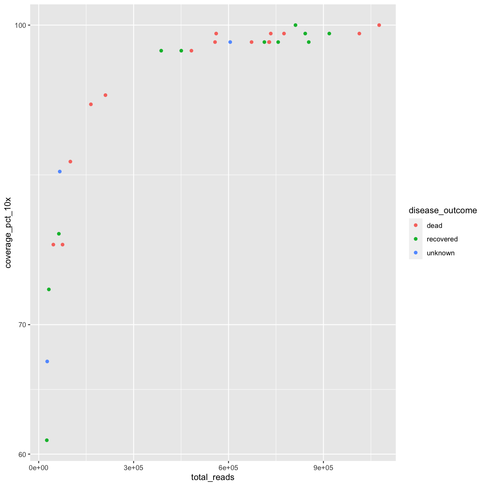
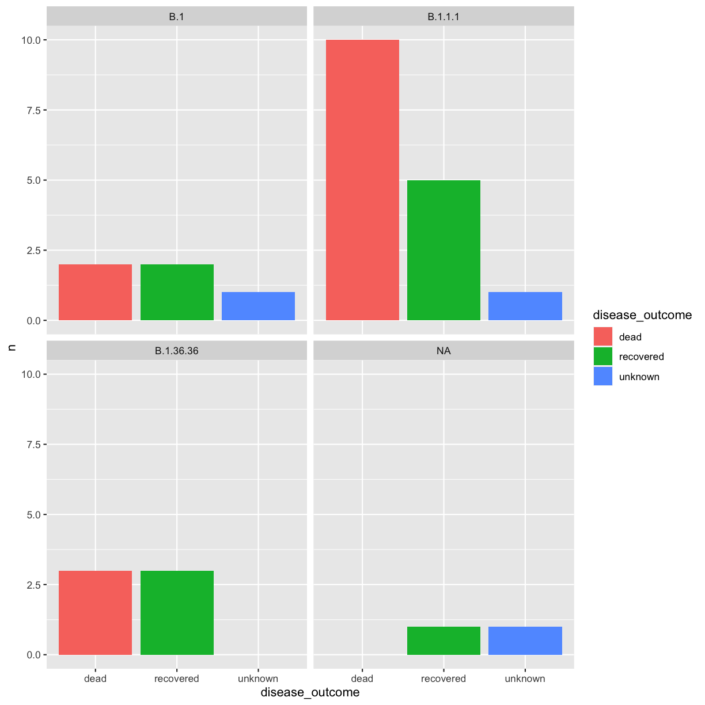

---
# Please do not edit this file directly; it is auto generated.
# Instead, please edit 06-exercises.md in _episodes_rmd/
title: Exercises
teaching: 0
exercises: 0
questions:
- ""
objectives:
- ""
keypoints:
- ""
source: Rmd
---


## 1. Introducing R and RStudio IDE

> ## Discussion: Your experience and expectations
>
> * What has motivated you to learn R? Have you had a research question for which
>   spreadsheet programs such as Excel have proven difficult to use, or where the
>   size of the data set created issues?
> * In what situations do you imagine that using R will be most valuable to you?
{: .discussion}


## 2. R Basics

> ## Challenge 2.1
>
> What are the values after each statement in the following?
>
> 
> ~~~
> mass <- 47.5            # mass?
> age  <- 122             # age?
> mass <- mass * 2.0      # mass?
> age  <- age - 20        # age?
> mass_index <- mass/age  # mass_index?
> ~~~
> {: .language-r}
{: .challenge}

> ## Challenge 2.2
>
> Write a function that returns the sum of two arguments given to it.
>
>> ## Solution
>>
>> 
>> ~~~
>> # Calculate the sum of x and y
>> add_two_args <- function(x, y) { x + y }
>> 
>> # Call the function
>> add_two_args(9, 7)
>> ~~~
>> {: .language-r}
>> 
>> 
>> 
>> ~~~
>> [1] 16
>> ~~~
>> {: .output}
>>
> {: .solution}
{: .challenge}

> ## Challenge 2.3
>
> * We’ve seen that atomic vectors can be of type character, numeric (or
>   double), integer, and logical. But what happens if we try to mix these types
>   in a single vector?
>
>> ## Answer
>>
>> R implicitly converts them all to be the same type.
> {: .solution}
>
> * What will happen in each of these examples? (hint: use `class()` to check
>   the data type of your objects):
>
>     ```r
>     num_char <- c(1, 2, 3, "a")
>     num_logical <- c(1, 2, 3, TRUE)
>     char_logical <- c("a", "b", "c", TRUE)
>     tricky <- c(1, 2, 3, "4")
>     ```
>
> * Why do you think it happens?
>
>> ## Answer
>>
>> Vectors can be of only one data type. R tries to convert (coerce) the content
>> of this vector to find a "common denominator" that doesn't lose any
>> information.
> {: .solution}
>
> * How many values in `combined_logical` are `"TRUE"` (as a character) in the
>   following example (reusing the 2 `..._logical`s from above):
>
>     ```r
>     combined_logical <- c(num_logical, char_logical)
>     ```
>
>> ## Answer
>>
>> Only one. There is no memory of past data types, and the coercion happens the
>> first time the vector is evaluated. Therefore, the `TRUE` in `num_logical`
>> gets converted into a `1` before it gets converted into `"1"` in
>> `combined_logical`.
> {: .solution}
>
> * You've probably noticed that objects of different types get
>   converted into a single, shared type within a vector. In R, we
>   call converting objects from one class into another class
>   _coercion_. These conversions happen according to a hierarchy,
>   whereby some types get preferentially coerced into other
>   types. Can you draw a diagram that represents the hierarchy of how
>   these data types are coerced?
>
>> ## Answer
>>
>> logical &#8594; numeric &#8594; character &#8592; logical
> {: .solution}
{: .challenge}

> ## Challenge 2.4 (optional)
>
> * Can you figure out why `"four" > "five"` returns `TRUE`?
>
>> ## Answer
>>
>> When using ">" or "<" on strings, R compares their alphabetical order.
>> Here "four" comes after "five", and therefore is "greater than" it.
> {: .solution}
{: .challenge}

> ## Challenge 2.5
>
> 1. Using this vector of heights in inches, create a new vector,
>    `heights_no_na`, with the NAs removed.
>
>     ```r
>     heights <- c(63, 69, 60, 65, NA, 68, 61, 70, 61, 59, 64, 69, 63, 63, NA, 72, 65, 64, 70, 63, 65)
>     ```
> 2. Use the function `median()` to calculate the median of the `heights` vector.
>
> 3. Use R to figure out how many people in the set are taller than 67 inches.
>
>> ## Solution
>>
>> 
>> ~~~
>> heights <- c(63, 69, 60, 65, NA, 68, 61, 70, 61, 59, 64, 69, 63, 63, NA, 72, 65, 64, 70, 63, 65)
>> 
>> # 1.
>> heights_no_na <- heights[!is.na(heights)]
>> # or
>> heights_no_na <- na.omit(heights)
>> # or
>> heights_no_na <- heights[complete.cases(heights)]
>> 
>> # 2.
>> median(heights, na.rm = TRUE)
>> ~~~
>> {: .language-r}
>> 
>> 
>> 
>> ~~~
>> [1] 64
>> ~~~
>> {: .output}
>> 
>> 
>> 
>> ~~~
>> # 3.
>> heights_above_67 <- heights_no_na[heights_no_na > 67]
>> length(heights_above_67)
>> ~~~
>> {: .language-r}
>> 
>> 
>> 
>> ~~~
>> [1] 6
>> ~~~
>> {: .output}
> {: .solution}
{: .challenge}


## 3. R Basics continued - factors and data frames

### Loading the samples data


~~~
download.file(
  url = "https://nbisweden.github.io/module-r-intro-dm-practices/data/covid_samples.csv",
  destfile = "data_raw/covid_samples.csv")
~~~
{: .language-r}


~~~
## load the tidyverse packages, incl. dplyr
library(tidyverse)
~~~
{: .language-r}


~~~
samples <- read_csv("data_raw/covid_samples.csv")
~~~
{: .language-r}


### Inspecting data frames

* Size:
    * `dim(samples)` - returns a vector with the number of rows in the first
      element, and the number of columns as the second element
      (the **dim**ensions of the object)
    * `nrow(samples)` - returns the number of rows
    * `ncol(samples)` - returns the number of columns

* Content:
    * `head(samples)` - shows the first 6 rows
    * `tail(samples)` - shows the last 6 rows

* Names:
    * `names(samples)` - returns the column names (synonym of `colnames()` for
      `data.frame` objects)
    * `rownames(samples)` - returns the row names

* Summary:
    * `str(samples)` - structure of the object and information about the class,
      length and content of each column
    * `summary(samples)` - summary statistics for each column

### Challenges

> ## Challenge 3.1
>
> Based on the output of `str(samples)`, can you answer the following questions?
>
> * What is the class of the object `samples`?
> * How many rows and how many columns are in this object?
>
>> ## Solution
>>
>> 
>> ~~~
>> str(samples)
>> ~~~
>> {: .language-r}
>> 
>> 
>> 
>> ~~~
>> spec_tbl_df [29 × 8] (S3: spec_tbl_df/tbl_df/tbl/data.frame)
>>  $ patient_id     : chr [1:29] "OAS-29_1" "OAS-29_10" "OAS-29_11" "OAS-29_12" ...
>>  $ collection_date: Date[1:29], format: "2020-03-31" "2020-03-31" ...
>>  $ country        : chr [1:29] "Italy" "Italy" "Italy" "Italy" ...
>>  $ region         : chr [1:29] "Turin" "Turin" "Turin" "Turin" ...
>>  $ age            : num [1:29] 48 35 59 60 83 21 44 55 81 63 ...
>>  $ disease_outcome: chr [1:29] "dead" NA "recovered" "recovered" ...
>>  $ sex            : chr [1:29] "female" "male" "male" "female" ...
>>  $ ct             : num [1:29] 41.5 15.3 25.3 27 25.3 ...
>>  - attr(*, "spec")=
>>   .. cols(
>>   ..   patient_id = col_character(),
>>   ..   collection_date = col_date(format = ""),
>>   ..   country = col_character(),
>>   ..   region = col_character(),
>>   ..   age = col_double(),
>>   ..   disease_outcome = col_character(),
>>   ..   sex = col_character(),
>>   ..   ct = col_double()
>>   .. )
>>  - attr(*, "problems")=<externalptr> 
>> ~~~
>> {: .output}
>> * The object `samples` is of class `data.frame`, or more specifically a
>>   `tibble` (`spec_tbl_df/tbl_df/tbl/data.frame`)
>> * Rows and columns: 29 rows and 8 columns
> {: .solution}
{: .challenge}

> ## Challenge 3.2
>
> 1. Create a `data.frame` (`samples_20`) containing only the data in
>    row 20 of the `samples` dataset.
>
> 2. Notice how `nrow()` gave you the number of rows in a `data.frame`?
>
>      * Use that number to pull out just that last row in the data frame.
>      * Compare that with what you see as the last row using `tail()` to make
>        sure it's meeting expectations.
>      * Pull out that last row using `nrow()` instead of the row number.
>      * Create a new data frame (`samples_last`) from that last row.
>
> 3. Combine `nrow()` with the `-` notation above to reproduce the behavior of
>    `head(samples)`, keeping just the first 6 rows of the samples
>    dataset.
>
>> ## Solution
>>
>> 
>> ~~~
>> ## 1.
>> samples_20 <- samples[20, ]
>> ## 2.
>> # Saving `n_rows` to improve readability and reduce duplication
>> n_rows <- nrow(samples)
>> samples_last <- samples[n_rows, ]
>> ## 3.
>> samples_head<- samples[-(7:n_rows), ]
>> ~~~
>> {: .language-r}
> {: .solution}
{: .challenge}

> ## Challenge 3.3
>
> 1. Change the columns `disease_outcome` and `sex` in the `samples` data frame
>    into factors.
>
> 2. Using the functions you have learnt so far, can you find out...
>
>      * How many levels are there in the `sex` column?
>      * How many individuals are listed as "dead" in the `disease_outcome`
>        column?
>
>> ## Solution
>>
>> 
>> ~~~
>> samples$disease_outcome <- factor(samples$disease_outcome)
>> samples$sex <- factor(samples$sex)
>> nlevels(samples$sex)
>> ~~~
>> {: .language-r}
>> 
>> 
>> 
>> ~~~
>> [1] 2
>> ~~~
>> {: .output}
>> 
>> 
>> 
>> ~~~
>> summary(samples$disease_outcome)
>> ~~~
>> {: .language-r}
>> 
>> 
>> 
>> ~~~
>>      dead recovered      NA's 
>>        15        11         3 
>> ~~~
>> {: .output}
>>
>> * How many levels in the `sex` column? There are 2 levels.
>> * How many are listed as dead? There are 15 individuals listed as "dead"
>>   in the `disease_outcome` column.
>>   column.
> {: .solution}
{: .challenge}

> ## Challenge 3.4
>
> * Store a copy of the factor column `sex` to a new object named `sex`.
> * In the new object, rename "female" and "male" to "F" and "M" respectively.
> * Reorder the factor levels so that "M" comes before "F".
> * Create a bar plot of the factor.
>
>> ## Solution
>>
>> 
>> ~~~
>> sex = samples$sex
>> levels(sex)[1:2] <- c("F", "M")
>> sex <- factor(sex, levels = c("M", "F"))
>> plot(sex)
>> ~~~
>> {: .language-r}
>> 
>> 
> {: .solution}
{: .challenge}

> ## Challenge 3.5 (optional)
>
> 1. We have seen how data frames are created when using `read_csv()`, but they
>    can also be created by hand with the `data.frame()` function. There are a
>    few mistakes in this hand-crafted `data.frame`. Can you spot and fix them?
>    Don't hesitate to experiment!
>
>    
>    ~~~
>    animal_data <- data.frame(
>              animal = c(dog, cat, sea cucumber, sea urchin),
>              feel = c("furry", "squishy", "spiny"),
>              weight = c(45, 8 1.1, 0.8)
>              )
>    ~~~
>    {: .language-r}
>
> 2. Can you predict the class for each of the columns in the following example?
>    Check your guesses using `str(country_climate)`:
>      * Are they what you expected? Why? Why not?
>      * What would you need to change to ensure that each column had the
>        accurate data type?
>
>     
>     ~~~
>     country_climate <- data.frame(
>            country = c("Canada", "Panama", "South Africa", "Australia"),
>            climate = c("cold", "hot", "temperate", "hot/temperate"),
>            temperature = c(10, 30, 18, "15"),
>            northern_hemisphere = c(TRUE, TRUE, FALSE, "FALSE"),
>            has_kangaroo = c(FALSE, FALSE, FALSE, 1)
>            )
>     ~~~
>     {: .language-r}
>
>> ## Solution
>>
>> * missing quotations around the names of the animals
>> * missing one entry in the `feel` column (probably for one of the furry
>>   animals)
>> * missing one comma in the `weight` column
>> * `country`, `climate`, `temperature`, and `northern_hemisphere` are
>>    characters; `has_kangaroo` is numeric
>> * using `factor()` one could replace character columns with factors columns
>> * removing the quotes in `temperature` and `northern_hemisphere` and
>>   replacing 1 by TRUE in the `has_kangaroo` column would give what was
>>   probably intended
> {: .solution}
{: .challenge}


## 4. Aggregating and Analyzing Data with dplyr

### Loading the samples data


~~~
download.file(
  url = "https://nbisweden.github.io/module-r-intro-dm-practices/data/covid_samples.csv",
  destfile = "data_raw/covid_samples.csv")
~~~
{: .language-r}


~~~
## load the tidyverse packages, incl. dplyr
library(tidyverse)
~~~
{: .language-r}


~~~
samples <- read_csv("data_raw/covid_samples.csv")
samples$disease_outcome <- factor(samples$disease_outcome)
samples$sex <- factor(samples$sex)
~~~
{: .language-r}


### Useful `dplyr` functions

- `select()`: subset columns
- `filter()`: subset rows on conditions
- `group_by()` and `summarize()`: create summary statistics on grouped data
- `arrange()`: sort results
- `count()`: count discrete values

### Challenges

> ## Challenge 4.1
>
> Using pipes, subset the `samples` data to include only males with Ct values
> (column `ct`) greater than or equal to 35, and retain only the columns
> `patient_id` and `disease_outcome`.
>
>> ## Solution
>>
>> 
>> ~~~
>> samples %>%
>>  filter(sex == "male" & ct >= 35) %>%
>>  select(patient_id, disease_outcome)
>> ~~~
>> {: .language-r}
>> 
>> 
>> 
>> ~~~
>> # A tibble: 4 × 2
>>   patient_id disease_outcome
>>   <chr>      <fct>          
>> 1 OAS-29_16  recovered      
>> 2 OAS-29_20  <NA>           
>> 3 OAS-29_27  dead           
>> 4 OAS-29_29  recovered      
>> ~~~
>> {: .output}
> {: .solution}
{: .challenge}

> ## Challenge 4.2
>
> * For each collecting date in the `samples` data frame, how many samples have
>   a Ct value greater than or equal to 35?
>
>> ## Solution
>>
>> 
>> ~~~
>> samples %>%
>>  filter(ct >= 35) %>%
>>  count(collection_date)
>> ~~~
>> {: .language-r}
>> 
>> 
>> 
>> ~~~
>> # A tibble: 4 × 2
>>   collection_date     n
>>   <date>          <int>
>> 1 2020-03-31          5
>> 2 2020-04-01          1
>> 3 2020-04-07          2
>> 4 2020-04-08          2
>> ~~~
>> {: .output}
> {: .solution}
>
> * Use `group_by()` and `summarize()` to find the mean and standard deviation
>   of the Ct value for each disease outcome and sex.
>
>   **Hint:** calculate the standard deviation with the `sd()` function.
>
>> ## Solution
>>
>> 
>> ~~~
>> samples %>%
>>     group_by(disease_outcome, sex) %>%
>>     summarize(mean = mean(ct),
>>               stdev = sd(ct))
>> ~~~
>> {: .language-r}
>> 
>> 
>> 
>> ~~~
>> # A tibble: 6 × 4
>> # Groups:   disease_outcome [3]
>>   disease_outcome sex     mean stdev
>>   <fct>           <fct>  <dbl> <dbl>
>> 1 dead            female  31.5  7.44
>> 2 dead            male    25.1  6.87
>> 3 recovered       female  29.4  6.22
>> 4 recovered       male    27.7 11.6 
>> 5 <NA>            female  36.7 NA   
>> 6 <NA>            male    29.2 19.6 
>> ~~~
>> {: .output}
> {: .solution}
{: .challenge}


## 5. Data Visualization with ggplot2

### Loading the samples data


~~~
download.file(
  url = "https://nbisweden.github.io/module-r-intro-dm-practices/data/covid_samples.csv",
  destfile = "data_raw/covid_samples.csv")
~~~
{: .language-r}


~~~
## load the tidyverse packages, incl. dplyr
library(tidyverse)
~~~
{: .language-r}


~~~
samples <- read_csv("data_raw/covid_samples.csv")
samples$disease_outcome <- factor(samples$disease_outcome)
samples$sex <- factor(samples$sex)
~~~
{: .language-r}


### Loading the sequencing data


~~~
download.file(
  url = "https://nbisweden.github.io/module-r-intro-dm-practices/data/covseq_miseq.csv",
  destfile = "data_raw/covseq_miseq.csv")
~~~
{: .language-r}


~~~
sequencing <- read_csv("data_raw/covseq_miseq.csv")
sequencing$pangolin_lineage <- factor(sequencing$pangolin_lineage)
sequencing$nextclade_clade <- factor(sequencing$nextclade_clade)
~~~
{: .language-r}


### Joining the `sequencing` and `samples` data frames


~~~
covseq <- sequencing %>%
  inner_join(samples, by = "patient_id")
~~~
{: .language-r}

### Challenges

> ## Challenge 5.1
>
> Create a scatter plot with the Ct value plotted against the total number of
> sequence reads.
>
>> ## Solution
>>
>> 
>> ~~~
>> ggplot(data = covseq,
>>        mapping = aes(x = ct, y = total_reads)) +
>>   geom_point()
>> ~~~
>> {: .language-r}
>> 
>> 
> {: .solution}
{: .challenge}

> ## Challenge 5.2
>
> Use what you just learned to create a scatter plot of the sex against the
> cycle threshold (Ct). Is this a good way to show this type of data?
>
>> ## Solution
>>
>> 
>> ~~~
>> ggplot(data = covseq,
>>        mapping = aes(x = sex, y = ct)) +
>>   geom_point(aes(color = sex))
>> ~~~
>> {: .language-r}
>> 
>> 
> {: .solution}
{: .challenge}

> ## Challenges 5.3
>
> Boxplots are useful summaries, but hide the *shape* of the distribution. For
> example, if there is a bimodal distribution, it would not be observed with a
> boxplot. An alternative to the boxplot is the violin plot (sometimes known as
> a beanplot), where the shape (of the density of points) is drawn. Replace the
> box plot with a violin plot; see `geom_violin()`. Modify the code below to
> show a violin plot instead.
>
> 
> ~~~
> ggplot(data = covseq, mapping = aes(x = sex, y = ct)) +
>     geom_boxplot(alpha = 0) +
>     geom_jitter(alpha = 0.5, color = "tomato")
> ~~~
> {: .language-r}
>
>> ## Solution
>>
>> 
>> ~~~
>> ggplot(data = covseq, mapping = aes(x = sex, y = ct)) +
>>     geom_violin(alpha = 0) +
>>     geom_jitter(alpha = 0.5, color = "tomato")
>> ~~~
>> {: .language-r}
> {: .solution}
>
> In many types of data, it is important to consider the *scale* of the
> observations. For example, it may be worth changing the scale of the axis to
> better distribute the observations in the space of the plot. Changing the
> scale of the axes is done similarly to adding/modifying other components.
>
> * Modify the code below so that the number of reads are shown on a
>   log 10 scale; see `scale_x_log10()`.
>
> 
> ~~~
> ggplot(data = covseq, mapping = aes(x = total_reads, y = coverage_pct_10x)) +
>     geom_point(alpha = 0)
> ~~~
> {: .language-r}
>
>> ## Solution
>>
>> 
>> ~~~
>> ggplot(data = covseq, mapping = aes(x = total_reads, y = coverage_pct_10x)) +
>>   geom_point() +
>>   scale_x_log10()
>> ~~~
>> {: .language-r}
>> 
>> 
> {: .solution}
>
> * Add color to the data points on your plot according to the disease outcome.
>
>> ## Solution
>>
>> 
>> ~~~
>> ggplot(data = covseq, mapping = aes(x = total_reads, y = coverage_pct_10x)) +
>>   geom_point(aes(color = disease_outcome)) +
>>   scale_y_log10()
>> ~~~
>> {: .language-r}
>> 
>> 
> {: .solution}
>
> * Replace "NA" with "unknown" (**hint:** use the `addNA()` and `levels()`
>   functions).
>
>> ## Solution
>>
>> 
>> ~~~
>> # Add NAs to the factor
>> covseq$disease_outcome <- addNA(covseq$disease_outcome)
>> 
>> # Rename the level
>> levels(covseq$disease_outcome)[3] <- "unknown"
>> 
>> # Now create the plot in the same way as before
>> ggplot(data = covseq, mapping = aes(x = total_reads, y = coverage_pct_10x)) +
>>   geom_point(aes(color = disease_outcome)) +
>>   scale_y_log10()
>> ~~~
>> {: .language-r}
>> 
>> 
> {: .solution}
{: .challenge}

> ## Challenge 5.4
>
> Use what you just learned to create a plot that shows how counts of PANGO
> lineages (`pangolin_lineage`) differ between disease outcomes.
>
>> ## Solution
>>
>> 
>> ~~~
>> covseq %>%
>>   count(pangolin_lineage, disease_outcome) %>%
>>   ggplot(aes(x = disease_outcome, y = n, fill = disease_outcome)) +
>>     geom_bar(stat = "identity") +
>>     facet_wrap(vars(pangolin_lineage))
>> ~~~
>> {: .language-r}
>> 
>> 
> {: .solution}
{: .challenge}

> ## Challenge 5.5
>
> With all of this information in hand, please take another five minutes to either
> improve one of the plots generated in this exercise or create a beautiful graph
> of your own. Use the RStudio [**`ggplot2`** cheat sheet](https://github.com/rstudio/cheatsheets/blob/master/data-visualization-2.1.pdf)
> for inspiration.
>
> Here are some ideas:
>
> * See if you can change the thickness of the lines.
> * Can you find a way to change the name of the legend? What about its labels?
> * Try using a different color palette (see
>   [http://www.cookbook-r.com/Graphs/Colors_(ggplot2)/](http://www.cookbook-r.com/Graphs/Colors_(ggplot2)/)).
{: .challenge}

