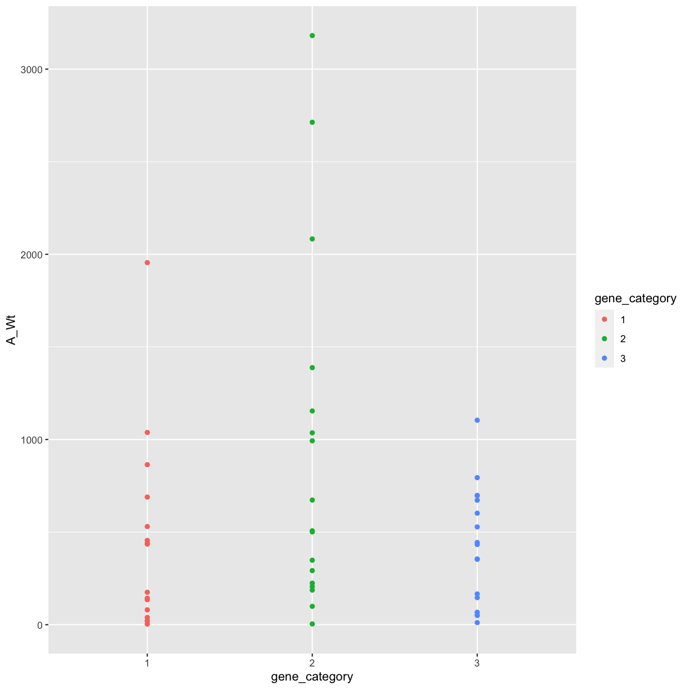
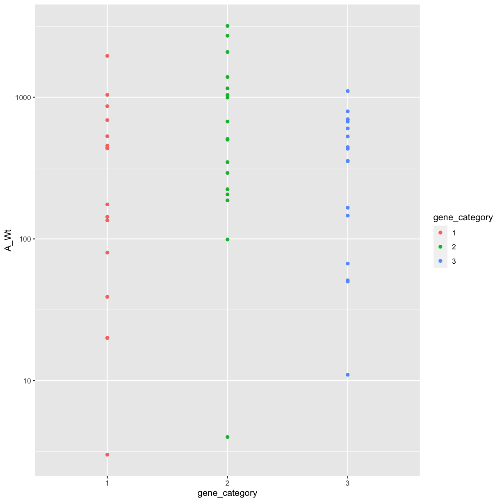
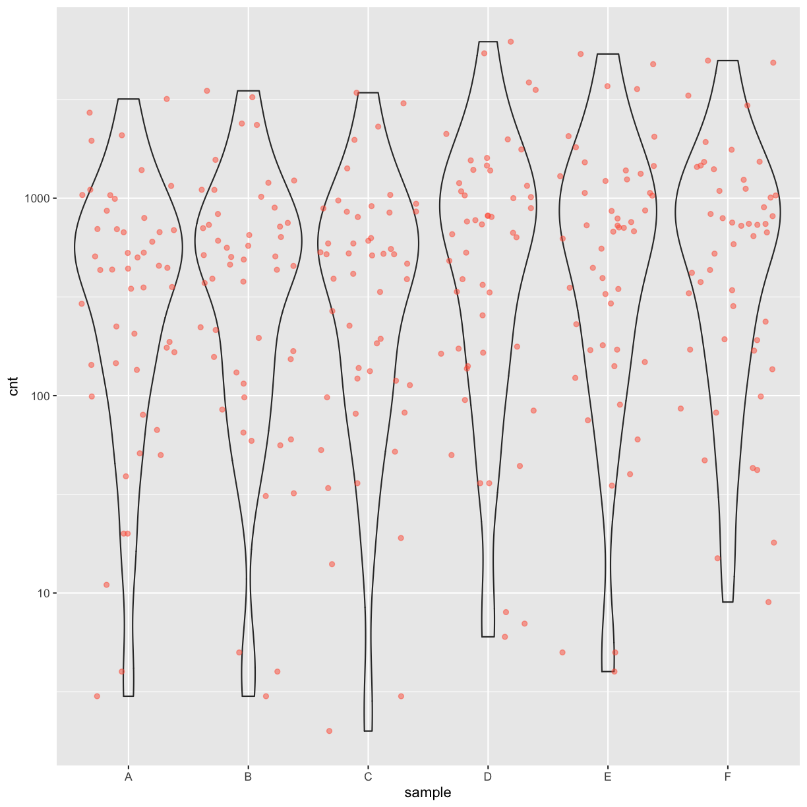
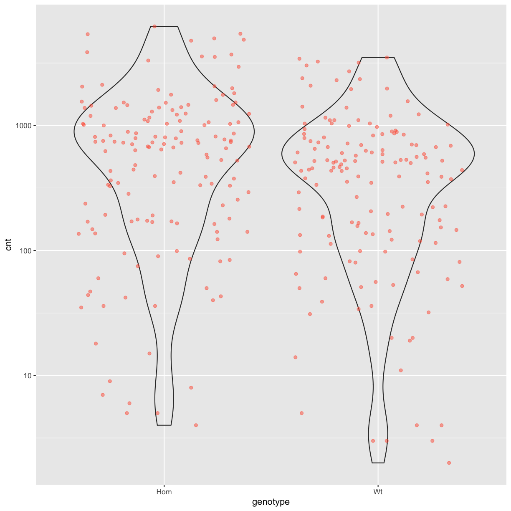
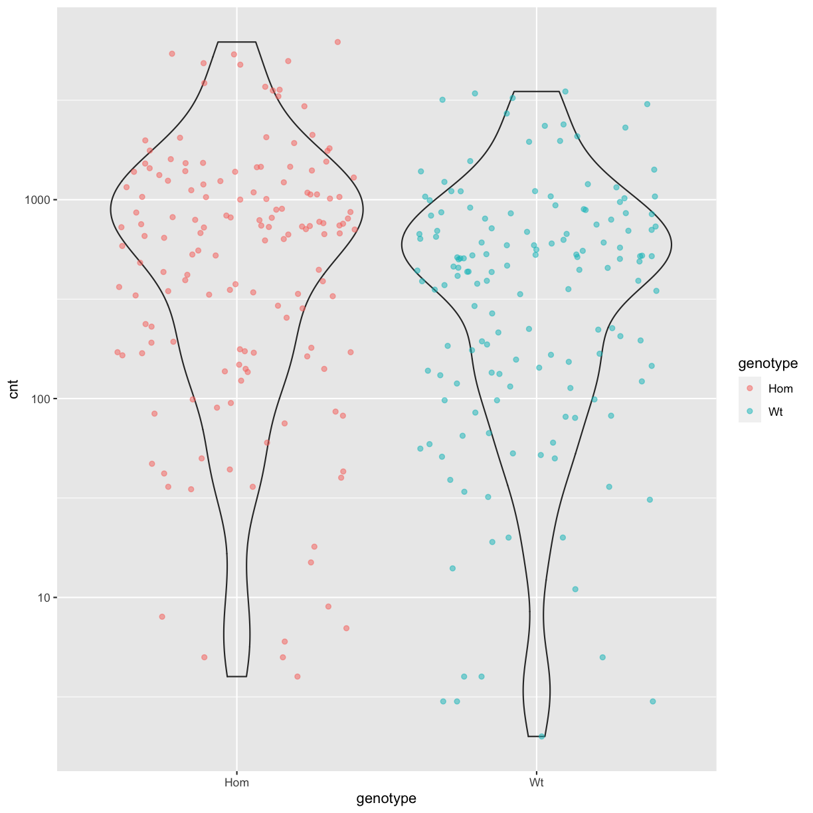
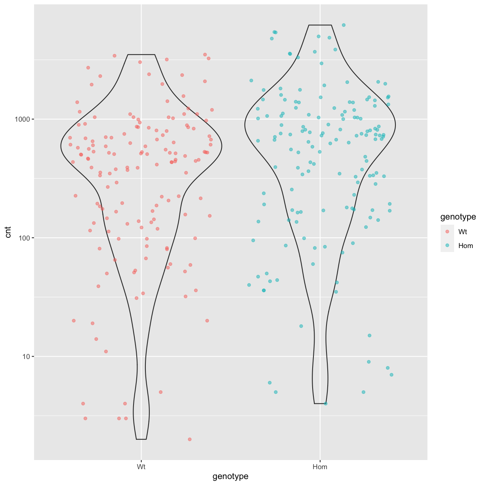
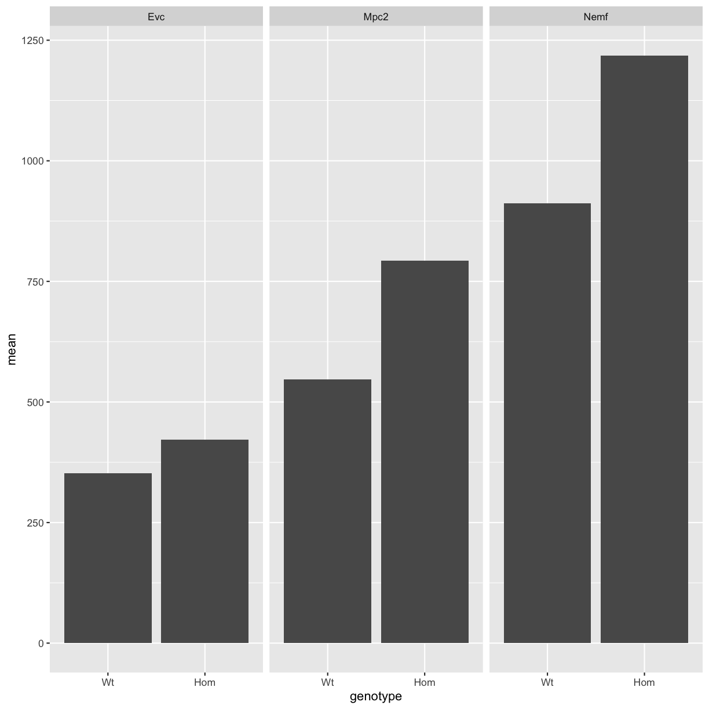

---
# Please do not edit this file directly; it is auto generated.
# Instead, please edit 07-exercises.md in _episodes_rmd/
title: Exercises
teaching: 0
exercises: 0
questions:
- ""
objectives:
- ""
keypoints:
- ""
source: Rmd
---


## 1. Introducing R and RStudio IDE

> ## Discussion: Your experience and expectations
>
> * What has motivated you to learn R? Have you had a research question for which
>   spreadsheet programs such as Excel have proven difficult to use, or where the
>   size of the data set created issues?
> * In what situations do you imagine that using R will be most valuable to you? 
{: .discussion}


## 2. R Basics

> ## Challenge 2.1
>
> What are the values after each statement in the following?
>
> 
> ~~~
> mass <- 47.5            # mass?
> age  <- 122             # age?
> mass <- mass * 2.0      # mass?
> age  <- age - 20        # age?
> mass_index <- mass/age  # mass_index?
> ~~~
> {: .language-r}
{: .challenge}


> ## Challenge 2.2
>
> Write a function that returns the sum of two arguments given to it.
>
>> ## Solution
>>
>> 
>> ~~~
>> # Calculate the sum of x and y
>> add_two_args <- function(x, y) { x + y }
>> 
>> # Call the function
>> add_two_args(9, 7)
>> ~~~
>> {: .language-r}
>> 
>> 
>> 
>> ~~~
>> [1] 16
>> ~~~
>> {: .output}
>>
> {: .solution}
{: .challenge}


> ## Challenge 2.3
>
> * We’ve seen that atomic vectors can be of type character,
>   numeric (or double), integer, and logical. But what happens if we try to mix
>   these types in a single vector?
> 
>> ## Answer
>>
>> R implicitly converts them to all be the same type
> {: .solution}
>
> * What will happen in each of these examples? (hint: use `class()`
>   to check the data type of your objects):
>
>     ```r
>     num_char <- c(1, 2, 3, "a")
>     num_logical <- c(1, 2, 3, TRUE)
>     char_logical <- c("a", "b", "c", TRUE)
>     tricky <- c(1, 2, 3, "4")
>     ```
>
> * Why do you think it happens?
>
>> ## Answer
>>
>> Vectors can be of only one data type. R tries to convert (coerce) the content
>> of this vector to find a "common denominator" that doesn't lose any
>> information.
> {: .solution}
>
> * How many values in `combined_logical` are `"TRUE"` (as a character) in the
>   following example (reusing the 2 `..._logical`s from above):
>
>     ```r
>     combined_logical <- c(num_logical, char_logical)
>     ```
>
>> ## Answer
>>
>> Only one. There is no memory of past data types, and the coercion happens the
>> first time the vector is evaluated. Therefore, the `TRUE` in `num_logical`
>> gets converted into a `1` before it gets converted into `"1"` in
>> `combined_logical`.
> {: .solution}
>
> * You've probably noticed that objects of different types get
>   converted into a single, shared type within a vector. In R, we
>   call converting objects from one class into another class
>   _coercion_. These conversions happen according to a hierarchy,
>   whereby some types get preferentially coerced into other
>   types. Can you draw a diagram that represents the hierarchy of how
>   these data types are coerced?
>
>> ## Answer
>>
>> logical &#8594; numeric &#8594; character &#8592; logical
> {: .solution}
{: .challenge}


> ## Challenge 2.4 (optional)
>
> * Can you figure out why `"four" > "five"` returns `TRUE`?
> 
>> ## Answer
>>
>> When using ">" or "<" on strings, R compares their alphabetical order. 
>> Here "four" comes after "five", and therefore is "greater than" it.
> {: .solution}
{: .challenge}


> ## Challenge 2.5
>
> 1. Using this vector of heights in inches, create a new vector,
>    `heights_no_na`, with the NAs removed.
>
>     ```r
>     heights <- c(63, 69, 60, 65, NA, 68, 61, 70, 61, 59, 64, 69, 63, 63, NA, 72, 65, 64, 70, 63, 65)
>     ```
> 2. Use the function `median()` to calculate the median of the `heights` vector.
>
> 3. Use R to figure out how many people in the set are taller than 67 inches.
>
>> ## solution
>>
>> 
>> ~~~
>> heights <- c(63, 69, 60, 65, NA, 68, 61, 70, 61, 59, 64, 69, 63, 63, NA, 72, 65, 64, 70, 63, 65)
>> 
>> # 1.
>> heights_no_na <- heights[!is.na(heights)] 
>> # or
>> heights_no_na <- na.omit(heights)
>> # or
>> heights_no_na <- heights[complete.cases(heights)]
>> 
>> # 2.
>> median(heights, na.rm = TRUE)
>> ~~~
>> {: .language-r}
>> 
>> 
>> 
>> ~~~
>> [1] 64
>> ~~~
>> {: .output}
>> 
>> 
>> 
>> ~~~
>> # 3.
>> heights_above_67 <- heights_no_na[heights_no_na > 67]
>> length(heights_above_67)
>> ~~~
>> {: .language-r}
>> 
>> 
>> 
>> ~~~
>> [1] 6
>> ~~~
>> {: .output}
> {: .solution}
{: .challenge}


## 3. R Basics continued - factors and data frames

### Loading the samples data


~~~
download.file(
  url = "https://nbisweden.github.io/module-r-intro-dm-practices/data/samples_r_lesson.csv",
  destfile = "data_raw/samples_r_lesson.csv")
~~~
{: .language-r}


~~~
## load the tidyverse packages, incl. dplyr
library(tidyverse)
~~~
{: .language-r}


~~~
samples <- read_csv("data_raw/samples_r_lesson.csv")
~~~
{: .language-r}

~~~

── Column specification ─────────────────────────────────────────────────────────────────────────────────────────────────────────────────────────────────────────────────────────────────────
cols(
  animal_id = col_double(),
  month = col_double(),
  day = col_double(),
  year = col_double(),
  mouse_line = col_character(),
  strain = col_character(),
  developmental_stage = col_character(),
  sex = col_character(),
  organism_part = col_character(),
  genotype = col_character(),
  experiment_type = col_character(),
  researcher = col_character()
)
~~~
{: .output}

### Inspecting data frames

* Size:
    * `dim(samples)` - returns a vector with the number of rows in the first
      element, and the number of columns as the second element
      (the **dim**ensions of the object)
    * `nrow(samples)` - returns the number of rows
    * `ncol(samples)` - returns the number of columns

* Content:
    * `head(samples)` - shows the first 6 rows
    * `tail(samples)` - shows the last 6 rows

* Names:
    * `names(samples)` - returns the column names (synonym of `colnames()` for
      `data.frame` objects)
    * `rownames(samples)` - returns the row names

* Summary:
    * `str(samples)` - structure of the object and information about the class,
      length and content of each column
    * `summary(samples)` - summary statistics for each column


> ## Challenge 3.1
>
> Based on the output of `str(samples)`, can you answer the following questions?
>
> * What is the class of the object `samples`?
> * How many rows and how many columns are in this object?
>
>> ## Solution
>>
>> 
>> ~~~
>> str(samples)
>> ~~~
>> {: .language-r}
>> 
>> 
>> 
>> ~~~
>> spec_tbl_df[,12] [100 × 12] (S3: spec_tbl_df/tbl_df/tbl/data.frame)
>>  $ animal_id          : num [1:100] 800793 804396 805431 805992 808935 ...
>>  $ month              : num [1:100] 1 1 1 1 1 1 1 1 1 1 ...
>>  $ day                : num [1:100] 6 7 12 13 14 16 19 19 20 24 ...
>>  $ year               : num [1:100] 2018 2019 2018 2019 2020 ...
>>  $ mouse_line         : chr [1:100] "Alk3" "Vegfr" "Vegfr" "Vegfr" ...
>>  $ strain             : chr [1:100] "BALB/cJ" "C57BL/6" "C57BL/6" "C57BL/6" ...
>>  $ developmental_stage: chr [1:100] "adult" "adult" "pup" "pup" ...
>>  $ sex                : chr [1:100] "F" "M" "F" "M" ...
>>  $ organism_part      : chr [1:100] NA "lung" "lung" "lung" ...
>>  $ genotype           : chr [1:100] "wild type" "wild type" "wild type" "wild type" ...
>>  $ experiment_type    : chr [1:100] "behaviour" "sequencing assay" "IHC" "IHC" ...
>>  $ researcher         : chr [1:100] "Kim" "Sam" "Sam" "Sam" ...
>>  - attr(*, "spec")=
>>   .. cols(
>>   ..   animal_id = col_double(),
>>   ..   month = col_double(),
>>   ..   day = col_double(),
>>   ..   year = col_double(),
>>   ..   mouse_line = col_character(),
>>   ..   strain = col_character(),
>>   ..   developmental_stage = col_character(),
>>   ..   sex = col_character(),
>>   ..   organism_part = col_character(),
>>   ..   genotype = col_character(),
>>   ..   experiment_type = col_character(),
>>   ..   researcher = col_character()
>>   .. )
>> ~~~
>> {: .output}
>> * The object `samples` is of class `data.frame`, or more specifically a
>>   `tibble` (`spec_tbl_df/tbl_df/tbl/data.frame`)
>> * Rows and columns: 100 rows and 12 columns
> {: .solution}
{: .challenge}


> ## Challenge 3.2
>
> 1. Create a `data.frame` (`samples_20`) containing only the data in
>    row 20 of the `samples` dataset.
>
> 2. Notice how `nrow()` gave you the number of rows in a `data.frame`?
>
>      * Use that number to pull out just that last row in the data frame.
>      * Compare that with what you see as the last row using `tail()` to make
>        sure it's meeting expectations.
>      * Pull out that last row using `nrow()` instead of the row number.
>      * Create a new data frame (`samples_last`) from that last row.
>
> 3. Use `nrow()` to extract the row that is in the middle of the data
>    frame. Store the content of this row in an object named `samples_middle`.
>
> 4. Combine `nrow()` with the `-` notation above to reproduce the behavior of
>    `head(samples)`, keeping just the first through 6th rows of the samples
>    dataset.
>
>> ## Solution
>>
>>
>>~~~
>>## 1.
>>samples_20 <- samples[20, ]
>>## 2.
>># Saving `n_rows` to improve readability and reduce duplication
>>n_rows <- nrow(samples)
>>samples_last <- samples[n_rows, ]
>>## 3.
>>samples_middle <- samples[n_rows / 2, ]
>>## 4.
>>samples_head<- samples[-(7:n_rows), ]
>>~~~
>>{: .language-r}
> {: .solution}
{: .challenge}


> ## Challenge 3.3
>
> 1. Change the columns `strain` and `organism_part` in the `samples`
>    data frame into a factor.
>
> 2. Using the functions you have learnt so far, can you find out...
>
>      * How many samples were taken from brain tissue?
>      * How many different mouse strains are in the `strain` column?
>
>> ## Solution
>>
>> 
>> ~~~
>> samples$strain <- factor(samples$strain)
>> samples$organism_part <- factor(samples$organism_part)
>> summary(samples$organism_part)
>> ~~~
>> {: .language-r}
>> 
>> 
>> 
>> ~~~
>> brain  lung  NA's 
>>    16    58    26 
>> ~~~
>> {: .output}
>> 
>> 
>> 
>> ~~~
>> nlevels(samples$strain)
>> ~~~
>> {: .language-r}
>> 
>> 
>> 
>> ~~~
>> [1] 2
>> ~~~
>> {: .output}
>>
>> * How many brain samples? There are 16 "brain" values in the `organism_part`
     column.
>> * how many mouse strains? There are 2 strains in the `strain` column.
> {: .solution}
{: .challenge}

> ## Challenge 3.4
>
> 1. We have seen how data frames are created when using `read_csv()`, but they
>    can also be created by hand with the `data.frame()` function.  There are a
>    few mistakes in this hand-crafted `data.frame`. Can you spot and fix them?
>    Don't hesitate to experiment!
>
>    
>    ~~~
>    animal_data <- data.frame(
>              animal = c(dog, cat, sea cucumber, sea urchin),
>              feel = c("furry", "squishy", "spiny"),
>              weight = c(45, 8 1.1, 0.8)
>              )
>    ~~~
>    {: .language-r}
>
> 2. Can you predict the class for each of the columns in the following example?
>    Check your guesses using `str(country_climate)`:
>      * Are they what you expected? Why? Why not?
>      * What would you need to change to ensure that each column had the
>        accurate data type?
>
>     
>     ~~~
>     country_climate <- data.frame(
>            country = c("Canada", "Panama", "South Africa", "Australia"),
>            climate = c("cold", "hot", "temperate", "hot/temperate"),
>            temperature = c(10, 30, 18, "15"),
>            northern_hemisphere = c(TRUE, TRUE, FALSE, "FALSE"),
>            has_kangaroo = c(FALSE, FALSE, FALSE, 1)
>            )
>     ~~~
>     {: .language-r}
>
>> ## Solution
>>
>> * missing quotations around the names of the animals
>> * missing one entry in the `feel` column (probably for one of the furry animals)
>> * missing one comma in the `weight` column
>> * `country`, `climate`, `temperature`, and `northern_hemisphere` are
>>    characters; `has_kangaroo` is numeric
>> * using `factor()` one could replace character columns with factors columns
>> * removing the quotes in `temperature` and `northern_hemisphere` and replacing 1
>>   by TRUE in the `has_kangaroo` column would give what was probably 
>>   intended
> {: .solution}
{: .challenge}


## 4. Aggregating and Analyzing Data with dplyr

### Load the gene counts dataset


| Column   | Description                            |
|----------|----------------------------------------|
| gene     | name of gene                           |
| sample   | 1-letter label for the sample (A to F) |
| genotype | "Wt" (wild type) or "Hom" (homozygous) |
| cnt      | number of reads overlapping the gene   |


~~~
download.file(
  url = "https://nbisweden.github.io/module-r-intro-dm-practices/data/gene_counts_r_lesson.csv",
  destfile = "data_raw/gene_counts_r_lesson.csv")
~~~
{: .language-r}


~~~
## load the tidyverse packages, incl. dplyr
library(tidyverse)
~~~
{: .language-r}

~~~
cnts <- read_tsv("data_raw/gene_counts_r_lesson.tsv")
~~~
{: .language-r}

~~~

── Column specification ─────────────────────────────────────────────────────────────────────────────────────────────────────────────────────────────────────────────────────────────────────
cols(
  gene = col_character(),
  sample = col_character(),
  genotype = col_character(),
  cnt = col_double()
)
~~~
{: .output}

- `select()`: subset columns
- `filter()`: subset rows on conditions
- `pivot_wider()`: transform rows into columns
- `pivot_longer()`: transform columns into rows
- `mutate()`: create new columns by using information from other columns
- `group_by()` and `summarize()`: create summary statistics on grouped data
- `arrange()`: sort results
- `count()`: count discrete values

> ## Challenge 4.1
>
> Using pipes, subset the `cnts` data to include only counts for wild type
> genotypes above 10,000 and retain only the columns `gene` and `cnt`.
>
>> ## Solution
>>
>> 
>> ~~~
>> cnts %>%
>>   filter(cnt > 10000 & genotype == "Wt") %>%
>>   select(gene, cnt)
>> ~~~
>> {: .language-r}
>> 
>> 
>> 
>> ~~~
>> # A tibble: 399 x 2
>>    gene     cnt
>>    <chr>  <dbl>
>>  1 Abca3  10111
>>  2 Ace    13834
>>  3 Ace    16353
>>  4 Ace    16830
>>  5 Actb   68901
>>  6 Actb   62553
>>  7 Actb   68037
>>  8 Acvrl1 10195
>>  9 Ager   51453
>> 10 Ager   47068
>> # … with 389 more rows
>> ~~~
>> {: .output}
> {: .solution}
{: .challenge}


> ## Challenge 4.2
>
> Reshape the `cnts` data frame with samples as rows and the three genes
> "Hopx", "Rpl21" and "Calr" as columns.
>
>> ## Solution
>>
>> 
>> ~~~
>> cnts %>%
>>   filter(gene %in% c("Hopx", "Rpl21", "Calr")) %>%
>>   pivot_wider(
>>     id_cols = sample,
>>     names_from = gene,
>>     values_from = cnt
>>   )
>> ~~~
>> {: .language-r}
>> 
>> 
>> 
>> ~~~
>> # A tibble: 6 x 4
>>   sample  Calr  Hopx Rpl21
>>   <chr>  <dbl> <dbl> <dbl>
>> 1 A       6137 18765 12499
>> 2 B       6279 15569 11248
>> 3 C       6733 14070  9851
>> 4 D      12369 16010 14494
>> 5 E      10524 18048 14177
>> 6 F      10801 19600 15642
>> ~~~
>> {: .output}
> {: .solution}
{: .challenge}

> ## Challenge 4.3
>
> Create a new data frame from the `cnts_wide` data that meets the
> following criteria: contains only the `gene` column and a new column called
> `log_A_Wt` with the common logarithm of the `cnt` values in the `A_Wt` column.
>
> **Hint**: You can use the `log10()` function to calculate the common
> logarithm values.
> 
>> ## Solution
>>
>> 
>> ~~~
>> cnts_wide %>%
>>   mutate(log_A_Wt = log10(A_Wt)) %>%
>>   select(gene, log_A_Wt)
>> ~~~
>> {: .language-r}
>> 
>> 
>> 
>> ~~~
>> Error in mutate(., log_A_Wt = log10(A_Wt)): object 'cnts_wide' not found
>> ~~~
>> {: .error}
> {: .solution}
{: .challenge}


> ## Challenge 4.4
>
> * For each sample in the `cnts` data frame, how many of the genes have
>   zero reads?
>
>> ## Solution
>>
>> 
>> ~~~
>> cnts %>%
>>   filter(cnt == 0) %>%
>>   count(gene) 
>> ~~~
>> {: .language-r}
>> 
>> 
>> 
>> ~~~
>> # A tibble: 23,451 x 2
>>    gene              n
>>    <chr>         <int>
>>  1 0610005C13Rik     4
>>  2 0610012D04Rik     2
>>  3 0610025J13Rik     1
>>  4 0610031O16Rik     4
>>  5 0610040F04Rik     2
>>  6 1110002J07Rik     1
>>  7 1110008E08Rik     6
>>  8 1110015O18Rik     6
>>  9 1110025L11Rik     6
>> 10 1110028F18Rik     5
>> # … with 23,441 more rows
>> ~~~
>> {: .output}
> {: .solution}
>
> * Use `group_by()` and `summarize()` to find the mean and standard deviation
>   of the number of reads for each genotype and gene. Then reshape the data
>   so that the mean and standard deviation for for the two genotypes are
>   displayed in separate columns.
>
>   **Hint:** calculate the standard deviation with the `sd()` function.
>
>> ## Solution
>>
>> 
>> ~~~
>> cnts %>%
>>     group_by(gene, genotype) %>%
>>     summarize(
>>         mean = mean(cnt),
>>         stdev = sd(cnt)
>>     ) %>% 
>>     pivot_wider(
>>         id_cols = gene,
>>         names_from = genotype,
>>         values_from = (c(mean, stdev))
>>     )
>> ~~~
>> {: .language-r}
>> 
>> 
>> 
>> ~~~
>> # A tibble: 43,280 x 5
>> # Groups:   gene [43,280]
>>    gene          mean_Hom mean_Wt stdev_Hom stdev_Wt
>>    <chr>            <dbl>   <dbl>     <dbl>    <dbl>
>>  1 0610005C13Rik    0.333    1.67     0.577     2.89
>>  2 0610007P14Rik  818.     573.      55.8      20.6 
>>  3 0610009B22Rik  210      115.      20.0      18.8 
>>  4 0610009E02Rik   14        9.33     6.08      3.51
>>  5 0610009L18Rik   46       31       10.4       5.57
>>  6 0610009O20Rik 1293.     803.      59.5      47.9 
>>  7 0610010F05Rik  349      186       52.2      15   
>>  8 0610010K14Rik    5.33     4.67     2.08      5.51
>>  9 0610011F06Rik  389.     314       40.0       6.08
>> 10 0610012D04Rik    2.33     2        2.08      2   
>> # … with 43,270 more rows
>> ~~~
>> {: .output}
> {: .solution}
{: .challenge}


### Exporting data to be used in later exercises


~~~
# Create a vector with a subset of genes
genes_subset <- c(
  "Rbpj", "Nop10", "Nsun2", "Cxcl5", "Cfdp1", "Furin", "Adcy8", "Grin1",
  "Itpka", "Ippk", "Aff2", "Rab43", "Ofd1", "Edem2", "Xlr4c", "Mpc2",
  "Ect2l", "Pcgf1", "Nov", "Sys1", "Ackr2", "Acat1", "Phkg2", "Hecw2",
  "Ctps", "Arl5b", "Wnt3a", "Evc", "Wibg", "Axl", "Usp19", "Agbl2",
  "Eif3f", "Mark4", "Sbk2", "Eri3", "Tab1", "Cd276", "Sox9", "Ces2e",
  "Htra3", "Foxj2", "Arl4d", "Wdr1", "Taco1", "Aebp2", "Nemf", "Fpgt",
  "Helq", "Nudt6")

# Filter out subset of genes
cnts_sml_wide <- cnts_wide %>%
  filter(gene %in% genes_subset)

cnts_sml_long <- cnts %>%
  filter(gene %in% genes_subset)

# Write data frame to CSV
write_csv(cnts_sml_wide, file = "gene_counts_sml_wide.csv")

# Write data frame to CSV
write_csv(cnts_sml_long, file = "gene_counts_sml_long.csv")
~~~
{: .language-r}

## 5. Data Visualization with ggplot2


~~~
library(tidyverse)
~~~
{: .language-r}

### Load the small gene counts datasets

If not still in the workspace, load the two small datasets that we created in
the previous episode.


~~~
cnts_sml_long <- read_csv("gene_counts_sml_long.csv")
cnts_sml_wide <- read_csv("gene_counts_sml_wide.csv")
~~~
{: .language-r}


To make the `cnts_sml_wide` dataset a bit more interesting for the plotting in
this episode, we will add a fictional column as a factor that we call
`gene_category`:


~~~
cnts_sml_wide$gene_category = factor(c(
    2, 2, 1, 1, 1, 3, 3, 1, 1, 1, 3, 3, 1, 3, 3, 2, 2, 3, 3, 2, 2, 2, 2, 3, 2,
    1, 2, 3, 2, 3, 1, 3, 1, 2, 3, 2, 1, 2, 3, 1, 1, 1, 3, 2, 1, 2, 2, 3, 3, 1))

head(cnts_sml_wide)
~~~
{: .language-r}


~~~
# A tibble: 6 x 8
  gene   A_Wt  B_Wt  C_Wt D_Hom E_Hom F_Hom gene_category
  <chr> <dbl> <dbl> <dbl> <dbl> <dbl> <dbl> <fct>        
1 Acat1  1154  1197  1039  1766  1812  1760 2            
2 Ackr2   348   454   513   657   708   643 2            
3 Adcy8   435   504   523   668   867   792 1            
4 Aebp2   864   832   846  1463  1520  1527 1            
5 Aff2     20    32    19    44    75    47 1            
6 Agbl2   146   153   113   141   170   191 3            
~~~
{: .output}


> ## Challenge 5.1 (optional)
>
> Scatter plots can be useful exploratory tools for small datasets. For data
> sets with large numbers of observations, overplotting of points can be a
> limitation of scatter plots. One strategy for handling such settings is to use
> hexagonal binning of observations. The plot space is tessellated into
> hexagons. Each hexagon is assigned a color based on the number of observations
> that fall within its boundaries. To use hexagonal binning with **`ggplot2`**, 
> irst install the R package `hexbin` from CRAN:
>
>
> 
> ~~~
>   install.packages("hexbin")
>   library(hexbin)
> ~~~
> {: .language-r}
>
> Then use the `geom_hex()` function:
>
> 
> ~~~
>   cnts_plot +
>   geom_hex()
> ~~~
> {: .language-r}
>
> - What are the relative strengths and weaknesses of a hexagonal bin plot
>   compared to a scatter plot? Examine the above scatter plot and compare it
>   with the hexagonal bin plot that you created.
```
{: .challenge}

> ## Challenge 5.2
>
> Use what you just learned to create a scatter plot the gene category against
> the counts for sample `A_Wt`. Is this a good way to show this type of data?
>
>> ## Solution
>>
>> 
>> ~~~
>> ggplot(data = cnts_sml_wide, 
>>        mapping = aes(x = gene_category, y = A_Wt)) +
>>   geom_point(aes(color = gene_category))
>> ~~~
>> {: .language-r}
>> 
>> 
>> Since we have counts that varies over a wide range, one could for example
>> use a logarithmic y-scale instead:
>>
>> 
>> ~~~
>> ggplot(data = cnts_sml_wide, 
>>        mapping = aes(x = gene_category, y = A_Wt)) +
>>   geom_point(aes(color = gene_category)) +
>>   scale_y_log10()
>> ~~~
>> {: .language-r}
>> 
>> 
> {: .solution}
{: .challenge}

> ## Challenges 5.3
>
> Use the code below, and try to incrementally make changes to the plot.
>
>
>~~~
>ggplot(data = cnts_sml_long, mapping = aes(x = sample, y = cnt)) +
>    geom_boxplot(alpha = 0) +
>    geom_jitter(alpha = 0.5, color = "tomato")
>~~~
>{: .language-r}
>
> Boxplots are useful summaries, but hide the *shape* of the distribution. For
> example, if there is a bimodal distribution, it would not be observed with a
> boxplot. An alternative to the boxplot is the violin plot (sometimes known as 
> a beanplot), where the shape (of the density of points) is drawn.
>
> * Replace the box plot with a violin plot; see `geom_violin()`.
>
>> ## Solution
>>
>> 
>> ~~~
>> # Violin plot instead of boxplot
>> ggplot(data = cnts_sml_long, mapping = aes(x = sample, y = cnt)) +
>>     geom_boxplot(alpha = 0) +
>>     geom_jitter(alpha = 0.5, color = "tomato")
>> ~~~
>> {: .language-r}
> {: .solution}
>
> In many types of data, it is important to consider the *scale* of the
> observations. For example, it may be worth changing the scale of the axis to
> better distribute the observations in the space of the plot. Changing the
> scale of the axes is done similarly to adding/modifying other components:
>
> * Represent the read counts on the log~10~ scale; see `scale_y_log10()`.
>
>> ## Solution
>>
>>
>>~~~
>># Violin plot with log-scale
>>ggplot(data = cnts_sml_long, mapping = aes(x = sample, y = cnt)) +
>>  geom_violin(alpha = 0) +
>>  geom_jitter(alpha = 0.5, color = "tomato") +
>>  scale_y_log10()
>>~~~
>>{: .language-r}
>>
>>
> {: .solution}
>
> * We've now looked at the distribution of the counts within samples. Try
>   making a new plot to explore the distribution for each `genotype` instead.
>   Overlay the boxplot layer on a jitter layer to show actual counts.
>
>> ## Solution
>>
>> 
>> ~~~
>> # Violin plot by genotype
>> ggplot(data = cnts_sml_long, mapping = aes(x = genotype, y = cnt)) +
>>   geom_violin(alpha = 0) +
>>   geom_jitter(alpha = 0.5, color = "tomato") +
>>   scale_y_log10()
>> ~~~
>> {: .language-r}
>> 
>> 
> {: .solution}
>
> * Add color to the data points on your boxplot according to the sample's
>   genotype of the actual sample.
>
>> ## Solution
>>
>> 
>> ~~~
>> # Violin plot by genotype in color
>> ggplot(data = cnts_sml_long, mapping = aes(x = genotype, y = cnt)) +
>>   geom_violin(alpha = 0) +
>>   geom_jitter(alpha = 0.5, aes(color = genotype)) +
>>   scale_y_log10()
>> ~~~
>> {: .language-r}
>> 
>> 
> {: .solution}
>
> * Reorder the genotype categories so that "Wt" is shown to the left and "Hom"
>   to the right (**hint:** use the `factor()` function).
>
>> ## Solution
>>
>> 
>> ~~~
>> # Violin plot by reordered genotypes
>> 
>> # Create a factor with reordered levels
>> cnts_sml_long$genotype <- factor(cnts_sml_long$genotype, levels = c("Wt", "Hom"))
>> 
>> # Now create the plot in the same way as before
>> ggplot(data = cnts_sml_long, mapping = aes(x = genotype, y = cnt)) +
>>   geom_violin(alpha = 0) +
>>   geom_jitter(alpha = 0.5, aes(color = genotype)) +
>>   scale_y_log10()
>> ~~~
>> {: .language-r}
>> 
>> 
> {: .solution}
{: .challenge}

> ## Challenge 5.4
>
> Use what you just learned to create a plot that show how the mean count for
> each genotype differ between the three genes "Evc", "Mpc" and "Nemf".
>
>> ## Solution
>> 
>> 
>> ~~~
>> cnts_sml_long %>%
>>   filter(gene %in% c("Evc", "Mpc2", "Nemf")) %>%
>>   group_by(gene, genotype) %>%
>>   summarize(mean=mean(cnt)) %>%
>>   ggplot(aes(x = genotype, y = mean)) +
>>     geom_bar(stat = "identity") +
>>     facet_wrap(vars(gene))
>> ~~~
>> {: .language-r}
>> 
>> 
> {: .solution}
{: .challenge}

> ## Challenge 5.5
>
> With all of this information in hand, please take another five minutes to either
> improve one of the plots generated in this exercise or create a beautiful graph
> of your own. Use the RStudio [**`ggplot2`** cheat sheet](https://www.rstudio.com/wp-content/uploads/2016/11/ggplot2-cheatsheet-2.1.pdf) 
> for inspiration.
>
> Here are some ideas:
>
> * See if you can change the thickness of the lines.
> * Can you find a way to change the name of the legend? What about its labels?
> * Try using a different color palette (see
>   [http://www.cookbook-r.com/Graphs/Colors_(ggplot2)/]).
{: .challenge


### Exporting plots


~~~
cnts_plot <- cnts_sml_long %>%
  # Filter out three genes
  filter(gene %in% c("Evc", "Mpc2", "Nemf")) %>%
  # Create a separate barplot for each gene
  ggplot(aes(x = sample, y = cnt, fill = genotype)) +
    geom_bar(stat = "identity") +
    facet_wrap(facets = vars(gene)) +
    labs(title = "Number of reads for selected genes",
         x = "Sample",
         y = "Number of reads") +
    scale_fill_discrete(
      name = "Genotype",
      labels = c("Wild type", "Homozygous")) + 
    theme_bw() +
    theme(text = element_text(size = 16))

# Save the file
ggsave("gene_counts_plot.png", cnts_plot, width = 15, height = 10)
~~~
{: .language-r}


## 6. Producing Reports With knitr

> ## Challenge 6.1
>
> Create a new R Markdown document. Delete all of the R code chunks
> and write a bit of Markdown (some sections, some italicized
> text, and an itemized list).
>
> Convert the document to a webpage.
{: .challenge}

> ## Challenge 6.2
>
> Add code chunks to:
>
> - Load the `tidyverse` and `ggplot2` packages
> - Read the data from the file `gene_counts_sml_long.csv` (you should have
>   the file in your working directory from earlier episodes).
> - Create a plot based on the loaded data.
{: .challenge}

> ## Challenge 6.3
>
> Use chunk options to control the size of a figure and to hide the
> code.
{: .challenge}

> ## Challenge 6.4
>
> Try out a bit of in-line R code.
{: .challenge}
