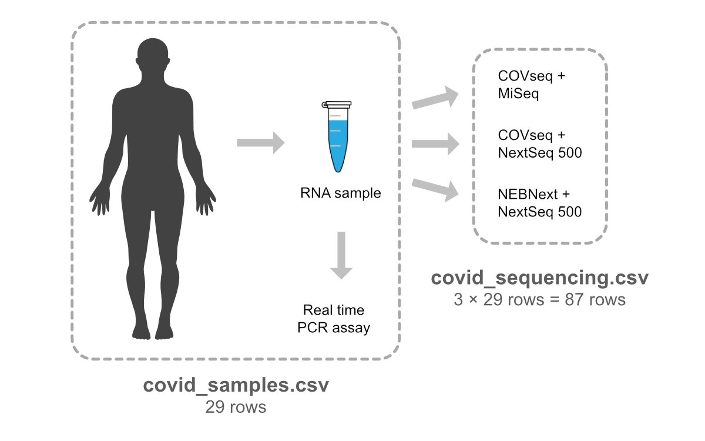

```{r, include = FALSE}
source("../bin/chunk-options.R")
knitr_fig_path("03-")
```

## COVID-19 example data

In this lesson we will use data on 29 positive SARS-CoV-2 samples taken from as
many individuals. The data come from a [scientific study](https://doi.org/10.1038/s41467-021-24078-9)
where researchers evaluated the performance of a new and more cost-effective
method, "COVseq", for obtaining viral genome sequences. The researchers were
particularly interested in the method's ability to detect new viral variants.

We will use two datasets that are stored in comma-separated values (CSV) files:
`covid_samples.csv` and `covid_sequencing.csv`. The first dataset contains 29
rows describing the SARS-CoV-2 samples. The second dataset contains results from
applying three different sequencing procedures to each sample. This dataset has
87 rows, i.e. three rows for each sample. The COVseq method is part of two of
the three investigated procedures, and is thus represented by two thirds of the
rows in the sequencing dataset.



## Loading the samples data

We will start with the dataset with 29 rows, where each row represents one
positive SARS-CoV-2 sample (and consequently one individual). This dataset has
the following columns:

| Column          | Description                                                                                                                     |
|-----------------|---------------------------------------------------------------------------------------------------------------------------------|
| patient_id      | code for the sampled individual                                                                                                 |
| collection_date | date when the sample was taken                                                                                                  |
| country         | country                                                                                                                         |
| region          | geographic region                                                                                                               |
| age             | age of the person when the sample was taken                                                                                     |
| disease_outcome | outcome of the disease (dead/recovered/NA)                                                                                      |
| sex             | sex of the person (female/male)                                                                                                 |                                                                                       |
| ct              | cycle threshold (Ct) value from real time PCR assays, i.e. the number of amplification cycles needed to detect the virus        |


### Downloading the data

We are going to use the R function `download.file()` to download the CSV file
that contains the data, and we will then use `read_csv()` to load the
content of the CSV file into R.

Inside the `download.file` command, the first entry is a character string with the
source URL ("https://nbisweden.github.io/module-r-intro-dm-practices/data/covid_samples.csv"). 
This source URL downloads a CSV file from GitHub. The text after the comma
("data_raw/covid_samples.csv") is the destination of the file on your computer.
You'll need to have a folder called "data_raw" where  you'll download the file.
So this command downloads a file from the web, names it "covid_samples.csv" and
adds it to a preexisting folder named "data_raw".

```{r, eval=FALSE, purl=TRUE}
download.file(
  url = "https://nbisweden.github.io/module-r-intro-dm-practices/data/covid_samples.csv",
  destfile = "data_raw/covid_samples.csv")
```


### Reading the data into R

The file has now been downloaded to the destination you specified, but R has not 
yet loaded the data from the file into memory. To do this, we can use the 
`read_csv()` function from the **`tidyverse`** package. 

Packages in R are basically sets of additional functions that let you do more
stuff. The functions we've been using so far, like `round()`, `sqrt()`, and
`c()`, come built into R; packages give you access to additional functions. 
Before you use a package for the first time you need to install it on your 
machine, and then you load it into every subsequent R session when you need it. 

If you have followed the [setup instructions](../setup.html), you should now
have the **`tidyverse`** package installed. If not, you can install the package
by typing `install.packages("tidyverse")` straight into the console. In fact,
it's better to write this in the console than in our script for any package, as
there's no need to re-install packages every time we run the script. Then, to
load the package type:

```{r, message = FALSE, purl = FALSE}
## load the tidyverse packages, incl. dplyr
library(tidyverse)
```

Now we can use the functions from the **`tidyverse`** package. Let's use
`read_csv()` to read the data into a data frame (we will learn more about data
frames later):

```{r, eval = FALSE,  purl = FALSE}
samples <- read_csv("data_raw/covid_samples.csv")
```
```{r, echo = FALSE, eval = TRUE, purl = FALSE}
# silently read in CSV file with samples
samples <- read_csv("../data/covid_samples.csv")
```

You will see the text `Column specification`, followed by the delimiter and the
columns' data types. When you execute `read_csv` on a data file, it looks
through the first 1000 rows of each column and guesses its data type. For
example, in this dataset, `read_csv()` reads `patient_id` as `chr` (short for
"character") and `age` as `dbl` (short for "double", a numeric data type),
and . You have the option to specify the data type for a column manually by
using the `col_types` argument in `read_csv`.

We can see the contents of the first few lines of the data by typing its name:
`samples`. By default, this will show show you as many rows and columns of the
data as fit on your screen. If you want to see the first 20 rows, you could type
`print(samples, n = 20)`. We can also extract the first few lines of this
data using the function `head()`:

```{r, results='show', purl=FALSE}
head(samples)
```

Unlike the `print()` function, `head()` returns the extracted data. You could 
use it to assign the first 20 rows of `samples` to an object using
`samples_head20 <- head(samples, 20)`. This can be useful if you want to try 
out complex computations on a subset of your data before you apply them to the
whole data set. There is a similar function that lets you extract the last few
lines of the dataset. It is called (you might have guessed it) `tail()`.

To open the dataset in RStudio's Data Viewer, use the `view()` function:

```{r, eval = FALSE, purl = FALSE}
view(samples)
```

> ### Note
>
> `read_csv()` assumes that fields are delineated by commas, however, in several
> countries, the comma is used as a decimal separator and the semicolon (;) is
> used as a field delineator. If you want to read in this type of files in R,
> you can use the `read_csv2()` function. It behaves like `read_csv()` but
> uses different parameters for the decimal and the field separators. 
> There is also the `read_tsv()` for tab separated data files and `read_delim()` 
> for less common formats.
> Check out the help for `read_csv()` by typing `?read_csv` to learn more. 
>
> In addition to the above versions of the csv format, you should develop the
> habits of looking at some parameters of your csv files. For
> instance, the character encoding, control characters used for line ending,
> date format (if the date is not splitted into three variables), and the
> presence of unexpected [newlines](https://en.wikipedia.org/wiki/Newline) are
> important characteristics of your data files. Those parameters will ease up
> the import step of your data in R.
{: .callout}

## What are data frames?

When we loaded the data into R, it got stored as an object of class `tibble`, 
which is a special kind of data frame (the difference is not important for our 
purposes, but you can learn more about tibbles [here](https://tibble.tidyverse.org/)). 
Data frames are the _de facto_ data structure for most tabular data, and what we
use for statistics and plotting. Data frames can be created by hand, but most
commonly they are generated by functions like `read_csv()`; in other words, when
importing spreadsheets from your hard drive or the web.

A data frame is the representation of data in the format of a table where the
columns are vectors that all have the same length. Because columns are vectors,
each column must contain a single type of data (e.g., characters, integers,
factors). For example, here is a figure depicting a data frame comprising a
numeric, a character, and a logical vector.


We can see this also when inspecting the <b>str</b>ucture of a data frame
with the function `str()`:

```{r, purl=FALSE}
str(samples)
```

## Inspecting data frames

We already saw how the functions `head()` and `str()` can be useful to check the
content and the structure of a data frame. Here is a non-exhaustive list of
functions to get a sense of the content/structure of the data. Let's try them
out!

* Size:
    * `dim(samples)` - returns a vector with the number of rows in the first
      element, and the number of columns as the second element
      (the **dim**ensions of the object)
    * `nrow(samples)` - returns the number of rows
    * `ncol(samples)` - returns the number of columns

* Content:
    * `head(samples)` - shows the first 6 rows
    * `tail(samples)` - shows the last 6 rows

* Names:
    * `names(samples)` - returns the column names (synonym of `colnames()` for
      `data.frame` objects)
    * `rownames(samples)` - returns the row names

* Summary:
    * `str(samples)` - structure of the object and information about the class,
      length and content of each column
    * `summary(samples)` - summary statistics for each column

Note: most of these functions are "generic", they can be used on other types of
objects besides `data.frame`.


> ## Challenge 3.1
>
> Based on the output of `str(samples)`, can you answer the following questions?
>
> * What is the class of the object `samples`?
> * How many rows and how many columns are in this object?
>
>> ## Solution
>>
>> ```{r, purl=FALSE}
>> str(samples)
>> ```
>> * The object `samples` is of class `data.frame`, or more specifically a
>>   `tibble` (`spec_tbl_df/tbl_df/tbl/data.frame`)
>> * Rows and columns: 29 rows and 8 columns
> {: .solution}
{: .challenge}


## Indexing and subsetting data frames

Our samples data frame has rows and columns (it has 2 dimensions), if we want to
extract some specific data from it, we need to specify the "coordinates" we
want from it. Row numbers come first, followed by column numbers.

```{r, purl=FALSE}
# first element in the first column of the data frame
samples[1, 1]   
# first element in the 6th column
samples[1, 6]   
# first column of the data frame
samples[, 1]    
# first column of the data frame
samples[1]      
# first three rows of the 6th column
samples[1:3, 6] 
# the 3rd row of the data frame
samples[3, ]    
# equivalent to head_samples <- head(samples)
head_samples <- samples[1:6, ] 
```

`:` is a special function that creates numeric vectors of integers in increasing
or decreasing order, test `1:10` and `10:1` for instance.

You can also exclude certain indices of a data frame using the "`-`" sign:

```{r, purl=FALSE}
samples[, -1]  # the whole data frame, except the first column
samples[-(7:29), ]  # equivalent to head(samples)
```

Data frames can be subset by calling indices (as shown previously), but also by
calling their column names directly:

```{r, purl=FALSE}
samples["patient_id"]
samples[, "patient_id"]
```

When we extract a subset from a data frame of class `tibble`, we normally
get back an object of the same class. To get one-column subsets returned as
vectors, we can use double square brackets:

```{r, purl=FALSE}
samples[[1]]  # first column as vector
samples[["patient_id"]]  # named column as vector
samples[[1, 1]]  # first element in the first column as vector        
samples[[1, "patient_id"]]  # first element in the named column as vector
```

We can also access an individual column as a vector by using a dollar sign, `$`:

```{r, purl=FALSE}
samples$patient_id  # named column as vector
```

In RStudio, you can use the autocompletion feature to get the full and correct
names of the columns.

> ## Challenge 3.2
>
> 1. Create a `data.frame` (`samples_20`) containing only the data in
>    row 20 of the `samples` dataset.
>
> 2. Notice how `nrow()` gave you the number of rows in a `data.frame`?
>
>      * Use that number to pull out just that last row in the data frame.
>      * Compare that with what you see as the last row using `tail()` to make
>        sure it's meeting expectations.
>      * Pull out that last row using `nrow()` instead of the row number.
>      * Create a new data frame (`samples_last`) from that last row.
>
> 3. Combine `nrow()` with the `-` notation above to reproduce the behavior of
>    `head(samples)`, keeping just the first 6 rows of the samples
>    dataset.
>
>> ## Solution
>>
>> ```{r, purl=FALSE}
>> ## 1.
>> samples_20 <- samples[20, ]
>> ## 2.
>> # Saving `n_rows` to improve readability and reduce duplication
>> n_rows <- nrow(samples)
>> samples_last <- samples[n_rows, ]
>> ## 3.
>> samples_head<- samples[-(7:n_rows), ]
>> ```
> {: .solution}
{: .challenge}


## Factors

```{r, echo=FALSE, purl=TRUE}
### Factors
```

When we did `str(samples)` we saw that the columns `age`, `tax_id` and
`ct` consist of numeric values and that the column `collection_date` contains
dates. The remaining columns (e.g. `patient_id`, `sex` and `disease_outcome`),
however, are of the class `character`. Arguably, some of these columns
(e.g. `sex` and `disease_outcome`) contain categorical data, which means that
they can only take on a limited number of values. 

R has a special class for working with categorical data, called `factor`. 
Factors are very useful and actually contribute to making R particularly well 
suited to working with data. So we are going to spend a little time introducing 
them.

Once created, factors can only contain a pre-defined set of values, known as
_levels_. Factors are stored as integers associated with labels and they can be
ordered or unordered. While factors look (and often behave) like character
vectors, they are actually treated as integer vectors by R. So you need to be
very careful when treating them as strings.

When importing a data frame with `read_csv()`, the columns that contain text are
not automatically coerced (=converted) into the `factor` data type, but once we
have loaded the data we can do the conversion using the `factor()` function: 

```{r, purl=FALSE}
samples$disease_outcome <- factor(samples$disease_outcome)
```

We can see that the conversion has worked by using the `summary()` 
function again. This produces a table with the counts for each factor level:

```{r, purl=FALSE}
summary(samples$disease_outcome)
```

By default, R always sorts levels in alphabetical order. For
instance, if you have a factor with 2 levels:

```{r, purl=TRUE}
disease_outcome <- factor(c("recovered", "dead", "dead", "recovered"))
```

R will assign `1` to the level `"dead"` and `2` to the level `"recovered"`
(because `d` comes before `r`, even though the first element in this vector is
`"recovered"`). You can see this by using the function `levels()` and you can
find the number of levels using `nlevels()`:

```{r, purl=FALSE}
levels(disease_outcome)
nlevels(disease_outcome)
```

Sometimes, the order of the factors does not matter, other times you might want
to specify the order because it is meaningful (e.g., "low", "medium", "high"),
it improves your visualization, or it is required by a particular type of
analysis. Here, one way to reorder our levels in the `desease_outcome` vector
would be:

```{r, results=TRUE, purl=FALSE}
disease_outcome # current order
disease_outcome <- factor(disease_outcome, levels = c("recovered", "dead"))
disease_outcome # after re-ordering
```

In R's memory, these factors are represented by integers (1, 2, 3), but are more
informative than integers because factors are self describing: `"dead"`,
`"recovered"` is more descriptive than `1`, `2`. Which one is "dead"? You 
wouldn't be able to tell just from the integer data. Factors, on the other hand,
have this information built in. It is particularly helpful when there are many
levels (like the species names in our example dataset).

> ## Challenge 3.3
>
> 1. Change the columns `disease_outcome` and `sex` in the `samples` data frame
>    into factors.
>
> 2. Using the functions you have learnt so far, can you find out...
>
>      * How many levels are there in the `sex` column?
>      * How many individuals are listed as "dead" in the `disease_outcome`
>        column?
>
>> ## Solution
>>
>> ```{r, purl=FALSE}
>> samples$disease_outcome <- factor(samples$disease_outcome)
>> samples$sex <- factor(samples$sex)
>> nlevels(samples$sex)
>> summary(samples$disease_outcome)
>> ```
>>
>> * How many levels in the `sex` column? There are 2 levels.
>> * How many are listed as dead? There are 15 individuals listed as "dead"
>>   in the `disease_outcome` column.
>>   column.
> {: .solution}
{: .challenge}


### Converting factors

If you need to convert a factor to a character vector, you use
`as.character(x)`.

```{r, purl=FALSE}
as.character(disease_outcome)
```

In some cases, you may have to convert factors where the levels appear as
numbers (such as concentration levels or years) to a numeric vector. For
instance, in one part of your analysis the years might need to be encoded as
factors (e.g., comparing average weights across years) but in another part of
your analysis they may need to be stored as numeric values (e.g., doing math
operations on the years). This conversion from factor to numeric is a little
trickier. The `as.numeric()` function returns the index values of the factor,
not its levels, so it will result in an entirely new (and unwanted in this case)
set of numbers. One method to avoid this is to convert factors to characters,
and then to numbers.

Another method is to use the `levels()` function. Compare:

```{r, purl=TRUE}
year_fct <- factor(c(1990, 1983, 1977, 1998, 1990))
as.numeric(year_fct)  # Wrong! And there is no warning...
as.numeric(as.character(year_fct))  # Works...
as.numeric(levels(year_fct))[year_fct]  # The recommended way.
```

Notice that in the `levels()` approach, three important steps occur:

* We obtain all the factor levels using `levels(year_fct)`
* We convert these levels to numeric values using `as.numeric(levels(year_fct))`
* We then access these numeric values using the underlying integers of the
  vector `year_fct` inside the square brackets

### Renaming factors

When your data is stored as a factor, you can use the `plot()` function to get a
quick glance at the number of observations represented by each factor
level. Let's look at the number of males and females captured over the course of
the experiment:

```{r barplot-1, fig.height = 6, fig.width = 6, fig.align = "center", purl = FALSE}
plot(samples$disease_outcome)
```

However, as we saw when we used `summary(samples$disease_outcomce)`, there are
3 individuals for which the information hasn't been recorded. To show them in
the plot, we can turn the missing values into a factor level with the `addNA()`
function. We will also have to give the new factor level a label. We are going
to work with a copy of the `disease_outcome` column, so we're not modifying the
working copy of the data frame:

```{r, purl=FALSE}
disease_outcome <- samples$disease_outcome
levels(disease_outcome)
```

We see that the missing values are not among the levels, so let's add them into
a new level:

```{r, purl=FALSE}
disease_outcome <- addNA(disease_outcome)
levels(disease_outcome)
```

Let us then label the new level with something more sensible:

```{r, purl=FALSE}
levels(disease_outcome)[3] <- "unknown"
levels(disease_outcome)
```

We see that there are now three labeled levels. We can also see the labels
if we look at the vector directly:

```{r, purl=FALSE}
disease_outcome
```

Now we can plot the data again, using `plot(disease_outcome)`.

```{r barplot-2, echo = FALSE, fig.height = 6, fig.width = 6, fig.align = "center", purl = FALSE}
plot(disease_outcome)
```

> ## Challenge 3.4
>
> * Store a copy of the factor column `sex` to an object named `sex`.
> * In the new object, rename "female" and "male" to "F" and "M" respectively.
> * Reorder the factor levels so that "M" comes before "F".
> * Create a bar plot of the factor.
>
>> ## Solution
>>
>> ```{r barplot-3, fig.height = 6, fig.width = 6, fig.align = "center", purl = FALSE}
>> sex = samples$sex
>> levels(sex)[1:2] <- c("F", "M")
>> sex <- factor(sex, levels = c("M", "F"))
>> plot(sex)
>> ```
> {: .solution}
{: .challenge}


> ## Challenge 3.5 (optional)
>
> 1. We have seen how data frames are created when using `read_csv()`, but they
>    can also be created by hand with the `data.frame()` function. There are a
>    few mistakes in this hand-crafted `data.frame`. Can you spot and fix them?
>    Don't hesitate to experiment!
>
>    ```{r, eval=FALSE, purl=FALSE}
>    animal_data <- data.frame(
>              animal = c(dog, cat, sea cucumber, sea urchin),
>              feel = c("furry", "squishy", "spiny"),
>              weight = c(45, 8 1.1, 0.8)
>              )
>    ```
>
> 2. Can you predict the class for each of the columns in the following example?
>    Check your guesses using `str(country_climate)`:
>      * Are they what you expected? Why? Why not?
>      * What would you need to change to ensure that each column had the
>        accurate data type?
>
>     ```{r, eval=FALSE, purl=FALSE}
>     country_climate <- data.frame(
>            country = c("Canada", "Panama", "South Africa", "Australia"),
>            climate = c("cold", "hot", "temperate", "hot/temperate"),
>            temperature = c(10, 30, 18, "15"),
>            northern_hemisphere = c(TRUE, TRUE, FALSE, "FALSE"),
>            has_kangaroo = c(FALSE, FALSE, FALSE, 1)
>            )
>     ```
>
>> ## Solution
>>
>> * missing quotations around the names of the animals
>> * missing one entry in the `feel` column (probably for one of the furry
>>   animals)
>> * missing one comma in the `weight` column
>> * `country`, `climate`, `temperature`, and `northern_hemisphere` are
>>    characters; `has_kangaroo` is numeric
>> * using `factor()` one could replace character columns with factors columns
>> * removing the quotes in `temperature` and `northern_hemisphere` and
>>   replacing 1 by TRUE in the `has_kangaroo` column would give what was
>>   probably intended
> {: .solution}
{: .challenge}

The automatic conversion of data type is sometimes a blessing, sometimes an
annoyance. Be aware that it exists, learn the rules, and double check that data
you import in R are of the correct type within your data frame. If not, use it
to your advantage to detect mistakes that might have been introduced during data
entry (for instance, a letter in a column that should only contain numbers).

Learn more in this [RStudio tutorial](https://support.rstudio.com/hc/en-us/articles/218611977-Importing-Data-with-RStudio)
